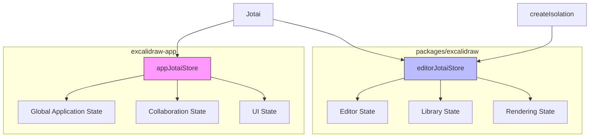
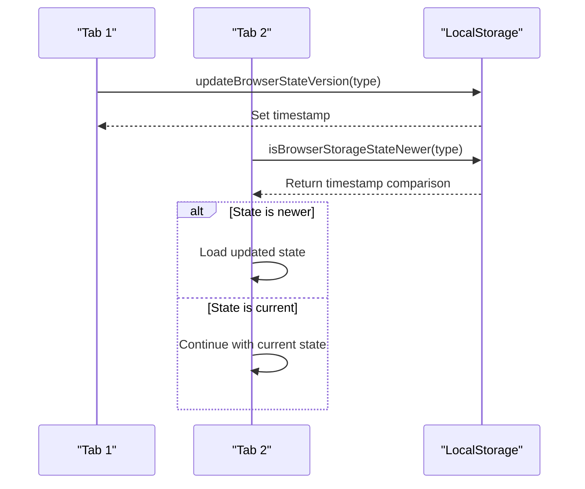
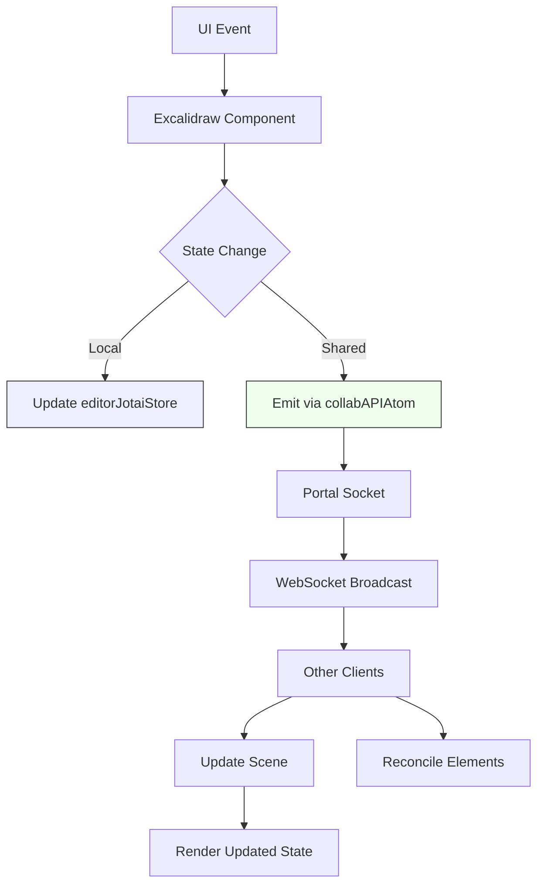
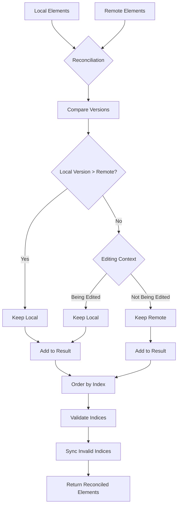
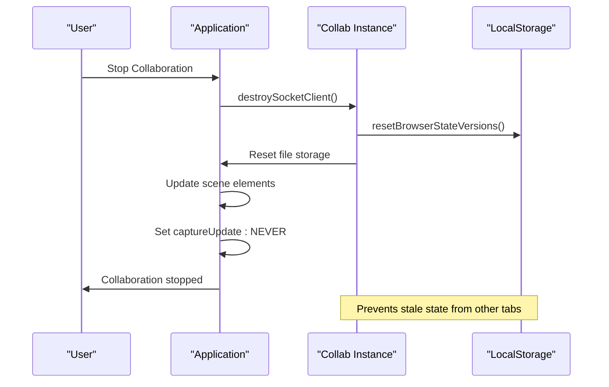

# State Synchronization

<cite>
**Referenced Files in This Document**   
- [app-jotai.ts](file://excalidraw-app/app-jotai.ts)
- [editor-jotai.ts](file://packages/excalidraw/editor-jotai.ts)
- [tabSync.ts](file://excalidraw-app/data/tabSync.ts)
- [app_constants.ts](file://excalidraw-app/app_constants.ts)
- [Collab.tsx](file://excalidraw-app/collab/Collab.tsx)
- [Portal.tsx](file://excalidraw-app/collab/Portal.tsx)
- [reconcile.ts](file://packages/excalidraw/data/reconcile.ts)
</cite>

## Table of Contents
1. [Introduction](#introduction)
2. [Jotai State Management Architecture](#jotai-state-management-architecture)
3. [Cross-Tab State Synchronization](#cross-tab-state-synchronization)
4. [Inter-Component State Propagation](#inter-component-state-propagation)
5. [State Reconciliation Mechanisms](#state-reconciliation-mechanisms)
6. [Concurrent State Update Handling](#concurrent-state-update-handling)
7. [Conclusion](#conclusion)

## Introduction
This document details the state synchronization patterns implemented in the Excalidraw monorepo, focusing on the interaction between the excalidraw-app and packages/excalidraw components. The system utilizes Jotai atoms for state management, enabling efficient state sharing across package boundaries. The documentation covers the tabSync.ts implementation for cross-tab synchronization, state propagation mechanisms between components, and strategies for handling concurrent updates and state reconciliation.

## Jotai State Management Architecture

The Excalidraw application employs Jotai as its primary state management solution, with distinct stores for different application contexts. The architecture separates concerns between the main application and the editor component through isolated Jotai stores.

**Diagram sources**
- [app-jotai.ts](file://excalidraw-app/app-jotai.ts#L1-L37)
- [editor-jotai.ts](file://packages/excalidraw/editor-jotai.ts#L1-L18)

The application implements two separate Jotai stores:
- `appJotaiStore`: Manages global application state in the excalidraw-app package
- `editorJotaiStore`: Handles editor-specific state within the packages/excalidraw package

This separation is achieved through Jotai's `createIsolation` function, which ensures that the editor's state remains encapsulated and doesn't interfere with the global application state. The `useAtomWithInitialValue` hook in app-jotai.ts provides a mechanism for initializing atoms with default values, ensuring consistent state across application instances.

**Section sources**
- [app-jotai.ts](file://excalidraw-app/app-jotai.ts#L1-L37)
- [editor-jotai.ts](file://packages/excalidraw/editor-jotai.ts#L1-L18)

## Cross-Tab State Synchronization

The tabSync.ts module implements a version-based synchronization mechanism that coordinates state between multiple browser tabs. This system prevents race conditions and ensures consistency when the same document is opened in multiple tabs.

**Diagram sources**
- [tabSync.ts](file://excalidraw-app/data/tabSync.ts#L1-L39)
- [app_constants.ts](file://excalidraw-app/app_constants.ts#L1-L59)

The synchronization mechanism uses timestamps stored in localStorage to track the version of different state components. The `LOCAL_STATE_VERSIONS` object maintains in-memory timestamps for each state type, while the actual versions are persisted in localStorage using keys defined in `STORAGE_KEYS`. The system provides three key functions:

- `isBrowserStorageStateNewer()`: Compares the in-memory version with the localStorage version to determine if another tab has updated the state
- `updateBrowserStateVersion()`: Updates both the in-memory and localStorage timestamps when state is saved
- `resetBrowserStateVersions()`: Resets all version timestamps, typically used when transitioning between collaboration modes

The `SYNC_BROWSER_TABS_TIMEOUT` constant (50ms) indicates that this synchronization check occurs frequently to ensure near-real-time consistency between tabs.

**Section sources**
- [tabSync.ts](file://excalidraw-app/data/tabSync.ts#L1-L39)
- [app_constants.ts](file://excalidraw-app/app_constants.ts#L1-L59)

## Inter-Component State Propagation

State changes propagate between the excalidraw-app and packages/excalidraw components through a combination of Jotai atoms and direct API calls. The collaboration system demonstrates a sophisticated pattern of state synchronization across package boundaries.

**Diagram sources**
- [Collab.tsx](file://excalidraw-app/collab/Collab.tsx#L51-L140)
- [Portal.tsx](file://excalidraw-app/collab/Portal.tsx#L41-L199)

The state propagation flow begins with UI events in the Excalidraw component, which update the local editor state via the editorJotaiStore. When collaboration is active, these changes are also propagated through the `collabAPIAtom`, which provides a centralized interface for collaboration functionality. The Portal class manages the WebSocket connection and broadcasts updates to other clients using encrypted payloads.

Key atoms involved in this process include:
- `collabAPIAtom`: Provides access to collaboration functionality
- `isCollaboratingAtom`: Tracks the current collaboration state
- `isOfflineAtom`: Indicates network connectivity status
- `activeRoomLinkAtom`: Stores the current collaboration room link

The system uses the `WS_EVENTS` and `WS_SUBTYPES` constants to categorize different types of state updates, allowing for efficient handling of various update types (scene initialization, updates, mouse location, idle status, etc.).

**Section sources**
- [Collab.tsx](file://excalidraw-app/collab/Collab.tsx#L51-L140)
- [Portal.tsx](file://excalidraw-app/collab/Portal.tsx#L41-L199)

## State Reconciliation Mechanisms

When multiple clients modify the same document concurrently, Excalidraw employs a sophisticated reconciliation algorithm to merge changes and maintain document consistency. The `reconcileElements` function implements a conflict resolution strategy that prioritizes certain changes based on version numbers and editing context.

**Diagram sources**
- [reconcile.ts](file://packages/excalidraw/data/reconcile.ts#L1-L118)

The reconciliation process follows these steps:
1. Create a map of local elements for efficient lookup
2. Process each remote element:
   - If a local element with the same ID exists and should be kept (based on version or editing context), add the local element to the result
   - Otherwise, add the remote element to the result
3. Add any remaining local elements that weren't processed
4. Order elements by fractional index
5. Validate and synchronize indices to prevent duplicates

The `shouldDiscardRemoteElement` function determines whether to keep the local or remote version based on several criteria:
- If the local element is currently being edited (text, resizing, etc.)
- If the local version is newer than the remote version
- If versions are equal but the local versionNonce is lower (providing deterministic resolution)

This approach ensures that users don't lose their local changes while still incorporating updates from other collaborators.

**Section sources**
- [reconcile.ts](file://packages/excalidraw/data/reconcile.ts#L1-L118)

## Concurrent State Update Handling

The system handles concurrent state updates through a combination of versioning, conflict detection, and strategic state reset mechanisms. When transitioning between collaboration modes, the application employs specific strategies to prevent state corruption.

**Diagram sources**
- [Collab.tsx](file://excalidraw-app/collab/Collab.tsx#L387-L429)
- [tabSync.ts](file://excalidraw-app/data/tabSync.ts#L30-L38)

When stopping collaboration, the system calls `resetBrowserStateVersions()` to prevent the application from loading potentially stale state that might have been saved in other tabs during the collaboration session. This is a critical safeguard that ensures the user starts with a clean state when returning to single-user mode.

The application also uses the `CaptureUpdateAction.NEVER` flag when updating the scene after collaboration ends, preventing the update from being recorded in the undo/redo history. This maintains a clean history state after collaboration transitions.

For file operations, the system implements timeout constants like `FILE_UPLOAD_TIMEOUT` (300ms) and `LOAD_IMAGES_TIMEOUT` (500ms) to prevent indefinite waiting on network operations, ensuring the application remains responsive even under poor network conditions.

**Section sources**
- [Collab.tsx](file://excalidraw-app/collab/Collab.tsx#L387-L429)
- [tabSync.ts](file://excalidraw-app/data/tabSync.ts#L30-L38)

## Conclusion
The Excalidraw monorepo implements a sophisticated state synchronization system that effectively manages state across package boundaries, multiple browser tabs, and concurrent collaborators. By leveraging Jotai's atom-based state management with isolated stores, the application maintains clear separation between global and editor-specific state. The version-based tab synchronization prevents race conditions between browser tabs, while the reconciliation algorithm ensures consistent document state across collaborators. The system's comprehensive approach to state management, combining versioning, conflict resolution, and strategic state resets, provides a robust foundation for real-time collaboration and multi-tab editing.