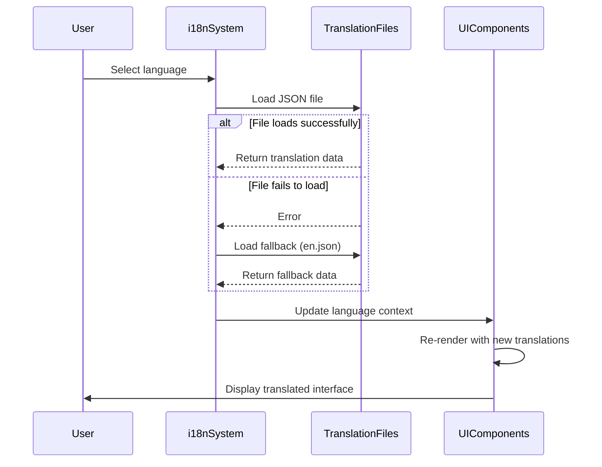
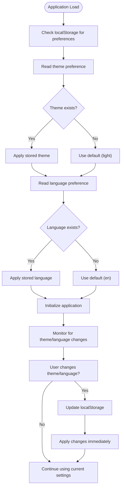
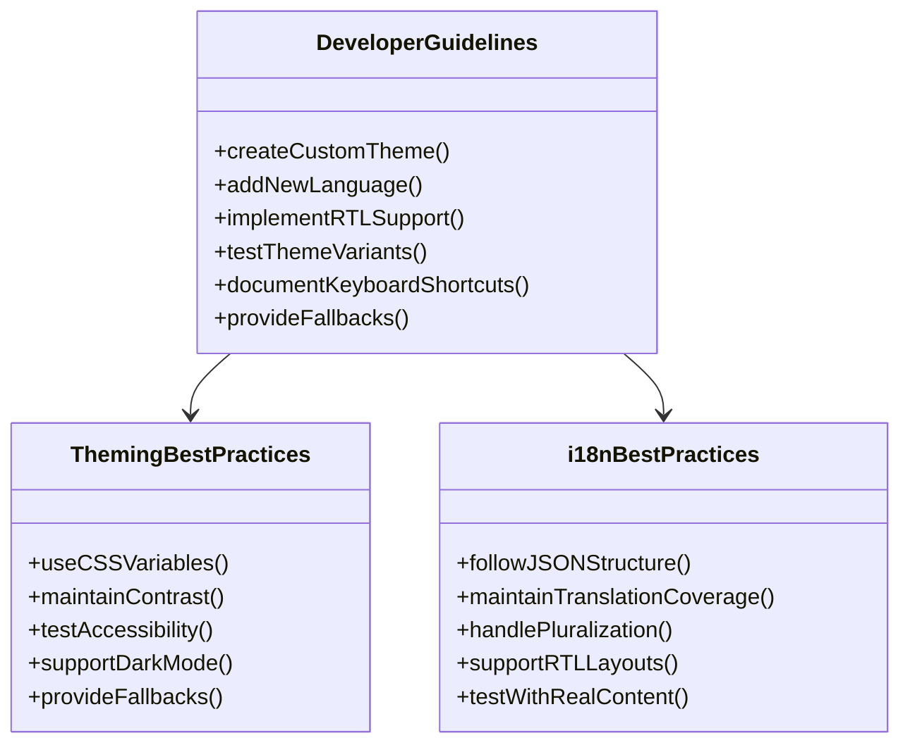

# Theming & Internationalization

<cite>
**Referenced Files in This Document**   
- [theme-wrapper.scss](file://excalidraw/excalidraw-app/theme-wrapper.scss)
- [useHandleAppTheme.ts](file://excalidraw/excalidraw-app/useHandleAppTheme.ts)
- [i18n.ts](file://excalidraw/packages/excalidraw/i18n.ts)
- [en.json](file://excalidraw/packages/excalidraw/locales/en.json)
- [app_constants.ts](file://excalidraw/excalidraw-app/app_constants.ts)
- [README-THEME-WRAPPER.md](file://excalidraw/excalidraw-app/README-THEME-WRAPPER.md)
</cite>

## Table of Contents
1. [Theming System](#theming-system)
2. [Internationalization System](#internationalization-system)
3. [Theme and Language Persistence](#theme-and-language-persistence)
4. [Developer Guidelines](#developer-guidelines)

## Theming System

The Excalidraw theming system is built on CSS Custom Properties (CSS variables) that allow complete customization of the application's visual appearance without modifying the core codebase. The system is implemented through the `theme-wrapper.scss` file and controlled by the `useHandleAppTheme.ts` hook.

The theming approach uses wrapper classes that override default Excalidraw styles through CSS variables. These variables define all visual aspects of the interface including colors, backgrounds, borders, shadows, and typography. The system supports both light and dark themes, with the ability to create custom themes by defining new CSS variable sets.

Theme switching is managed by the `useHandleAppTheme` hook, which handles the logic for determining the active theme and applying it to the application. The hook manages three theme states: light, dark, and system (which follows the user's operating system preference). When the theme changes, the hook updates the CSS variables accordingly and persists the selection in localStorage.

Custom themes can be injected by creating new CSS classes that define the complete set of CSS variables needed for the application. These classes can be added to the `theme-wrapper.scss` file or loaded dynamically. The system supports advanced visual effects like glassmorphism through properties such as `backdrop-filter`, `blur`, and `saturate`, with appropriate fallbacks for browsers that don't support these features.

```mermaid
classDiagram
class ThemeWrapper {
+string themeClass
+Map~string, CSSVariable~ variables
+setTheme(themeName)
+addCustomTheme(themeName, cssClass)
+setCSSVariable(variableName, value)
+exportConfig()
+importConfig(config)
}
class ThemeManager {
+Theme appTheme
+Theme editorTheme
+setAppTheme(theme)
+handleSystemPreference()
+persistTheme()
}
ThemeWrapper --> ThemeManager : "controls"
ThemeManager --> "localStorage" : "persists"
```

**Section sources**
- [theme-wrapper.scss](file://excalidraw/excalidraw-app/theme-wrapper.scss#L1-L153)
- [useHandleAppTheme.ts](file://excalidraw/excalidraw-app/useHandleAppTheme.ts#L1-L70)
- [README-THEME-WRAPPER.md](file://excalidraw/excalidraw-app/README-THEME-WRAPPER.md#L1-L415)

## Internationalization System

The internationalization system in Excalidraw is based on JSON translation files and a comprehensive i18n framework implemented in `i18n.ts`. The system supports multiple languages through language-specific JSON files stored in the `locales` directory, with `en.json` serving as the fallback language file.

The i18n system defines a `Language` interface that includes the language code, display label, and an optional RTL (right-to-left) flag for languages that require right-to-left text rendering. The available languages are defined in an array that is filtered by completion percentage, ensuring only sufficiently translated languages are available to users.

Translation keys are organized in a nested structure within the JSON files, with categories such as labels, buttons, alerts, and errors. The `t()` function provides translation lookup with support for variable replacement through template strings. When a translation key is not found, the system either throws an error in development mode or returns an empty string in production, preventing application crashes due to missing translations.

RTL layout support is implemented by setting the `dir` attribute on the document element when an RTL language is selected. This ensures proper text direction and layout for languages like Arabic and Hebrew. The system also includes a test mode for development, which can be enabled to identify missing translations by wrapping all text in special markers.



**Section sources**
- [i18n.ts](file://excalidraw/packages/excalidraw/i18n.ts#L1-L172)
- [en.json](file://excalidraw/packages/excalidraw/locales/en.json#L1-L645)

## Theme and Language Persistence

Theme and language preferences are persisted across sessions using localStorage, ensuring users don't need to reconfigure their preferences on subsequent visits. The theme persistence is handled by the `useHandleAppTheme` hook, which reads the stored theme preference on initialization and updates localStorage whenever the theme changes.

The theme preference is stored using the `STORAGE_KEYS.LOCAL_STORAGE_THEME` key defined in `app_constants.ts`. When the application loads, the hook checks localStorage for a previously saved theme, defaulting to light theme if no preference is found. For the "system" theme option, the hook also listens for changes to the operating system's dark mode preference using the `prefers-color-scheme` media query.

Language preferences are persisted through the language selection mechanism, which stores the selected language code in the application state. The i18n system sets both the `lang` and `dir` attributes on the document element, which are maintained across sessions. The system also includes a completion threshold check, only showing languages that have sufficient translation coverage (85% by default), preventing users from selecting languages with incomplete translations.



**Section sources**
- [useHandleAppTheme.ts](file://excalidraw/excalidraw-app/useHandleAppTheme.ts#L1-L70)
- [app_constants.ts](file://excalidraw/excalidraw-app/app_constants.ts#L1-L59)
- [i18n.ts](file://excalidraw/packages/excalidraw/i18n.ts#L1-L172)

## Developer Guidelines

For developers integrating custom themes, the recommended approach is to extend the existing theme system by creating new CSS classes in the `theme-wrapper.scss` file. Each custom theme should define all necessary CSS variables to ensure visual consistency across the entire application. Developers should test their themes in both light and dark mode contexts and provide appropriate fallbacks for browsers that don't support advanced CSS features like backdrop-filter.

When adding new languages, developers should create a new JSON file in the `locales` directory following the same structure as `en.json`. The file should include translations for all keys in the fallback language file. Developers should also update the languages array in `i18n.ts` to include the new language, specifying the language code, display label, and RTL flag if applicable.

For RTL languages, developers should ensure that the interface elements properly support right-to-left text flow and that any directional icons or graphics are appropriately mirrored. The system automatically handles basic RTL layout through the `dir` attribute, but complex layouts may require additional CSS adjustments.

Theme and language preferences should be integrated into the application's settings interface, providing users with clear options to customize their experience. The system supports keyboard shortcuts for theme switching (Alt+Shift+D) which should be documented in the application's help system.



**Section sources**
- [theme-wrapper.scss](file://excalidraw/excalidraw-app/theme-wrapper.scss#L1-L153)
- [useHandleAppTheme.ts](file://excalidraw/excalidraw-app/useHandleAppTheme.ts#L1-L70)
- [i18n.ts](file://excalidraw/packages/excalidraw/i18n.ts#L1-L172)
- [README-THEME-WRAPPER.md](file://excalidraw/excalidraw-app/README-THEME-WRAPPER.md#L1-L415)