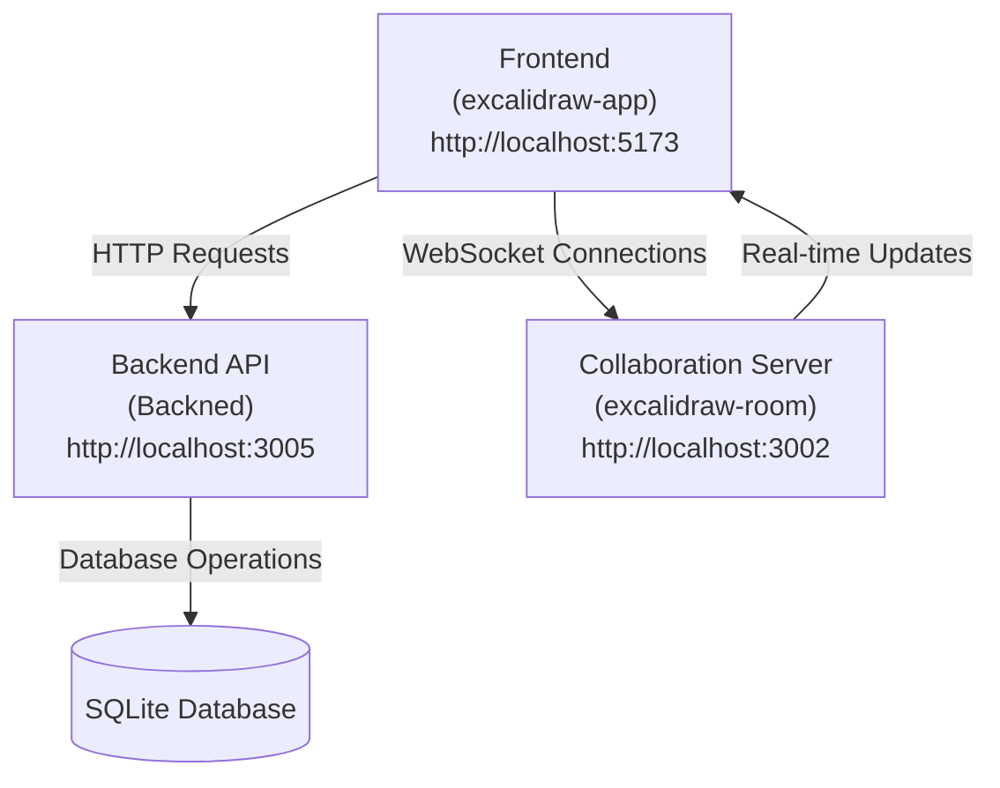

# Getting Started

<cite>
**Referenced Files in This Document**   
- [excalidraw/README.md](file://excalidraw/README.md)
- [Backned/README.md](file://Backned/README.md)
- [excalidraw-room/package.json](file://excalidraw-room/package.json)
- [Backned/package.json](file://Backned/package.json)
- [excalidraw/package.json](file://excalidraw/package.json)
- [excalidraw/excalidraw-app/package.json](file://excalidraw/excalidraw-app/package.json)
- [excalidraw/excalidraw-room/src/index.js](file://excalidraw/excalidraw-room/src/index.js)
- [Backned/src/server.ts](file://Backned/src/server.ts)
</cite>

## Table of Contents
1. [Introduction](#introduction)
2. [Prerequisites](#prerequisites)
3. [Repository Setup](#repository-setup)
4. [Running the Development Environment](#running-the-development-environment)
5. [Basic Usage Guide](#basic-usage-guide)
6. [Common Setup Issues and Solutions](#common-setup-issues-and-solutions)
7. [Troubleshooting Tips](#troubleshooting-tips)
8. [Conclusion](#conclusion)

## Introduction
This guide provides comprehensive instructions for onboarding new developers and users to the Excalidraw collaborative whiteboard application. It covers setting up the development environment, running the frontend (excalidraw-app), backend API (Backned), and collaboration server (excalidraw-room) in development mode. The document includes basic usage examples for creating diagrams, enabling collaboration, and using core features, along with solutions to common setup issues.

**Section sources**
- [excalidraw/README.md](file://excalidraw/README.md)

## Prerequisites
Before setting up the Excalidraw development environment, ensure you have the following prerequisites installed:

- **Node.js**: Version 18.0.0 to 22.x.x (as specified in the project's engines configuration)
- **npm or yarn**: Package managers for installing dependencies
- **Git**: For cloning the repository

The project requires specific Node.js versions as defined in the package.json files across the repository. Using an incorrect Node.js version may lead to compatibility issues during installation or runtime.

**Section sources**
- [excalidraw/package.json](file://excalidraw/package.json)
- [excalidraw/excalidraw-app/package.json](file://excalidraw/excalidraw-app/package.json)

## Repository Setup
To set up the Excalidraw repository for development, follow these steps:

1. Clone the repository from GitHub:
```bash
git clone https://github.com/excalidraw/excalidraw.git
cd excalidraw
```

2. Install all dependencies using yarn (recommended) or npm:
```bash
yarn install
# or
npm install
```

The repository uses a monorepo structure with multiple packages managed through workspaces. The main components include:
- **excalidraw-app**: The frontend application
- **Backned**: The backend API service
- **excalidraw-room**: The collaboration server

**Section sources**
- [excalidraw/package.json](file://excalidraw/package.json)

## Running the Development Environment
To run the Excalidraw application in development mode, you need to start three separate services: the frontend, backend API, and collaboration server.

### Starting the Frontend (excalidraw-app)
Navigate to the excalidraw directory and start the frontend development server:
```bash
cd excalidraw
yarn start
```
The frontend will be available at http://localhost:5173 by default.

### Starting the Backend API (Backned)
Open a new terminal window, navigate to the Backned directory, and start the API server:
```bash
cd Backned
npm install
npm run dev
```
The backend API will be available at http://localhost:3005.

### Starting the Collaboration Server (excalidraw-room)
Open another terminal window, navigate to the excalidraw-room directory, and start the collaboration server:
```bash
cd excalidraw-room
npm install
npm run start:dev
```
The collaboration server will be available at http://localhost:3002.



**Diagram sources**
- [excalidraw/excalidraw-app/package.json](file://excalidraw/excalidraw-app/package.json)
- [Backned/package.json](file://Backned/package.json)
- [excalidraw-room/package.json](file://excalidraw-room/package.json)

**Section sources**
- [excalidraw/excalidraw-app/package.json](file://excalidraw/excalidraw-app/package.json)
- [Backned/package.json](file://Backned/package.json)
- [excalidraw-room/package.json](file://excalidraw-room/package.json)
- [Backned/src/server.ts](file://Backned/src/server.ts)
- [excalidraw/excalidraw-room/src/index.js](file://excalidraw/excalidraw-room/src/index.js)

## Basic Usage Guide
Once all services are running, you can begin using Excalidraw for diagram creation and collaboration.

### Creating Diagrams
1. Access the application at http://localhost:5173
2. Use the toolbar to select drawing tools (rectangle, circle, arrow, etc.)
3. Click and drag on the canvas to create shapes
4. Use text tool to add labels and annotations
5. Customize colors, stroke width, and other properties using the right sidebar

### Enabling Collaboration
1. Create a new room or join an existing one using the collaboration feature
2. Share the room URL with other participants
3. All participants will see real-time updates as others draw
4. Use the user list to see who is currently in the room
5. Collaborative changes are synchronized through the WebSocket connection to the collaboration server

### Core Features
- **Hand-drawn style**: Natural looking diagrams with sketch-like appearance
- **Infinite canvas**: Pan and zoom across an unlimited drawing space
- **Export options**: Save diagrams as PNG, SVG, or JSON files
- **Dark mode**: Toggle between light and dark themes
- **Shape libraries**: Access pre-defined shapes and elements
- **End-to-end encryption**: Secure collaboration with encrypted data transmission

**Section sources**
- [excalidraw/README.md](file://excalidraw/README.md)

## Common Setup Issues and Solutions
This section addresses frequent problems encountered during setup and their resolutions.

### Node.js Version Mismatch
**Issue**: Installation fails with engine compatibility errors.
**Solution**: Ensure you're using Node.js version 18.0.0 to 22.x.x. Use a version manager like nvm to switch between Node.js versions if needed.

### Port Conflicts
**Issue**: Services fail to start due to port conflicts.
**Solution**: Modify the PORT environment variables:
- Frontend: Default port 5173 (configurable in Vite)
- Backend: Default port 3005 (set in Backned/.env)
- Collaboration server: Default port 3002 (set via PORT environment variable)

### CORS Errors
**Issue**: Browser console shows CORS errors when connecting to backend services.
**Solution**: Verify the CORS_ORIGIN environment variable in Backned/.env matches the frontend origin (typically http://localhost:5173).

### Database Connection Issues
**Issue**: Backend fails to start with database initialization errors.
**Solution**: Ensure the DATABASE_PATH directory exists and is writable. The default path is ./excalidraw.db in the Backned directory.

**Section sources**
- [Backned/README.md](file://Backned/README.md)
- [Backned/src/server.ts](file://Backned/src/server.ts)
- [excalidraw/excalidraw-room/src/index.js](file://excalidraw/excalidraw-room/src/index.js)

## Troubleshooting Tips
When encountering issues with the Excalidraw development environment, consider these troubleshooting strategies:

### Service Not Starting
- Verify all dependencies are installed with `yarn install` or `npm install`
- Check that no other processes are using the required ports
- Ensure Node.js version meets the project requirements
- Review console output for specific error messages

### Collaboration Not Working
- Confirm the collaboration server is running on http://localhost:3002
- Check that the frontend can establish a WebSocket connection
- Verify the roomId parameter is correctly passed between clients
- Inspect browser developer tools for network errors

### Performance Issues
- Ensure you're running the development server, not a production build
- Close unnecessary browser tabs to free up memory
- Disable browser extensions that might interfere with WebSocket connections
- Monitor system resources to ensure adequate CPU and memory availability

### Data Persistence Problems
- Verify the SQLite database file is being created and updated
- Check file permissions for the database directory
- Confirm the backend has write access to the DATABASE_PATH location
- Examine the database schema to ensure tables are properly initialized

**Section sources**
- [Backned/README.md](file://Backned/README.md)
- [excalidraw/excalidraw-room/src/index.js](file://excalidraw/excalidraw-room/src/index.js)

## Conclusion
This guide has provided a comprehensive overview of setting up and running the Excalidraw collaborative whiteboard application in a development environment. By following these instructions, developers and users can successfully configure the frontend, backend API, and collaboration server to create and share diagrams with real-time collaboration features. The application's modular architecture allows for independent development and testing of each component while maintaining seamless integration for end-to-end functionality.