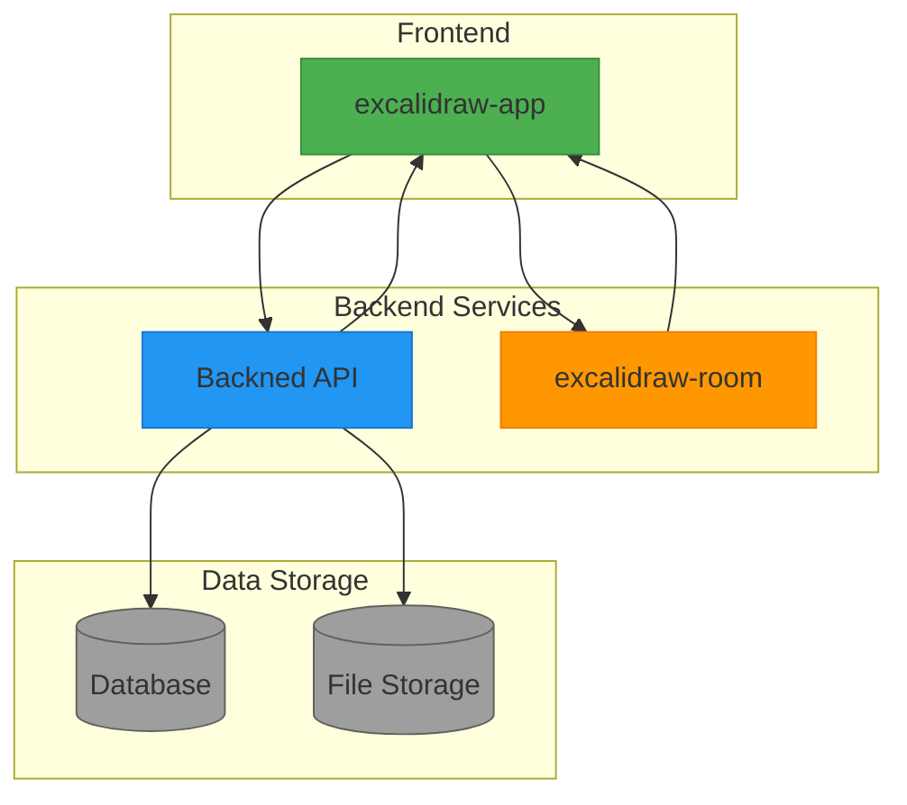
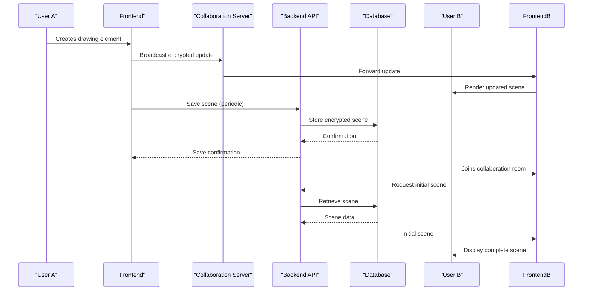

# System Overview

<cite>
**Referenced Files in This Document**   
- [server.ts](file://Backned/src/server.ts)
- [routes.ts](file://Backned/src/routes.ts)
- [Collab.tsx](file://excalidraw/excalidraw-app/collab/Collab.tsx)
- [api-client.ts](file://excalidraw/excalidraw-app/data/api-client.ts)
- [index.js](file://excalidraw/excalidraw-room/src/index.js)
- [app_constants.ts](file://excalidraw/excalidraw-app/app_constants.ts)
</cite>

## Table of Contents
1. [Introduction](#introduction)
2. [Core Components](#core-components)
3. [Architecture Overview](#architecture-overview)
4. [Data Flow and User Interaction](#data-flow-and-user-interaction)
5. [Technology Stack and Monorepo Structure](#technology-stack-and-monorepo-structure)
6. [Key Differentiators and Use Cases](#key-differentiators-and-use-cases)

## Introduction

The Excalidraw-based collaborative whiteboard application is a hand-drawn style diagramming tool designed for real-time collaboration with integrated educational features. This system enables users to create diagrams, conduct classroom teaching sessions, and develop wireframes through an intuitive sketch-style interface. The application supports multiple collaboration modes including persistent rooms, shareable links, and teacher-managed classrooms. Its architecture is optimized for low-latency real-time updates while maintaining data persistence and security.

## Core Components

The system consists of three primary components: the frontend application (excalidraw-app), the backend API service (Backned), and the real-time collaboration server (excalidraw-room). These components work together to provide a seamless collaborative experience. The frontend handles user interface rendering and local state management, the backend manages persistent data storage and retrieval, and the collaboration server facilitates real-time communication between users.

**Section sources**
- [server.ts](file://Backned/src/server.ts#L1-L37)
- [routes.ts](file://Backned/src/routes.ts#L1-L365)
- [Collab.tsx](file://excalidraw/excalidraw-app/collab/Collab.tsx#L1-L799)
- [index.js](file://excalidraw/excalidraw-room/src/index.js#L1-L131)

## Architecture Overview

The system follows a microservices architecture with clear separation of concerns between real-time collaboration and persistent data storage. The frontend application connects to both the real-time collaboration server for immediate updates and the backend API for persistent storage operations.

**Diagram sources**
- [server.ts](file://Backned/src/server.ts#L1-L37)
- [index.js](file://excalidraw/excalidraw-room/src/index.js#L1-L131)
- [Collab.tsx](file://excalidraw/excalidraw-app/collab/Collab.tsx#L1-L799)

## Data Flow and User Interaction

The application implements a sophisticated data synchronization strategy that balances real-time performance with data persistence. When users collaborate in a room, their actions are immediately broadcast through the real-time collaboration server using WebSockets. These updates include scene modifications, cursor positions, and user presence information.

For persistent storage, the system periodically saves the complete scene state to the backend API, which stores it in a database. The backend also manages educational features such as permalinks that map to specific classroom sessions, allowing teachers to create stable links for students.

**Diagram sources**
- [routes.ts](file://Backned/src/routes.ts#L1-L365)
- [api-client.ts](file://excalidraw/excalidraw-app/data/api-client.ts#L1-L157)
- [Collab.tsx](file://excalidraw/excalidraw-app/collab/Collab.tsx#L1-L799)

## Technology Stack and Monorepo Structure

The application is organized as a monorepo containing multiple packages and services. The frontend (excalidraw-app) is built with React and TypeScript, leveraging Jotai for state management. The real-time collaboration server (excalidraw-room) uses Socket.IO for WebSocket communication, while the backend API (Backned) is implemented with Express.js and SQLite for data persistence.

The monorepo structure enables shared utilities and consistent tooling across components. The system uses environment variables to configure different deployment scenarios, including development, testing, and production environments. Security is maintained through end-to-end encryption of scene data, with encryption keys managed client-side to ensure privacy.

**Section sources**
- [app_constants.ts](file://excalidraw/excalidraw-app/app_constants.ts#L1-L59)
- [package.json](file://Backned/package.json)
- [package.json](file://excalidraw/excalidraw-app/package.json)
- [package.json](file://excalidraw/excalidraw-room/package.json)

## Key Differentiators and Use Cases

The Excalidraw-based application distinguishes itself through its focus on educational use cases and hand-drawn aesthetic. Primary use cases include:

- **Diagram Creation**: Users can create flowcharts, wireframes, and technical diagrams with a natural, hand-drawn appearance
- **Classroom Teaching**: Teachers can create persistent rooms with stable permalinks for students, enabling structured learning sessions
- **Real-time Collaboration**: Multiple users can work on the same canvas simultaneously with low-latency updates
- **Privacy-focused Design**: End-to-end encryption ensures that only authorized users can access scene content

The system's architecture supports both temporary collaboration sessions and persistent rooms, making it suitable for both ad-hoc brainstorming and structured educational settings.

**Section sources**
- [routes.ts](file://Backned/src/routes.ts#L1-L365)
- [Collab.tsx](file://excalidraw/excalidraw-app/collab/Collab.tsx#L1-L799)
- [api-client.ts](file://excalidraw/excalidraw-app/data/api-client.ts#L1-L157)