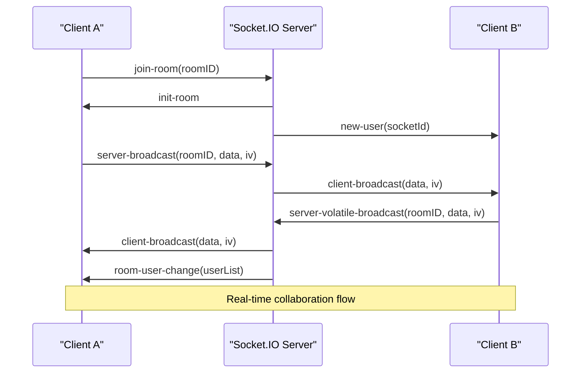
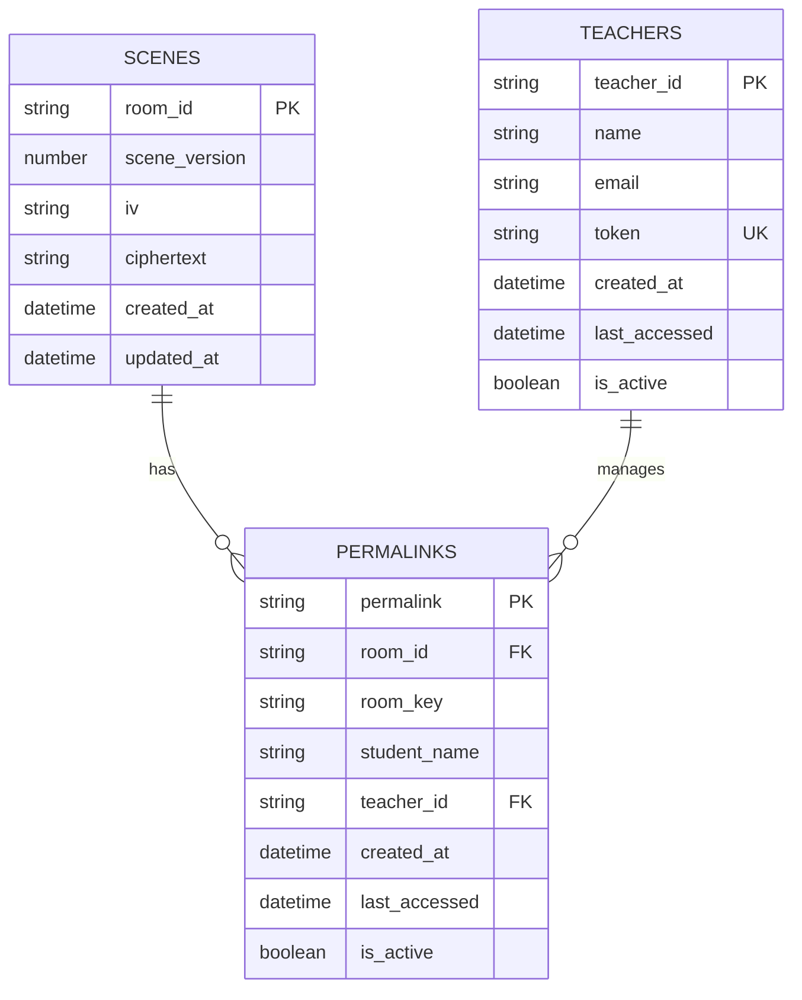

# Backend Frameworks

<cite>
**Referenced Files in This Document**   
- [server.ts](file://Backned/src/server.ts)
- [routes.ts](file://Backned/src/routes.ts)
- [db.ts](file://Backned/src/db.ts)
- [index.ts](file://excalidraw-room/src/index.ts)
</cite>

## Table of Contents
1. [Introduction](#introduction)
2. [Server Architecture](#server-architecture)
3. [Express.js REST API Implementation](#expressjs-rest-api-implementation)
4. [Socket.IO Real-Time Communication](#socketio-real-time-communication)
5. [Scene Persistence and Database Management](#scene-persistence-and-database-management)
6. [User Authentication and Authorization](#user-authentication-and-authorization)
7. [Middleware and Error Handling](#middleware-and-error-handling)
8. [API Routing Structure](#api-routing-structure)
9. [Performance and Scalability Considerations](#performance-and-scalability-considerations)

## Introduction
This document provides a comprehensive analysis of the backend technology stack for the Excalidraw application, focusing on its Express.js REST API, Node.js runtime configuration, and Socket.IO real-time collaboration server. The backend infrastructure supports scene persistence, user authentication, and real-time collaboration through a combination of RESTful endpoints and WebSocket-based communication. Two distinct server implementations are analyzed: a SQLite-based backend for basic scene storage and a PostgreSQL-based collaboration server for real-time multi-user editing.

## Server Architecture

```mermaid
graph TB
subgraph "Frontend"
Client[Excalidraw Client]
end
subgraph "Backend Services"
API[Express.js REST API]
Socket[Socket.IO Server]
DB[(Database)]
end
Client --> API
Client --> Socket
API --> DB
Socket --> DB
API -.-> Socket: Shared state coordination
style API fill:#4CAF50,stroke:#388E3C
style Socket fill:#2196F3,stroke:#1976D2
style DB fill:#FF9800,stroke:#F57C00
```

**Diagram sources**
- [server.ts](file://Backned/src/server.ts#L1-L37)
- [index.ts](file://excalidraw-room/src/index.ts#L1-L50)

**Section sources**
- [server.ts](file://Backned/src/server.ts#L1-L37)
- [index.ts](file://excalidraw-room/src/index.ts#L1-L50)

## Express.js REST API Implementation

The Express.js framework serves as the foundation for the REST API in both backend implementations. The server initialization follows standard Express patterns with middleware configuration for JSON parsing, CORS handling, and error management.

In the SQLite-based backend, Express routes handle scene persistence through GET and POST requests to `/api/scenes/:roomId`, while the PostgreSQL-based collaboration server provides similar endpoints with enhanced database connectivity through the pg Pool.

Key implementation patterns include:
- Environment variable configuration via dotenv
- CORS policy support for multiple origins
- JSON payload parsing with size limits
- Structured error handling with logging

**Section sources**
- [server.ts](file://Backned/src/server.ts#L1-L37)
- [index.ts](file://excalidraw-room/src/index.ts#L1-L50)

## Socket.IO Real-Time Communication



**Diagram sources**
- [index.ts](file://excalidraw-room/src/index.ts#L200-L277)

**Section sources**
- [index.ts](file://excalidraw-room/src/index.ts#L200-L318)

The Socket.IO server enables real-time collaboration by establishing persistent WebSocket connections between clients. The implementation supports two broadcast modes:
- **Reliable broadcasting**: Standard `socket.broadcast.to(roomID).emit()` for guaranteed message delivery
- **Volatile broadcasting**: `socket.volatile.broadcast.to(roomID).emit()` for performance-critical updates that can be dropped if network conditions are poor

The server manages room membership through socket joining and leaving events, broadcasting user presence changes to all participants. A unique "follow" feature allows users to track specific collaborators through dedicated follow rooms prefixed with `follow@`.

## Scene Persistence and Database Management



**Diagram sources**
- [db.ts](file://Backned/src/db.ts#L15-L96)
- [index.ts](file://excalidraw-room/src/index.ts#L100-L150)

**Section sources**
- [db.ts](file://Backned/src/db.ts#L15-L96)
- [index.ts](file://excalidraw-room/src/index.ts#L100-L150)

Both backend implementations use relational databases to persist Excalidraw scenes. The SQLite backend uses a local database file with three main tables: scenes, permalinks, and teachers. The PostgreSQL implementation uses a hosted database with similar schema design.

Scene data is stored in encrypted form with:
- `room_id`: Unique identifier for the drawing session
- `scene_version`: Version number for conflict detection
- `iv`: Initialization vector for encryption
- `ciphertext`: Base64-encoded encrypted scene data

Database initialization includes table creation, index definition, and schema migration handling (such as adding the teacher_id column to permalinks table).

## User Authentication and Authorization

The backend implements a multi-tier authentication system:
- **Teacher authentication**: Token-based verification for teacher accounts
- **Admin authentication**: Header-based token validation for administrative endpoints
- **Session management**: Automatic timestamp updates on access

Authentication is implemented through middleware functions that validate credentials before allowing access to protected routes. The system uses random token generation (16 characters) for teacher accounts and admin access, with tokens stored securely in the database.

Protected endpoints include:
- Teacher-managed permalink operations
- Admin-only teacher creation and management
- Bulk teacher upload functionality

**Section sources**
- [routes.ts](file://Backned/src/routes.ts#L100-L365)

## Middleware and Error Handling

The Express applications implement comprehensive middleware stacks for request processing and error management. Key middleware components include:

- **CORS middleware**: Configurable origin policies supporting wildcard and comma-separated origin lists
- **JSON parsing middleware**: Size-limited JSON body parsing (2MB limit)
- **Raw body parsing**: Special handling for binary data in scene exports
- **Error logging**: Comprehensive error logging with context for debugging

Error handling follows a consistent pattern across all routes:
1. Input validation with 400 responses for invalid payloads
2. Database operation error handling with 500 responses
3. Specific error logging for debugging
4. Graceful degradation when database is unavailable

**Section sources**
- [server.ts](file://Backned/src/server.ts#L1-L37)
- [routes.ts](file://Backned/src/routes.ts#L1-L365)

## API Routing Structure

```mermaid
flowchart TD
A[Root /] --> B[GET /health]
A --> C[GET /api/scenes/:roomId]
A --> D[POST /api/scenes/:roomId]
A --> E[POST /api/permalinks]
A --> F[GET /api/permalinks/:permalink]
A --> G[GET /api/permalinks]
A --> H[DELETE /api/permalinks/:permalink]
A --> I[GET /api/teachers/:teacherId/permalinks]
A --> J[DELETE /api/teachers/:teacherId/permalinks/:permalink]
A --> K[POST /api/admin/teachers]
A --> L[POST /api/admin/teachers/upload]
A --> M[GET /api/admin/teachers]
style A fill:#2196F3,stroke:#1976D2
style B fill:#4CAF50,stroke:#388E3C
style C fill:#4CAF50,stroke:#388E3C
style D fill:#4CAF50,stroke:#388E3C
```



**Diagram sources**
- [routes.ts](file://Backned/src/routes.ts#L1-L365)

**Section sources**
- [routes.ts](file://Backned/src/routes.ts#L1-L365)

The API routing structure follows RESTful conventions with clear endpoint organization:
- **Scene management**: GET/POST to `/api/scenes/:roomId` for scene persistence
- **Permalink operations**: Creation, resolution, and management of shareable links
- **Teacher endpoints**: Teacher-specific operations with token authentication
- **Admin endpoints**: Administrative functions requiring elevated privileges

The routing system includes both public endpoints and protected routes with authentication requirements. Route parameters and query string parsing is handled through Express's built-in request object properties.

## Performance and Scalability Considerations

The current implementation presents several performance and scalability characteristics:

**SQLite Backend Limitations:**
- Single-file database with potential concurrency limitations
- Local storage constraints scalability
- No built-in connection pooling
- File system I/O bottlenecks under high load

**PostgreSQL Collaboration Server Advantages:**
- Connection pooling through pg Pool
- Hosted database with better scalability
- Index optimization for frequent queries
- SSL support for secure connections

**Socket.IO Performance Features:**
- Volatile broadcasting for non-critical updates
- Efficient room-based message routing
- Connection state management with automatic cleanup
- Support for both WebSocket and HTTP polling transports

**Scalability Challenges:**
- Stateful Socket.IO connections complicate horizontal scaling
- Database connection limits under high concurrency
- Memory usage growth with active rooms and users
- Potential bottlenecks in scene serialization/deserialization

The architecture would benefit from:
- Redis-based session and room state storage
- Horizontal scaling with load balancing
- Database read replicas for high-traffic scenarios
- Message queue integration for offline message delivery

**Section sources**
- [server.ts](file://Backned/src/server.ts#L1-L37)
- [index.ts](file://excalidraw-room/src/index.ts#L1-L318)
- [db.ts](file://Backned/src/db.ts#L1-L96)