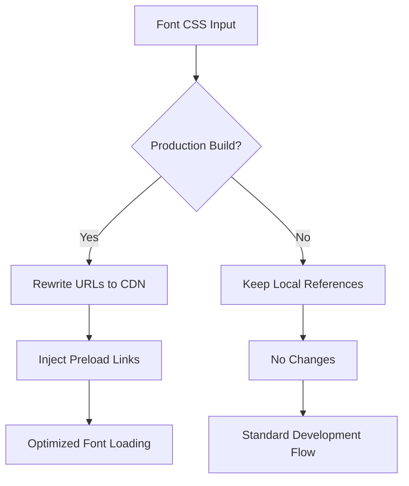
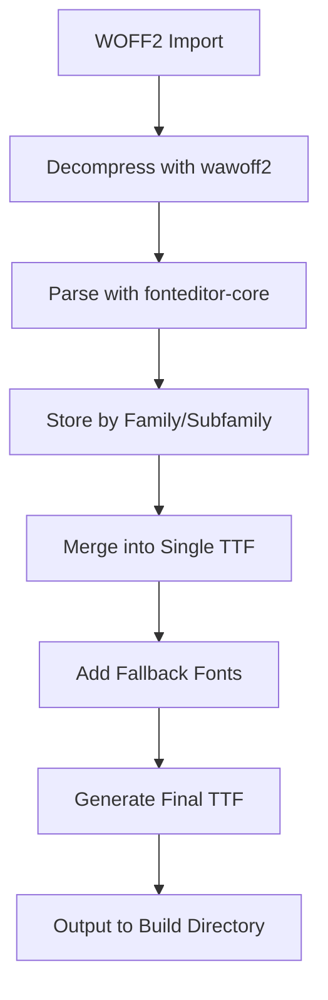
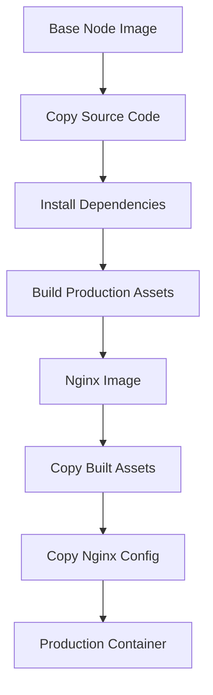
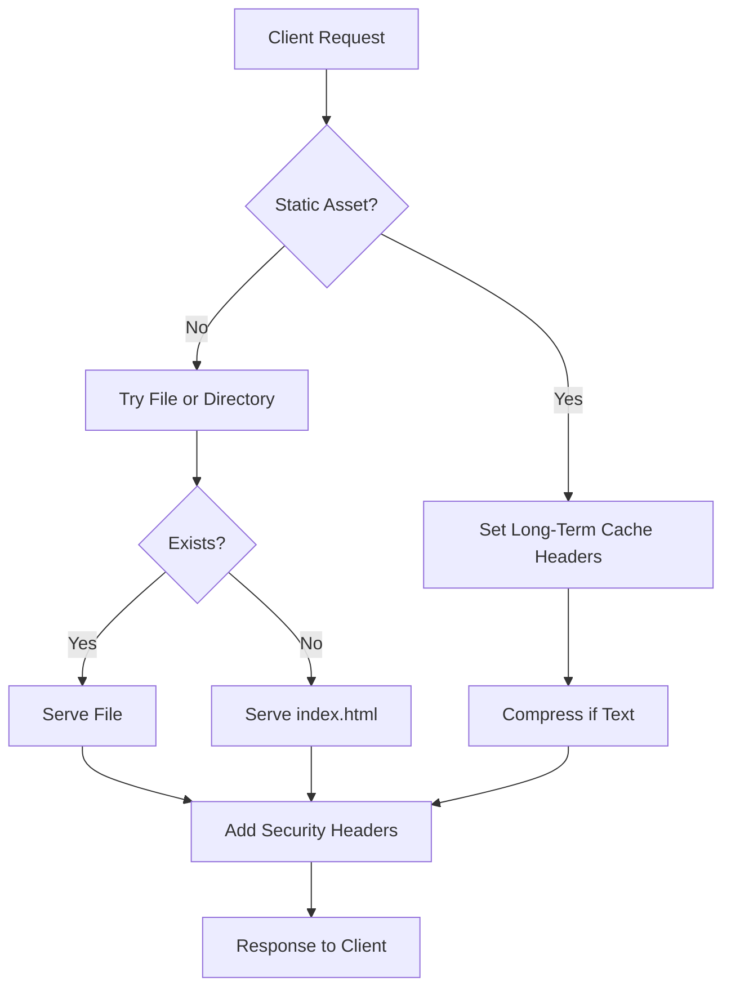

# Build Tooling & Infrastructure

<cite>
**Referenced Files in This Document**   
- [Dockerfile](file://Dockerfile)
- [nginx.conf](file://nginx.conf)
- [excalidraw-app/vite.config.mts](file://excalidraw-app/vite.config.mts)
- [scripts/woff2/woff2-vite-plugins.js](file://scripts/woff2/woff2-vite-plugins.js)
- [scripts/woff2/woff2-esbuild-plugins.js](file://scripts/woff2/woff2-esbuild-plugins.js)
- [package.json](file://package.json)
</cite>

## Table of Contents
1. [Introduction](#introduction)
2. [Vite and ESBuild Configuration](#vite-and-esbuild-configuration)
3. [Custom WOFF2 Font Subsetting Plugins](#custom-woff2-font-subsetting-plugins)
4. [Docker Containerization](#docker-containerization)
5. [Nginx Reverse Proxy Setup](#nginx-reverse-proxy-setup)
6. [Build Pipeline and Environment Management](#build-pipeline-and-environment-management)
7. [CI/CD Integration](#cicd-integration)
8. [Performance Optimization and Caching Strategies](#performance-optimization-and-caching-strategies)
9. [Deployment Automation](#deployment-automation)
10. [Conclusion](#conclusion)

## Introduction
The Excalidraw application leverages a modern build toolchain and infrastructure stack to enable efficient development workflows, optimized production builds, and scalable deployments. This document details the key components of this ecosystem, including Vite and ESBuild for bundling, custom font handling plugins, Docker-based containerization, and Nginx for serving static assets with optimal performance. The integration of these tools supports a robust CI/CD pipeline that ensures consistent and reliable deployments across environments.

## Vite and ESBuild Configuration
The build system is centered around Vite as the primary development server and bundler, with ESBuild used for specific server-side compilation tasks. The configuration enables fast development iterations through hot module replacement and optimized dependency pre-bundling.

The Vite configuration in `excalidraw-app/vite.config.mts` defines aliases for monorepo packages, enabling seamless imports across the codebase. It also configures the build output to handle font assets appropriately and implements code splitting for locale files to optimize caching strategies.

**Section sources**
- [excalidraw-app/vite.config.mts](file://excalidraw-app/vite.config.mts#L1-L314)

## Custom WOFF2 Font Subsetting Plugins
Excalidraw implements two specialized plugins to handle WOFF2 font assets differently for browser and server environments. These plugins ensure optimal font loading behavior while maintaining compatibility across different execution contexts.

### Browser Font Handling
The `woff2BrowserPlugin` modifies font declarations to point to CDN-hosted versions in production while maintaining local fallbacks. It dynamically generates CSS with CDN URLs for Assistant font variants and injects preload hints for critical fonts like Excalifont, Nunito, and ComicShanns.

**Diagram sources**
- [scripts/woff2/woff2-vite-plugins.js](file://scripts/woff2/woff2-vite-plugins.js#L1-L105)

### Server Font Handling
The `woff2ServerPlugin` processes WOFF2 files for server-side rendering by converting them to TTF format compatible with Resvg. It merges multiple font weights into single files, deduplicates glyphs, and embeds fallback fonts like Xiaolai, Emoji, and Liberation to ensure comprehensive character coverage.

**Diagram sources**
- [scripts/woff2/woff2-esbuild-plugins.js](file://scripts/woff2/woff2-esbuild-plugins.js#L1-L253)

**Section sources**
- [scripts/woff2/woff2-vite-plugins.js](file://scripts/woff2/woff2-vite-plugins.js#L1-L105)
- [scripts/woff2/woff2-esbuild-plugins.js](file://scripts/woff2/woff2-esbuild-plugins.js#L1-L253)

## Docker Containerization
The application uses a multi-stage Docker build process to create optimized production images. The build stage uses Node.js to compile assets, while the runtime stage uses Nginx for efficient static file serving.

The Dockerfile specifies platform-specific builds to ensure compatibility across architectures. It installs dependencies with architecture-specific configurations and runs the production build before copying artifacts to the lightweight Nginx image.

**Diagram sources**
- [Dockerfile](file://Dockerfile#L1-L23)

**Section sources**
- [Dockerfile](file://Dockerfile#L1-L23)

## Nginx Reverse Proxy Setup
The Nginx configuration provides production-grade static asset serving with comprehensive caching, security, and compression settings. It handles client-side routing through history API fallback and implements long-term caching for immutable assets.

Key features include:
- One-year cache expiration for static assets with immutable headers
- Gzip compression for text-based resources
- Security headers to prevent common web vulnerabilities
- Health check endpoint for container orchestration
- Client-side routing support via try_files directive

**Diagram sources**
- [nginx.conf](file://nginx.conf#L1-L35)

**Section sources**
- [nginx.conf](file://nginx.conf#L1-L35)

## Build Pipeline and Environment Management
The build pipeline is orchestrated through npm scripts defined in the root `package.json`. These scripts coordinate the compilation of monorepo packages and the main application, ensuring proper dependency ordering.

Environment variables are managed through Vite's loadEnv function, which loads configuration from the project root. The system supports different modes for development, testing, and production, with specific flags to enable or disable features like ESLint, PWA, and overlay debugging tools.

The build process includes:
- Separate builds for each monorepo package
- Application-specific builds with Docker and preview variants
- Version information embedding
- Asset optimization and code splitting

**Section sources**
- [package.json](file://package.json#L1-L95)
- [excalidraw-app/vite.config.mts](file://excalidraw-app/vite.config.mts#L1-L314)

## CI/CD Integration
The CI/CD pipeline is defined in GitHub Actions workflows located in `.github/workflows/`. These workflows automate testing, linting, building, and publishing processes.

Key workflows include:
- Automated releases triggered by semantic versioning
- Docker image building and publishing
- Code quality checks and linting
- Test coverage reporting
- Size limit monitoring
- Pull request validation

The pipeline ensures that all changes are properly tested and validated before deployment, with automated cancellation of redundant workflows to optimize resource usage.

## Performance Optimization and Caching Strategies
The build infrastructure implements multiple layers of optimization to deliver fast load times and responsive user experiences.

### Asset Caching
Static assets are cached for one year with immutable headers, leveraging browser caching for repeat visits. The build process generates unique filenames for hashed assets, enabling safe long-term caching.

### Service Worker Caching
The Vite PWA plugin configures runtime caching strategies:
- Fonts cached with CacheFirst strategy for 90 days
- Locale files cached for 30 days
- Code chunks cached for 90 days
- Maximum file size increased to 4MB for comprehensive asset coverage

### Compression
Gzip compression is enabled for all text-based resources, reducing transfer sizes for HTML, CSS, JavaScript, and JSON payloads.

## Deployment Automation
Deployment is automated through a combination of Docker, GitHub Actions, and Nginx. The build-docker.yml workflow triggers on pushes to main, building and pushing Docker images to a registry. The publish-docker.yml workflow handles the publication of these images.

The multi-stage Docker build ensures that only necessary files are included in the final image, minimizing attack surface and reducing download times. The HEALTHCHECK directive enables container orchestration platforms to monitor application health.

## Conclusion
The Excalidraw build tooling and infrastructure represent a modern, production-ready stack that balances developer experience with performance and reliability. By leveraging Vite for rapid development, custom font handling for optimal rendering, Docker for consistent deployments, and Nginx for efficient serving, the system delivers a robust foundation for the application. The comprehensive CI/CD integration ensures that changes are properly validated and deployed, while the caching and optimization strategies provide excellent performance for end users.