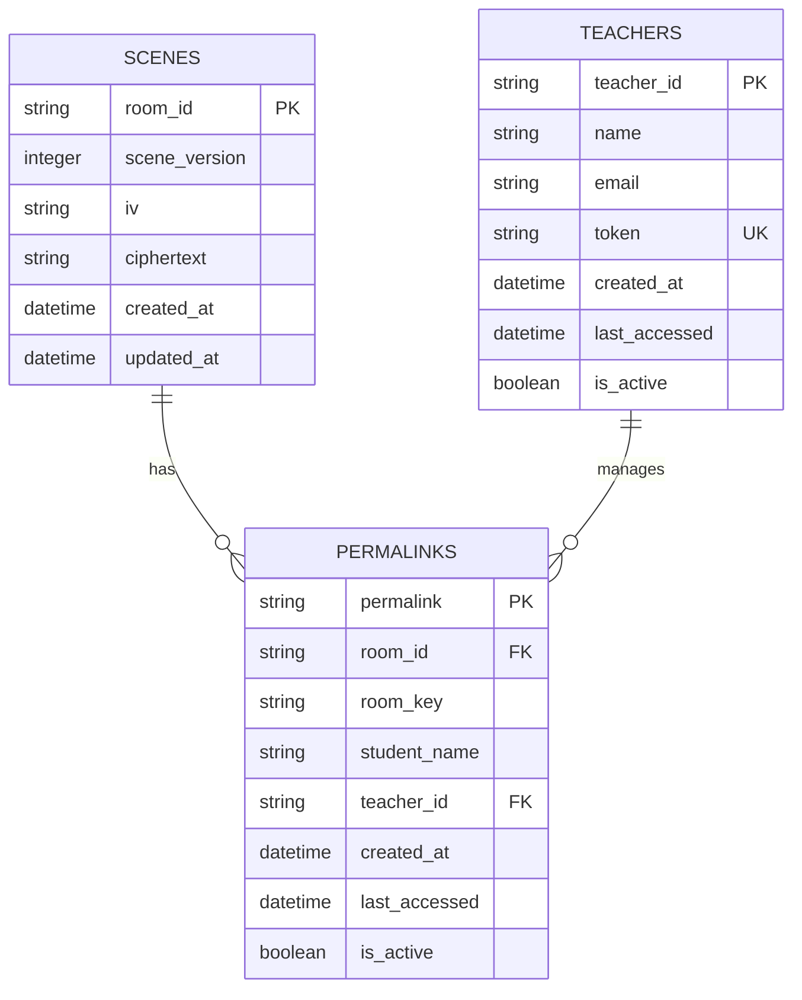
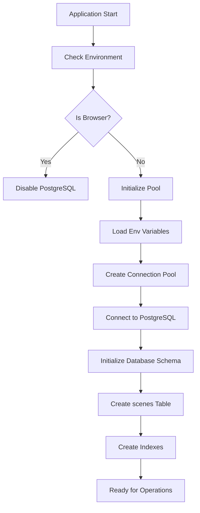
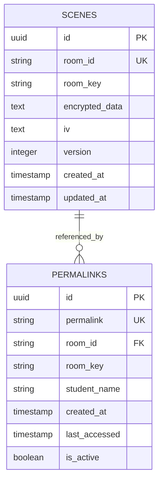
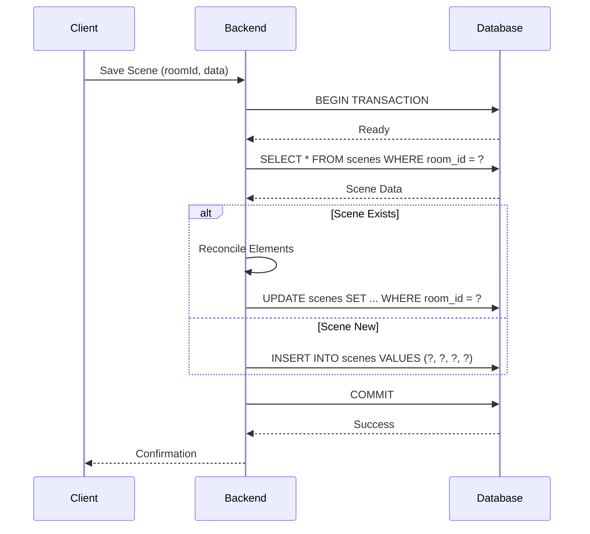
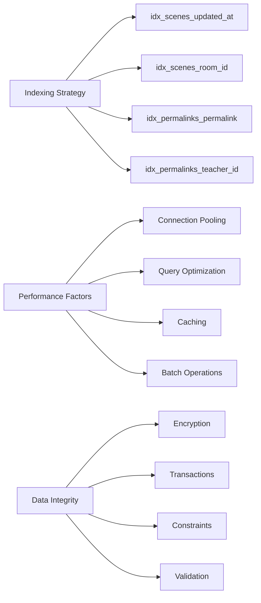

# Database Systems

<cite>
**Referenced Files in This Document**   
- [db.ts](file://Backned/src/db.ts)
- [routes.ts](file://Backned/src/routes.ts)
- [postgresql.ts](file://excalidraw/excalidraw-app/data/postgresql.ts)
- [localStorage.ts](file://excalidraw/excalidraw-app/data/localStorage.ts)
- [LocalData.ts](file://excalidraw/excalidraw-app/data/LocalData.ts)
- [init-db.sql](file://excalidraw/init-db.sql)
</cite>

## Table of Contents
1. [Introduction](#introduction)
2. [Database Technology Stack](#database-technology-stack)
3. [SQLite Implementation for Local Persistence](#sqlite-implementation-for-local-persistence)
4. [PostgreSQL Configuration for Production Deployments](#postgresql-configuration-for-production-deployments)
5. [localStorage Fallback Strategy](#localstorage-fallback-strategy)
6. [Database Schema Design](#database-schema-design)
7. [Migration Strategy](#migration-strategy)
8. [Query Patterns for Scene Storage and Retrieval](#query-patterns-for-scene-storage-and-retrieval)
9. [Data Access Layer, Connection Pooling, and Transaction Management](#data-access-layer-connection-pooling-and-transaction-management)
10. [Data Integrity, Backup Strategies, and Performance Optimization](#data-integrity-backup-strategies-and-performance-optimization)

## Introduction
Excalidraw employs a multi-layered database architecture designed to support both local development and scalable production deployments. The system integrates SQLite for lightweight local persistence, PostgreSQL for robust production-grade data storage, and localStorage as a client-side fallback mechanism. This document details the implementation, configuration, and interaction patterns across these storage layers, focusing on scene data management, schema design, and performance optimization strategies.

## Database Technology Stack
Excalidraw's database architecture is composed of three primary components:
- **SQLite**: Used in the backend for local development and lightweight deployments
- **PostgreSQL**: Employed in production environments for high availability and scalability
- **localStorage**: Serves as a client-side fallback for user preferences and temporary state

Each technology serves a distinct role in the application lifecycle, ensuring flexibility across deployment scenarios while maintaining data consistency and integrity.

**Section sources**
- [db.ts](file://Backned/src/db.ts)
- [postgresql.ts](file://excalidraw/excalidraw-app/data/postgresql.ts)
- [localStorage.ts](file://excalidraw/excalidraw-app/data/localStorage.ts)

## SQLite Implementation for Local Persistence
The SQLite implementation provides a lightweight, file-based database solution for local development and simple deployments. The backend uses the `sqlite3` npm package to manage database connections and operations.

Key features of the SQLite implementation:
- File-based storage with automatic creation of `excalidraw.db`
- Schema initialization via `initDb()` function that creates essential tables
- Support for scenes, permalinks, and teachers entities
- Indexing strategy for optimized query performance
- Integration with Express.js routes for RESTful API access

The SQLite database is initialized with three core tables: `scenes`, `permalinks`, and `teachers`. The `scenes` table stores encrypted Excalidraw scene data with versioning and timestamps, while `permalinks` manages shareable links with teacher-student relationships. The `teachers` table supports authentication and access control for educational use cases.

**Diagram sources**
- [db.ts](file://Backned/src/db.ts#L15-L41)
- [routes.ts](file://Backned/src/routes.ts#L100-L120)

**Section sources**
- [db.ts](file://Backned/src/db.ts#L1-L96)
- [routes.ts](file://Backned/src/routes.ts#L100-L365)

## PostgreSQL Configuration for Production Deployments
PostgreSQL serves as the primary database for production deployments, offering enhanced reliability, concurrency support, and enterprise-grade features. The configuration is environment-driven, with connection parameters sourced from environment variables.

Key configuration aspects:
- Connection pooling using the `pg.Pool` class
- Environment variable-based configuration for host, port, database, user, and password
- SSL configuration for production environments
- Automatic initialization of database tables and indexes
- Transaction management for data consistency

The PostgreSQL implementation includes a comprehensive initialization function that creates the `scenes` table with appropriate constraints and indexes. The connection string can be provided via `VITE_APP_DATABASE_URL` or individual components (host, port, database, user, password). In production mode, SSL is enabled with `rejectUnauthorized: false` to accommodate various certificate configurations.

**Diagram sources**
- [postgresql.ts](file://excalidraw/excalidraw-app/data/postgresql.ts#L20-L80)
- [init-db.sql](file://excalidraw/init-db.sql#L10-L30)

**Section sources**
- [postgresql.ts](file://excalidraw/excalidraw-app/data/postgresql.ts#L1-L282)
- [init-db.sql](file://excalidraw/init-db.sql#L1-L65)

## localStorage Fallback Strategy
The localStorage implementation provides client-side storage for user preferences and temporary state when server-based persistence is unavailable. This strategy ensures basic functionality even in offline scenarios or when backend services are unreachable.

Key components of the localStorage strategy:
- Storage of collaboration username via `saveUsernameToLocalStorage` and `importUsernameFromLocalStorage`
- Persistence of Excalidraw elements and application state
- Size tracking utilities for storage management
- Error handling for environments where localStorage is restricted

The implementation uses predefined storage keys from `app_constants` and handles serialization/deserialization of complex objects. Sensitive data is not stored in localStorage; instead, it focuses on user interface preferences and non-critical state information. The system includes error handling for cases where localStorage access is denied due to browser policies or quota limitations.

**Section sources**
- [localStorage.ts](file://excalidraw/excalidraw-app/data/localStorage.ts#L1-L102)
- [LocalData.ts](file://excalidraw/excalidraw-app/data/LocalData.ts#L1-L259)

## Database Schema Design
The database schema is designed to support Excalidraw's collaborative drawing features while maintaining data integrity and efficient query performance. Two primary schemas exist: one for SQLite (used in the backend) and one for PostgreSQL (used in production).

### SQLite Schema
The SQLite schema consists of three interconnected tables:
- **scenes**: Stores encrypted scene data with versioning
- **permalinks**: Manages shareable links with teacher-student relationships
- **teachers**: Supports authentication and access control

### PostgreSQL Schema
The PostgreSQL schema, defined in `init-db.sql`, includes additional enterprise features:
- UUID primary keys for enhanced security
- Triggers for automatic timestamp updates
- Comprehensive indexing strategy
- Extension support (uuid-ossp)

The schema design emphasizes data integrity through proper constraints and relationships. Both implementations use encryption at rest, storing sensitive scene data in encrypted form with separate initialization vectors (IV) for security.

**Diagram sources**
- [init-db.sql](file://excalidraw/init-db.sql#L10-L65)
- [db.ts](file://Backned/src/db.ts#L15-L41)

**Section sources**
- [init-db.sql](file://excalidraw/init-db.sql#L1-L65)
- [db.ts](file://Backned/src/db.ts#L15-L41)

## Migration Strategy
Excalidraw employs a pragmatic migration strategy that accommodates both development and production environments. The system includes mechanisms for schema evolution and data compatibility across versions.

Key migration features:
- Idempotent table creation using `CREATE TABLE IF NOT EXISTS`
- Index management with `CREATE INDEX IF NOT EXISTS`
- Column addition with error handling for existing columns
- Unique constraint management for backward compatibility

The SQLite implementation demonstrates a robust migration approach in the `initDb` function, which attempts to add new columns and indexes while gracefully handling cases where they already exist. This allows for seamless upgrades without data loss. The system also includes a mechanism to drop legacy indexes and create new ones with improved constraints, ensuring data integrity evolves with application requirements.

**Section sources**
- [db.ts](file://Backned/src/db.ts#L45-L90)

## Query Patterns for Scene Storage and Retrieval
Excalidraw implements consistent query patterns across its database layers, abstracting the underlying storage mechanism while maintaining performance and reliability.

### Scene Storage Pattern
The scene storage process follows a transactional pattern:
1. Begin transaction
2. Check for existing scene
3. Create or update scene record
4. Commit transaction
5. Handle errors with rollback

This pattern ensures data consistency, particularly important in collaborative environments where multiple users might modify the same scene.

### Scene Retrieval Pattern
Scene retrieval follows a simple but effective pattern:
1. Query for scene by room ID
2. Return data if found
3. Handle missing scenes gracefully
4. Update access timestamps for analytics

The system uses parameterized queries to prevent SQL injection and employs connection pooling for improved performance under load.

**Diagram sources**
- [routes.ts](file://Backned/src/routes.ts#L40-L80)
- [postgresql.ts](file://excalidraw/excalidraw-app/data/postgresql.ts#L150-L220)

**Section sources**
- [routes.ts](file://Backned/src/routes.ts#L40-L365)
- [postgresql.ts](file://excalidraw/excalidraw-app/data/postgresql.ts#L100-L282)

## Data Access Layer, Connection Pooling, and Transaction Management
Excalidraw's data access layer provides a consistent interface across different storage backends while leveraging the strengths of each technology.

### Data Access Layer
The data access layer is implemented through dedicated modules:
- `db.ts`: SQLite interface with promisified methods
- `postgresql.ts`: PostgreSQL interface with connection pooling
- `localStorage.ts`: Browser storage interface

Each layer abstracts the underlying database specifics, providing a uniform API for scene operations.

### Connection Pooling
PostgreSQL implementation uses connection pooling via `pg.Pool` to:
- Reuse database connections
- Limit concurrent connections
- Improve performance under load
- Manage connection lifecycle

The pool is initialized lazily and configured with environment-specific parameters, ensuring optimal performance in both development and production environments.

### Transaction Management
Transaction management is implemented differently across storage layers:
- **SQLite**: Uses explicit `BEGIN`/`COMMIT`/`ROLLBACK` in route handlers
- **PostgreSQL**: Implements full transaction support with error handling
- **localStorage**: Not applicable (client-side storage)

The PostgreSQL implementation demonstrates robust transaction management with try-catch blocks that ensure proper rollback on errors, maintaining data integrity during concurrent operations.

**Section sources**
- [db.ts](file://Backned/src/db.ts#L1-L96)
- [postgresql.ts](file://excalidraw/excalidraw-app/data/postgresql.ts#L70-L282)
- [routes.ts](file://Backned/src/routes.ts#L40-L365)

## Data Integrity, Backup Strategies, and Performance Optimization
Excalidraw implements comprehensive strategies to ensure data integrity, enable reliable backups, and optimize performance across its database systems.

### Data Integrity
Data integrity is maintained through:
- Encryption at rest for scene data
- Foreign key relationships where applicable
- Unique constraints on critical fields
- Validation in application logic
- Transactional updates to prevent partial writes

The system uses AES-GCM encryption with unique IVs for each scene, ensuring confidentiality and integrity of user data.

### Backup Strategies
While explicit backup mechanisms are not detailed in the code, the architecture supports several backup approaches:
- File-based backups for SQLite (simple file copy)
- pg_dump for PostgreSQL
- Regular database dumps via external scripts
- Cloud provider snapshots (for hosted deployments)

The use of standardized SQL databases enables integration with existing backup solutions.

### Performance Optimization
Performance is optimized through:
- Strategic indexing on frequently queried fields
- Connection pooling for database efficiency
- Caching of scene versions in memory
- Batch operations where applicable
- Efficient query patterns

The system creates indexes on `updated_at` for cleanup operations and `room_id` for fast lookups. The PostgreSQL implementation includes additional indexes and uses UUIDs for improved distribution and query performance.

**Diagram sources**
- [init-db.sql](file://excalidraw/init-db.sql#L35-L65)
- [db.ts](file://Backned/src/db.ts#L70-L90)
- [postgresql.ts](file://excalidraw/excalidraw-app/data/postgresql.ts#L250-L282)

**Section sources**
- [init-db.sql](file://excalidraw/init-db.sql#L1-L65)
- [db.ts](file://Backned/src/db.ts#L1-L96)
- [postgresql.ts](file://excalidraw/excalidraw-app/data/postgresql.ts#L1-L282)