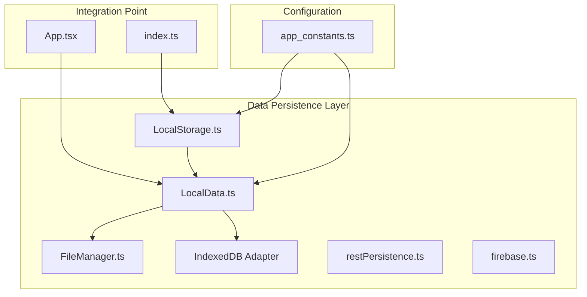
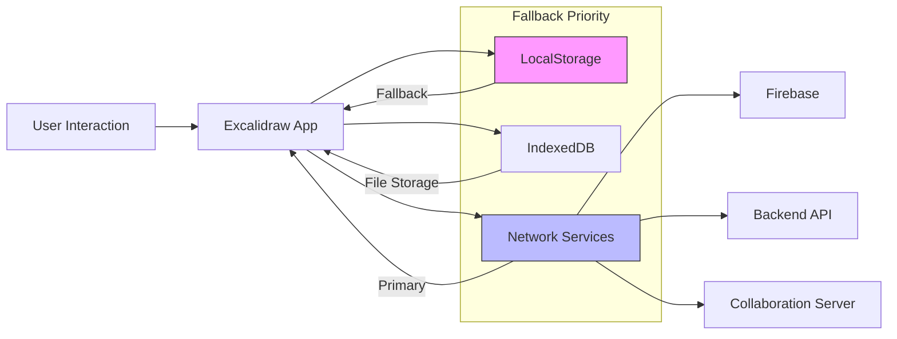
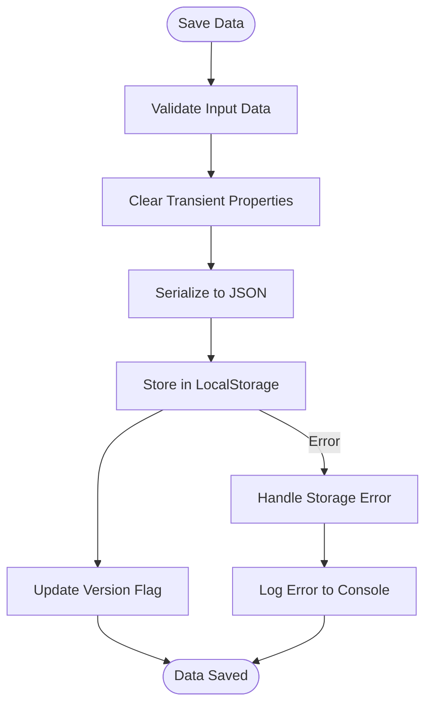
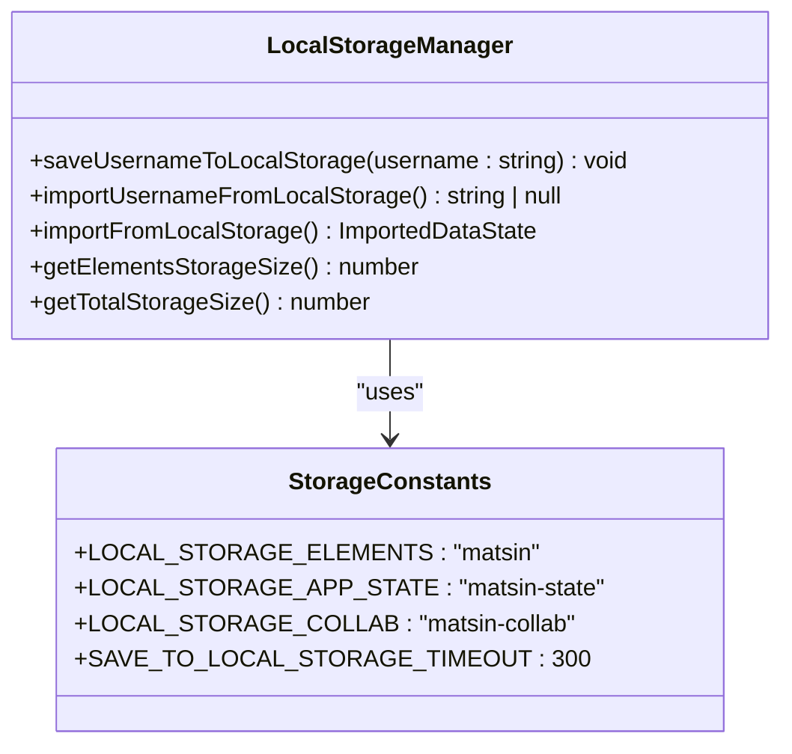
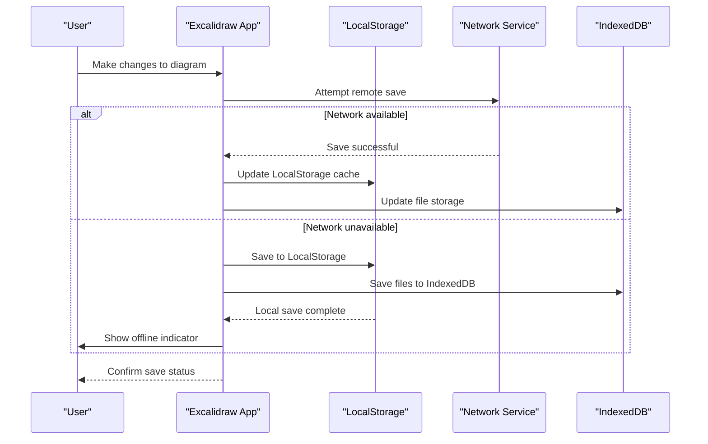
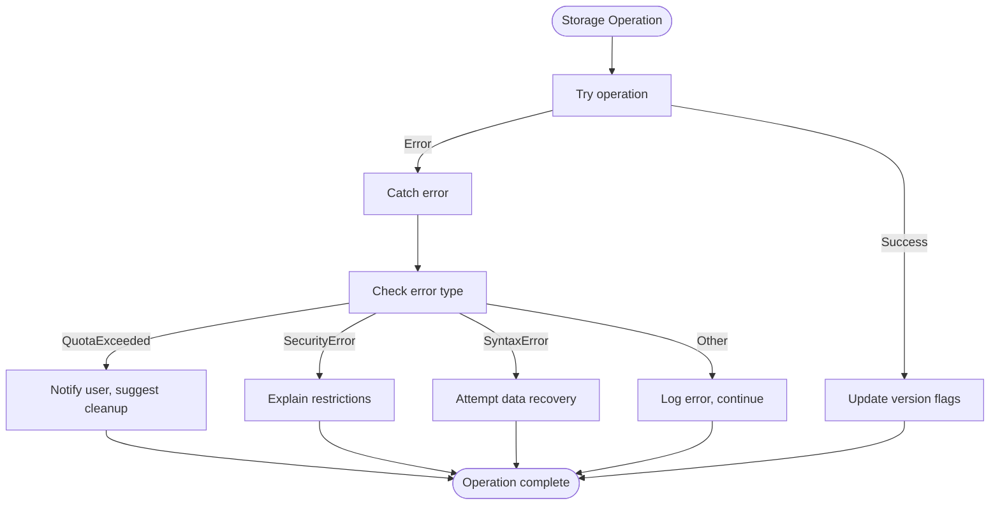

# LocalStorage Fallback Strategy

<cite>
**Referenced Files in This Document**   
- [localStorage.ts](file://excalidraw-app/data/localStorage.ts)
- [LocalData.ts](file://excalidraw-app/data/LocalData.ts)
- [index.ts](file://excalidraw-app/data/index.ts)
- [app_constants.ts](file://excalidraw-app/app_constants.ts)
- [App.tsx](file://excalidraw-app/App.tsx)
</cite>

## Table of Contents
1. [Introduction](#introduction)
2. [Project Structure](#project-structure)
3. [Core Components](#core-components)
4. [Architecture Overview](#architecture-overview)
5. [Detailed Component Analysis](#detailed-component-analysis)
6. [Dependency Analysis](#dependency-analysis)
7. [Performance Considerations](#performance-considerations)
8. [Troubleshooting Guide](#troubleshooting-guide)
9. [Conclusion](#conclusion)

## Introduction
This document details the LocalStorage fallback strategy implemented in the Excalidraw frontend application. The system provides client-side persistence when network services are unavailable, ensuring users can continue working on diagrams without interruption. The strategy integrates with multiple persistence mechanisms including Firebase, backend APIs, and IndexedDB, with LocalStorage serving as the primary fallback when other services fail or are inaccessible. The implementation handles serialization, quota management, data expiration, and synchronization challenges while maintaining a seamless user experience.

## Project Structure
The LocalStorage functionality is organized within the `excalidraw-app/data` directory, which contains specialized modules for different storage mechanisms. The core LocalStorage implementation is separated from other persistence layers to maintain clear responsibilities and enable independent operation when network services are unavailable.



**Diagram sources**
- [localStorage.ts](file://excalidraw-app/data/localStorage.ts)
- [LocalData.ts](file://excalidraw-app/data/LocalData.ts)
- [app_constants.ts](file://excalidraw-app/app_constants.ts)

**Section sources**
- [localStorage.ts](file://excalidraw-app/data/localStorage.ts)
- [LocalData.ts](file://excalidraw-app/data/LocalData.ts)
- [app_constants.ts](file://excalidraw-app/app_constants.ts)

## Core Components
The LocalStorage fallback strategy consists of several core components that work together to provide reliable client-side persistence. The system is designed with a layered architecture where LocalStorage serves as the immediate fallback when network-based persistence mechanisms fail. The implementation includes specialized functions for data serialization, storage size monitoring, and error handling to ensure robust operation under various conditions.

**Section sources**
- [localStorage.ts](file://excalidraw-app/data/localStorage.ts#L1-L102)
- [LocalData.ts](file://excalidraw-app/data/LocalData.ts#L1-L259)

## Architecture Overview
The LocalStorage fallback architecture is designed as a multi-layered persistence system where data flows through different storage mechanisms based on availability and requirements. When network services are available, data is synchronized with remote endpoints while being cached locally. When network services are unavailable, the system seamlessly falls back to LocalStorage, ensuring uninterrupted user experience. The architecture includes mechanisms for data synchronization, conflict resolution, and quota management to handle the limitations of browser storage.



**Diagram sources**
- [localStorage.ts](file://excalidraw-app/data/localStorage.ts)
- [LocalData.ts](file://excalidraw-app/data/LocalData.ts)
- [index.ts](file://excalidraw-app/data/index.ts)

## Detailed Component Analysis

### LocalStorage Implementation
The LocalStorage implementation provides essential functions for saving and retrieving diagram data when network services are unavailable. The system uses JSON serialization to store elements and application state, with error handling to manage cases where LocalStorage access is restricted or quota limits are exceeded.

#### Data Serialization and Storage


**Diagram sources**
- [localStorage.ts](file://excalidraw-app/data/localStorage.ts#L49-L100)
- [LocalData.ts](file://excalidraw-app/data/LocalData.ts#L47-L79)

#### Storage Size Management
The system includes functions to monitor LocalStorage usage, helping prevent quota exceeded errors that could disrupt user workflows. This is particularly important for large diagrams that may approach browser storage limits.



**Diagram sources**
- [localStorage.ts](file://excalidraw-app/data/localStorage.ts)
- [app_constants.ts](file://excalidraw-app/app_constants.ts)

### Data Synchronization and Fallback Logic
The integration between LocalStorage and the main data layer is managed through the LocalData class, which coordinates persistence across multiple storage mechanisms. The system implements a sophisticated fallback strategy that prioritizes network services when available but seamlessly switches to LocalStorage when connectivity is lost.

#### Fallback Sequence Diagram


**Diagram sources**
- [LocalData.ts](file://excalidraw-app/data/LocalData.ts)
- [index.ts](file://excalidraw-app/data/index.ts)

### Error Handling and Conflict Resolution
The system implements comprehensive error handling to manage various failure scenarios that can occur with browser storage. When conflicts arise between local and remote data, the system follows a defined resolution strategy to maintain data integrity.

#### Error Handling Flowchart


**Diagram sources**
- [localStorage.ts](file://excalidraw-app/data/localStorage.ts)
- [LocalData.ts](file://excalidraw-app/data/LocalData.ts)

**Section sources**
- [localStorage.ts](file://excalidraw-app/data/localStorage.ts#L1-L102)
- [LocalData.ts](file://excalidraw-app/data/LocalData.ts#L1-L259)

## Dependency Analysis
The LocalStorage fallback strategy depends on several key components and configuration values to function correctly. The system is designed to be resilient, with minimal dependencies that could cause failure when network services are unavailable.

```mermaid
dependency-graph
LocalStorage --> appState
LocalStorage --> elements
LocalStorage --> app_constants
LocalStorage --> FileManager
LocalData --> LocalStorage
LocalData --> Locker
LocalData --> tabSync
App --> LocalData
index --> LocalStorage
```

**Diagram sources**
- [localStorage.ts](file://excalidraw-app/data/localStorage.ts)
- [LocalData.ts](file://excalidraw-app/data/LocalData.ts)
- [app_constants.ts](file://excalidraw-app/app_constants.ts)

**Section sources**
- [localStorage.ts](file://excalidraw-app/data/localStorage.ts#L1-L102)
- [LocalData.ts](file://excalidraw-app/data/LocalData.ts#L1-L259)
- [app_constants.ts](file://excalidraw-app/app_constants.ts#L1-L60)

## Performance Considerations
The LocalStorage implementation includes several performance optimizations to ensure responsive operation even with large diagrams. The system uses debounced saving to prevent excessive write operations, which could impact performance and reach storage quotas more quickly. Data is cleared of transient properties before storage to minimize size, and storage size is monitored to prevent quota exceeded errors.

For large diagrams, the system separates file storage (images, etc.) into IndexedDB while keeping the core diagram data in LocalStorage. This separation allows for more efficient storage management and prevents LocalStorage from being filled with large binary data. The implementation also includes mechanisms to clear obsolete files from storage after 24 hours if they are no longer used in any diagrams.

**Section sources**
- [LocalData.ts](file://excalidraw-app/data/LocalData.ts#L47-L79)
- [LocalData.ts](file://excalidraw-app/data/LocalData.ts#L200-L250)

## Troubleshooting Guide
When diagnosing issues with the LocalStorage fallback strategy, consider the following common problems and solutions:

**Section sources**
- [localStorage.ts](file://excalidraw-app/data/localStorage.ts#L1-L102)
- [LocalData.ts](file://excalidraw-app/data/LocalData.ts#L1-L259)

### Common Issues and Solutions
- **LocalStorage quota exceeded**: The system may fail to save when the browser's LocalStorage quota is exceeded. Users should clear browser data or remove unused diagrams.
- **Incognito/private mode restrictions**: Some browsers restrict LocalStorage in private browsing modes. Users should use regular browsing mode for full functionality.
- **Cross-origin restrictions**: LocalStorage is subject to same-origin policy. The application must be served from a consistent origin.
- **Synchronization conflicts**: When reconnecting after offline work, conflicts between local and remote data may occur. The system prioritizes the most recent changes.

### Debugging Steps
1. Check browser console for LocalStorage errors
2. Verify storage keys are correctly defined in app_constants.ts
3. Monitor storage usage with getTotalStorageSize()
4. Test fallback behavior by disabling network connectivity
5. Verify version flags are updated after successful saves

## Conclusion
The LocalStorage fallback strategy in Excalidraw provides a robust solution for client-side persistence when network services are unavailable. By implementing a layered architecture with clear separation of concerns, the system ensures users can continue working on their diagrams without interruption. The strategy effectively balances the limitations of browser storage with the need for reliable data persistence, using LocalStorage as a critical fallback mechanism when primary network-based services fail. The implementation includes comprehensive error handling, quota management, and data synchronization logic to maintain data integrity across different storage mechanisms.