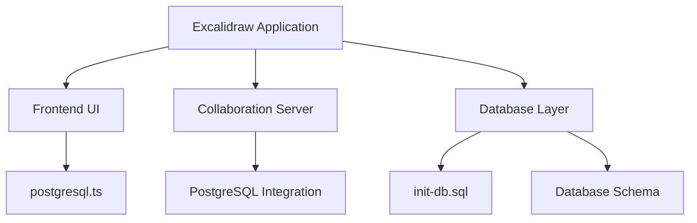
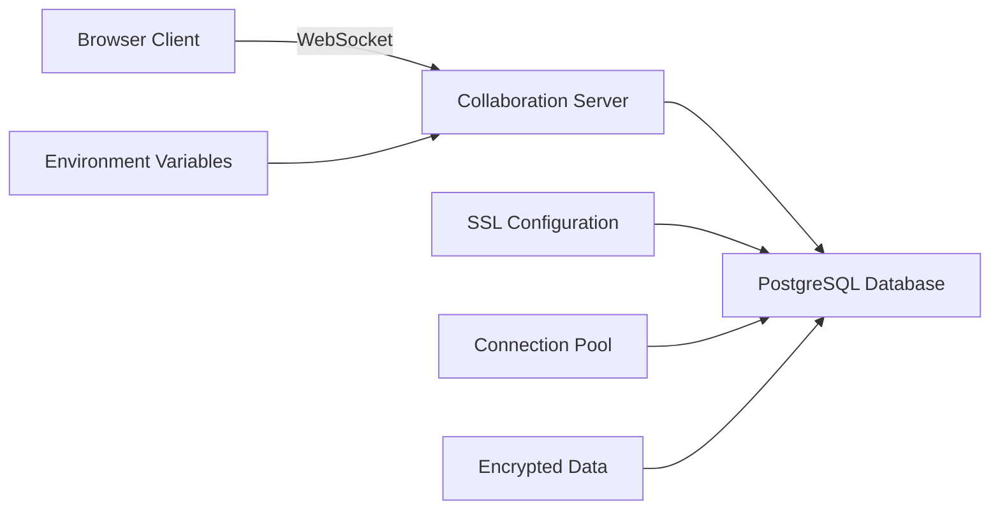
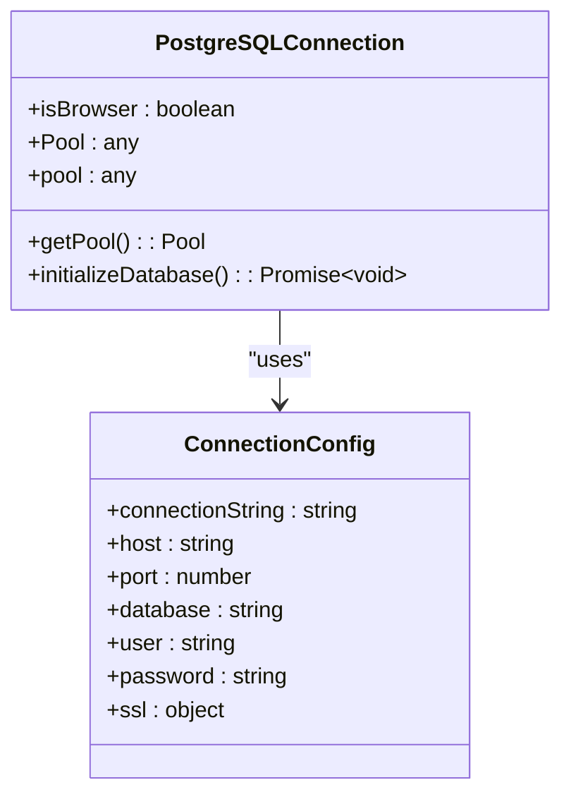
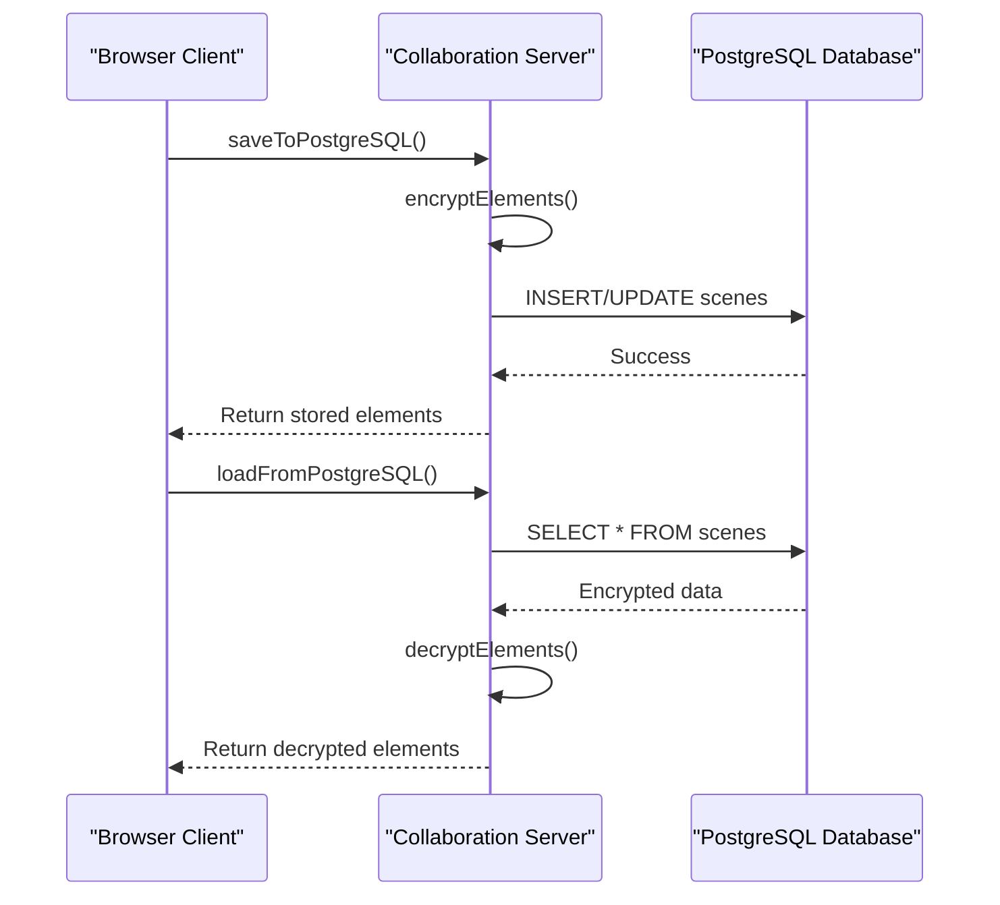
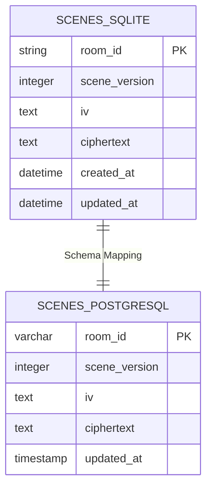
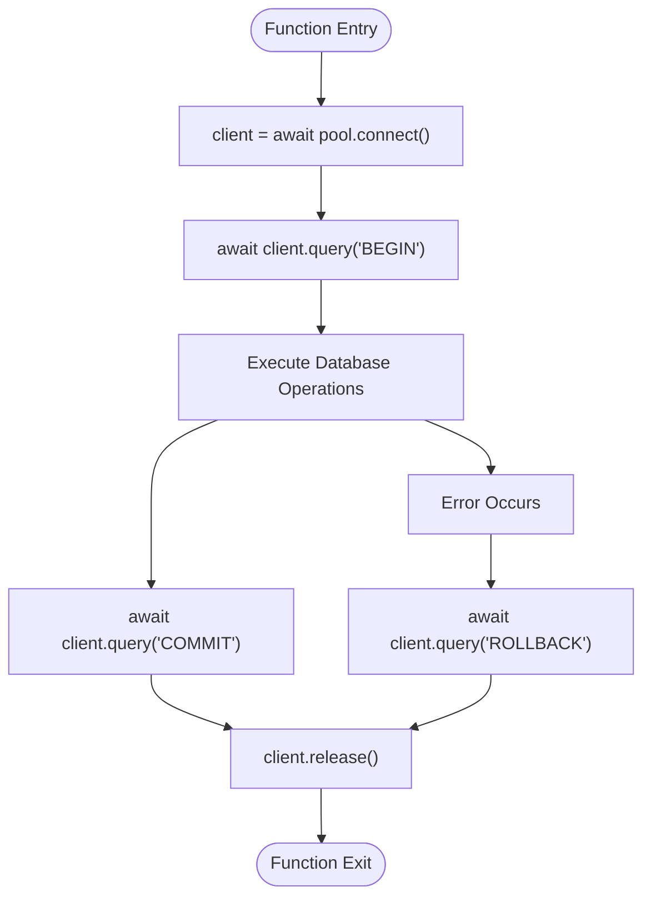
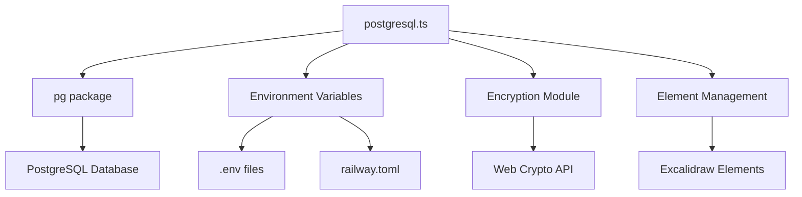
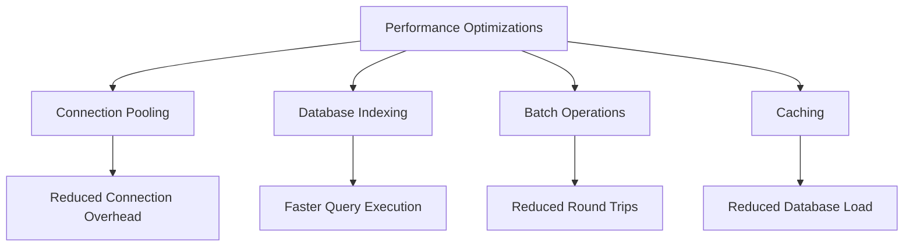

# PostgreSQL Configuration

<cite>
**Referenced Files in This Document**   
- [postgresql.ts](file://excalidraw/excalidraw-app/data/postgresql.ts)
- [docker-compose.yml](file://excalidraw/docker-compose.yml)
- [init-db.sql](file://excalidraw/init-db.sql)
- [railway.toml](file://excalidraw/railway.toml)
- [Backned/src/db.ts](file://Backned/src/db.ts)
</cite>

## Table of Contents
1. [Introduction](#introduction)
2. [Project Structure](#project-structure)
3. [Core Components](#core-components)
4. [Architecture Overview](#architecture-overview)
5. [Detailed Component Analysis](#detailed-component-analysis)
6. [Dependency Analysis](#dependency-analysis)
7. [Performance Considerations](#performance-considerations)
8. [Troubleshooting Guide](#troubleshooting-guide)
9. [Conclusion](#conclusion)

## Introduction
This document provides comprehensive documentation for the PostgreSQL configuration in the Excalidraw application. It details how the `postgresql.ts` module manages database connections, client pools, and environment-based configuration for production deployments. The document explains the migration strategy from SQLite to PostgreSQL, including schema compatibility and data type mappings. It covers connection lifecycle management, error recovery, and timeout handling. Examples of environment variable setup, SSL configuration, and integration with containerized deployments via `docker-compose.yml` are provided. The documentation also addresses scalability considerations, replication support, and monitoring best practices for production use.

## Project Structure
The Excalidraw application has a multi-repository structure with distinct components for the frontend, collaboration server, and database management. The PostgreSQL configuration is primarily handled in the `excalidraw-app` module, with supporting infrastructure in the `excalidraw-room` collaboration server and database initialization scripts.

**Diagram sources**
- [postgresql.ts](file://excalidraw/excalidraw-app/data/postgresql.ts)
- [init-db.sql](file://excalidraw/init-db.sql)

**Section sources**
- [postgresql.ts](file://excalidraw/excalidraw-app/data/postgresql.ts)
- [docker-compose.yml](file://excalidraw/docker-compose.yml)

## Core Components
The core components of the PostgreSQL configuration in Excalidraw include the connection management in `postgresql.ts`, the database schema definition in `init-db.sql`, and the containerized deployment configuration in `docker-compose.yml`. The system is designed to support persistent room storage with encryption and versioning capabilities.

**Section sources**
- [postgresql.ts](file://excalidraw/excalidraw-app/data/postgresql.ts)
- [init-db.sql](file://excalidraw/init-db.sql)
- [docker-compose.yml](file://excalidraw/docker-compose.yml)

## Architecture Overview
The PostgreSQL architecture in Excalidraw follows a client-server model with the frontend application communicating with a collaboration server that manages database connections. The system uses connection pooling for efficient database access and implements encryption for data at rest.

**Diagram sources**
- [postgresql.ts](file://excalidraw/excalidraw-app/data/postgresql.ts)
- [railway.toml](file://excalidraw/railway.toml)

## Detailed Component Analysis

### PostgreSQL Connection Management
The `postgresql.ts` module implements connection management through a singleton pattern that creates a connection pool when needed. The connection configuration is environment-aware, supporting different settings for development and production deployments.

**Diagram sources**
- [postgresql.ts](file://excalidraw/excalidraw-app/data/postgresql.ts#L0-L70)

**Section sources**
- [postgresql.ts](file://excalidraw/excalidraw-app/data/postgresql.ts#L0-L70)

### Data Persistence and Encryption
The system implements end-to-end encryption for stored scenes, with data encrypted client-side before being stored in the PostgreSQL database. The encryption uses a room-specific key to ensure data privacy.

**Diagram sources**
- [postgresql.ts](file://excalidraw/excalidraw-app/data/postgresql.ts#L72-L111)
- [postgresql.ts](file://excalidraw/excalidraw-app/data/postgresql.ts#L113-L158)

**Section sources**
- [postgresql.ts](file://excalidraw/excalidraw-app/data/postgresql.ts#L72-L158)

### Schema Migration from SQLite to PostgreSQL
The migration from SQLite to PostgreSQL involves schema transformation and data type mapping. The system maintains compatibility between the two database systems through consistent data structures and type definitions.

**Diagram sources**
- [init-db.sql](file://excalidraw/init-db.sql#L10-L25)
- [Backned/src/db.ts](file://Backned/src/db.ts#L20-L30)

**Section sources**
- [init-db.sql](file://excalidraw/init-db.sql)
- [Backned/src/db.ts](file://Backned/src/db.ts)

### Connection Lifecycle Management
The connection lifecycle is managed through proper resource allocation and cleanup. The system uses try-catch-finally blocks to ensure connections are properly released back to the pool.

**Diagram sources**
- [postgresql.ts](file://excalidraw/excalidraw-app/data/postgresql.ts#L158-L199)

**Section sources**
- [postgresql.ts](file://excalidraw/excalidraw-app/data/postgresql.ts#L158-L199)

## Dependency Analysis
The PostgreSQL configuration depends on several external packages and environment variables. The system uses the `pg` package for PostgreSQL connectivity and integrates with environment-specific configurations.

**Diagram sources**
- [postgresql.ts](file://excalidraw/excalidraw-app/data/postgresql.ts)
- [railway.toml](file://excalidraw/railway.toml)

**Section sources**
- [postgresql.ts](file://excalidraw/excalidraw-app/data/postgresql.ts)
- [railway.toml](file://excalidraw/railway.toml)

## Performance Considerations
The PostgreSQL configuration includes several performance optimizations, including connection pooling, indexing, and efficient query patterns. The system is designed to handle high-concurrency scenarios typical of collaborative drawing applications.

**Diagram sources**
- [postgresql.ts](file://excalidraw/excalidraw-app/data/postgresql.ts)
- [RAILWAY_DEPLOYMENT.md](file://excalidraw/RAILWAY_DEPLOYMENT.md#L138-L143)

**Section sources**
- [postgresql.ts](file://excalidraw/excalidraw-app/data/postgresql.ts)
- [RAILWAY_DEPLOYMENT.md](file://excalidraw/RAILWAY_DEPLOYMENT.md)

## Troubleshooting Guide
Common issues with the PostgreSQL configuration include connection failures, SSL configuration problems, and schema initialization errors. This section provides guidance for diagnosing and resolving these issues.

**Section sources**
- [postgresql.ts](file://excalidraw/excalidraw-app/data/postgresql.ts)
- [docker-compose.yml](file://excalidraw/docker-compose.yml)
- [issue.md](file://issue.md)

## Conclusion
The PostgreSQL configuration in Excalidraw provides a robust foundation for persistent storage of collaborative drawings. The system implements secure, encrypted storage with efficient connection management and scalability features. While the current implementation has some architectural inconsistencies between the SQLite and PostgreSQL backends, it provides a solid foundation for production deployments. The configuration supports containerized deployment, SSL encryption, and connection pooling for optimal performance.