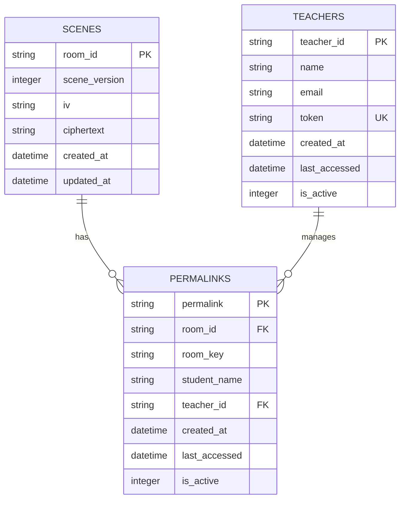
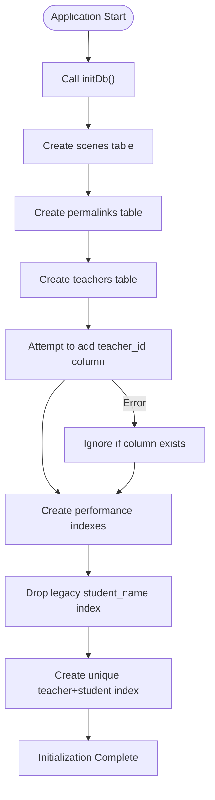
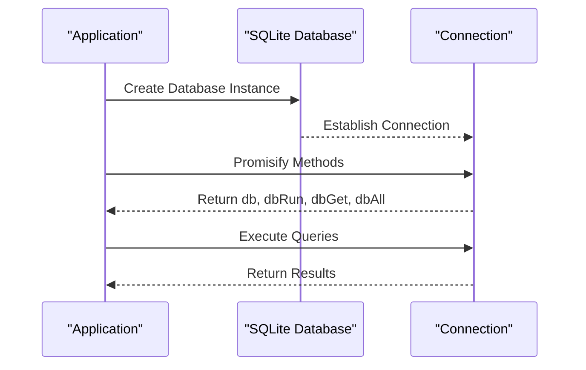
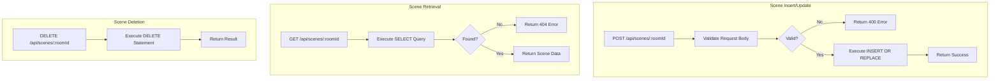
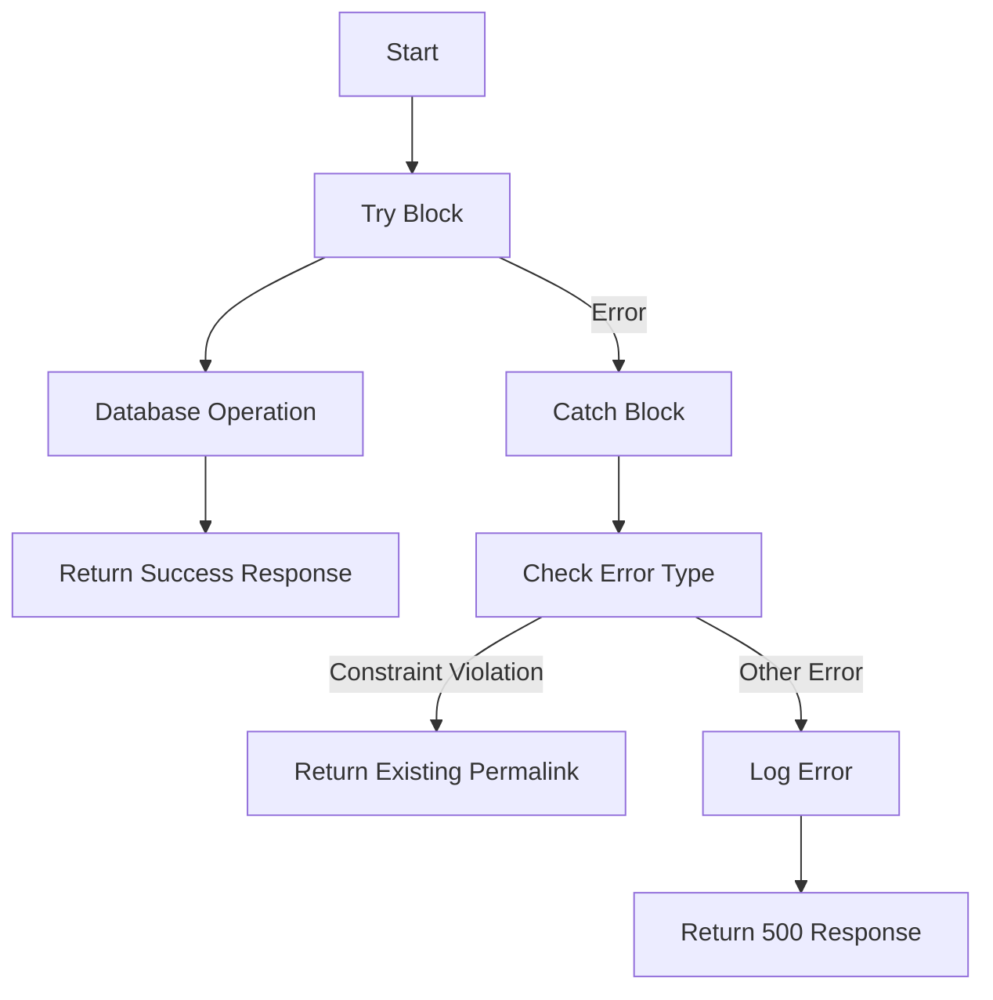
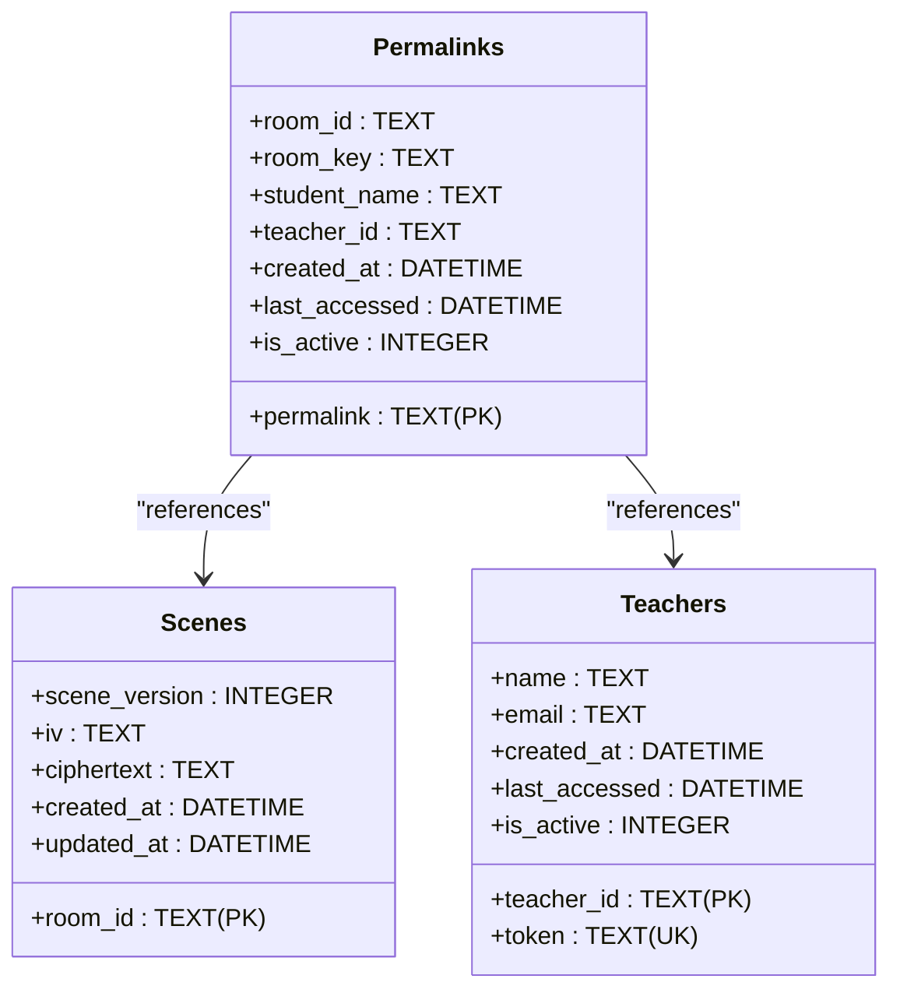
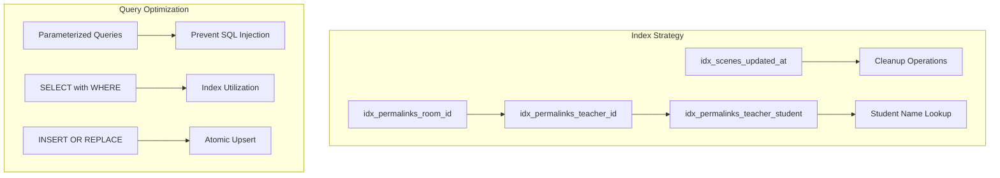
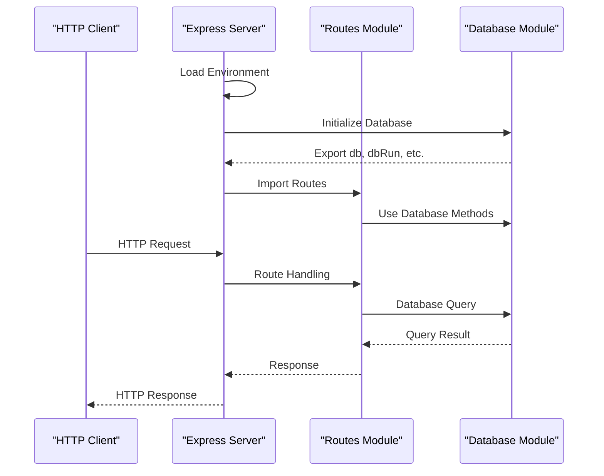

# SQLite Implementation

<cite>
**Referenced Files in This Document**   
- [init-db.sql](file://excalidraw/init-db.sql)
- [db.ts](file://Backned/src/db.ts)
- [routes.ts](file://Backned/src/routes.ts)
- [server.ts](file://Backned/src/server.ts)
</cite>

## Table of Contents
1. [Introduction](#introduction)
2. [Database Schema Design](#database-schema-design)
3. [Database Initialization Process](#database-initialization-process)
4. [Connection Handling and Query Execution](#connection-handling-and-query-execution)
5. [CRUD Operations for Scenes](#crud-operations-for-scenes)
6. [Transaction Usage and Error Handling](#transaction-usage-and-error-handling)
7. [Data Integrity Constraints](#data-integrity-constraints)
8. [Performance Considerations](#performance-considerations)
9. [Integration with Express.js Server](#integration-with-expressjs-server)
10. [Conclusion](#conclusion)

## Introduction
This document provides a comprehensive analysis of the SQLite implementation used in the Excalidraw backend. It covers the database schema design, initialization process, connection handling, query execution patterns, and integration with the Express.js server. The implementation supports persistence for collaborative drawing sessions through REST API endpoints, with specific focus on scenes, permalinks, and teacher management functionality.

**Section sources**
- [init-db.sql](file://excalidraw/init-db.sql#L1-L65)
- [db.ts](file://Backned/src/db.ts#L1-L96)

## Database Schema Design
The SQLite database schema consists of three core tables: scenes, permalinks, and teachers. The scenes table stores encrypted drawing data with room identifiers and cryptographic metadata. The permalinks table manages student access links with references to room information and optional student names. The teachers table maintains teacher accounts with authentication tokens for administrative access.

**Diagram sources**
- [init-db.sql](file://excalidraw/init-db.sql#L1-L65)
- [db.ts](file://Backned/src/db.ts#L15-L41)

**Section sources**
- [init-db.sql](file://excalidraw/init-db.sql#L1-L65)
- [db.ts](file://Backned/src/db.ts#L15-L41)

## Database Initialization Process
The database initialization process creates all necessary tables and indexes when the application starts. The initDb function in db.ts handles this process, creating the scenes, permalinks, and teachers tables with appropriate columns and constraints. The initialization includes special handling for schema migrations, such as adding the teacher_id column to existing permalinks tables and managing index changes for improved data integrity.

**Diagram sources**
- [db.ts](file://Backned/src/db.ts#L15-L95)

**Section sources**
- [db.ts](file://Backned/src/db.ts#L15-L95)

## Connection Handling and Query Execution
The database connection is established using the sqlite3 module with configuration from environment variables. The implementation uses promisified versions of the database methods (dbRun, dbGet, dbAll) for asynchronous operations. Connection pooling is not explicitly implemented, relying on SQLite's built-in concurrency handling for the expected workload.

**Diagram sources**
- [db.ts](file://Backned/src/db.ts#L1-L14)

**Section sources**
- [db.ts](file://Backned/src/db.ts#L1-L14)

## CRUD Operations for Scenes
Scene operations follow a standard CRUD pattern with specific implementations for insertion, retrieval, and deletion. Scenes are inserted or updated using the INSERT OR REPLACE statement to handle both create and update operations atomically. Retrieval operations use parameterized queries to prevent SQL injection, while deletion is handled through standard DELETE statements.

**Diagram sources**
- [routes.ts](file://Backned/src/routes.ts#L50-L75)

**Section sources**
- [routes.ts](file://Backned/src/routes.ts#L50-L75)

## Transaction Usage and Error Handling
The implementation uses implicit transactions for individual operations rather than explicit transaction blocks. Each database operation is wrapped in try-catch blocks to handle errors gracefully. The error handling strategy includes specific handling for constraint violations, particularly for the unique index on teacher-student combinations in permalinks.

**Diagram sources**
- [routes.ts](file://Backned/src/routes.ts#L65-L75)
- [routes.ts](file://Backned/src/routes.ts#L130-L165)

**Section sources**
- [routes.ts](file://Backned/src/routes.ts#L65-L75)
- [routes.ts](file://Backned/src/routes.ts#L130-L165)

## Data Integrity Constraints
The database enforces data integrity through primary keys, unique constraints, and conditional unique indexes. The scenes table uses room_id as a primary key to ensure single instance per room. The permalinks table has a composite unique constraint on teacher_id and student_name when both are present, preventing duplicate student names within a teacher's collection.

**Diagram sources**
- [db.ts](file://Backned/src/db.ts#L15-L41)
- [init-db.sql](file://excalidraw/init-db.sql#L1-L65)

**Section sources**
- [db.ts](file://Backned/src/db.ts#L15-L41)
- [init-db.sql](file://excalidraw/init-db.sql#L1-L65)

## Performance Considerations
The implementation includes several performance optimizations, primarily through strategic indexing. Indexes are created on frequently queried columns such as updated_at in the scenes table and room_id in the permalinks table. The conditional unique index on teacher_id and student_name improves lookup performance for active student links while maintaining data integrity.

**Diagram sources**
- [db.ts](file://Backned/src/db.ts#L50-L65)

**Section sources**
- [db.ts](file://Backned/src/db.ts#L50-L65)

## Integration with Express.js Server
The SQLite database integrates with the Express.js server through a modular architecture. The database module exports connection and query methods that are used by the routes module to handle HTTP requests. The server initializes the database connection during startup and registers routes that interact with the database for persistence operations.

**Diagram sources**
- [server.ts](file://Backned/src/server.ts#L1-L36)
- [routes.ts](file://Backned/src/routes.ts#L1-L365)

**Section sources**
- [server.ts](file://Backned/src/server.ts#L1-L36)
- [routes.ts](file://Backned/src/routes.ts#L1-L365)

## Conclusion
The SQLite implementation in the Excalidraw backend provides a robust persistence layer for collaborative drawing sessions. The schema design effectively supports the core requirements of scene storage, permalink management, and teacher administration. The initialization process handles schema creation and migration gracefully, while the query execution patterns ensure data integrity and performance. The integration with Express.js follows a clean separation of concerns, with well-defined interfaces between the database layer and API routes. This implementation balances simplicity with functionality, providing reliable persistence for the application's collaborative features.