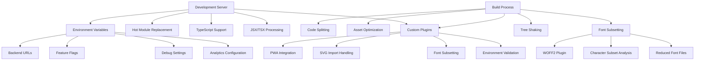
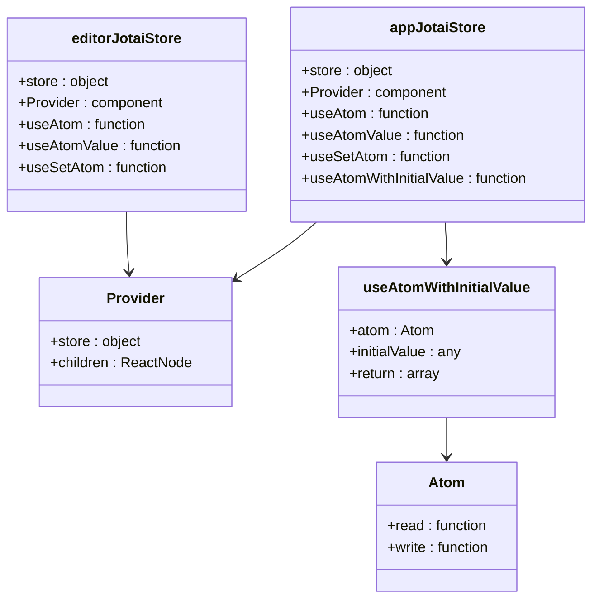
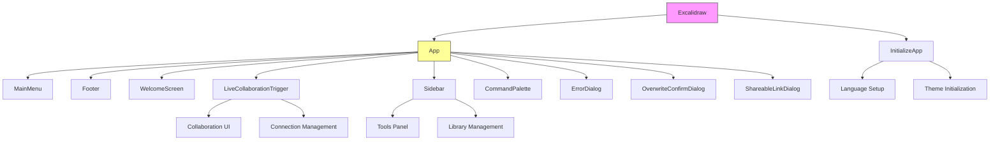

# Frontend Technologies

<cite>
**Referenced Files in This Document**   
- [index.tsx](file://excalidraw/packages/excalidraw/index.tsx)
- [App.tsx](file://excalidraw/excalidraw-app/App.tsx)
- [app-jotai.ts](file://excalidraw/excalidraw-app/app-jotai.ts)
- [editor-jotai.ts](file://excalidraw/packages/excalidraw/editor-jotai.ts)
- [useCallbackRefState.ts](file://excalidraw/packages/excalidraw/hooks/useCallbackRefState.ts)
- [vite-env.d.ts](file://excalidraw/packages/excalidraw/vite-env.d.ts)
- [tsconfig.json](file://excalidraw/packages/excalidraw/tsconfig.json)
</cite>

## Table of Contents
1. [Introduction](#introduction)
2. [React Component Architecture](#react-component-architecture)
3. [TypeScript Configuration and Type System](#typescript-configuration-and-type-system)
4. [Vite Build Tooling and Custom Plugins](#vite-build-tooling-and-custom-plugins)
5. [Jotai State Management Implementation](#jotai-state-management-implementation)
6. [Hand-Drawn Style Rendering and Responsive Design](#hand-drawn-style-rendering-and-responsive-design)
7. [Component Hierarchy and Code Splitting](#component-hierarchy-and-code-splitting)
8. [Performance Optimization Techniques](#performance-optimization-techniques)
9. [Development Workflow and Hot Module Replacement](#development-workflow-and-hot-module-replacement)
10. [Bundle Optimization Strategies](#bundle-optimization-strategies)

## Introduction
The Excalidraw application leverages a modern frontend technology stack centered around React, TypeScript, Vite, and Jotai to deliver a collaborative whiteboard experience with hand-drawn style rendering. This document details how these technologies work together to enable real-time collaboration, responsive design, and optimal performance. The architecture emphasizes type safety, efficient state management, and developer experience through modern tooling.

## React Component Architecture

The React component architecture in Excalidraw follows a hierarchical pattern with clear separation of concerns. The application is structured around a core Excalidraw component that serves as the main container, wrapping various subcomponents responsible for specific functionality. The component tree begins with the ExcalidrawBase component which is memoized to prevent unnecessary re-renders, ensuring optimal performance during user interactions.

Key architectural patterns include:
- Composition through children prop to allow flexible UI customization
- Separation of initialization logic into InitializeApp component
- Context-based configuration passing through props rather than context providers
- Memoization of the main component using React.memo with a custom comparison function

The architecture supports extensibility through configurable UI options that can be passed as props, allowing consumers to customize the canvas actions, tools visibility, and other interface elements. This design enables the hand-drawn style rendering by providing a stable rendering surface while allowing dynamic updates to elements and state.

**Section sources**
- [index.tsx](file://excalidraw/packages/excalidraw/index.tsx#L1-L309)
- [App.tsx](file://excalidraw/excalidraw-app/App.tsx#L1-L1244)

## TypeScript Configuration and Type System

Excalidraw employs a robust TypeScript configuration that extends a shared base configuration, ensuring consistency across packages. The tsconfig.json file specifies output directory for type declarations and includes all source files while excluding test files, examples, and distribution directories. This setup enables type checking across the codebase while optimizing build output.

The type system is comprehensive, with well-defined interfaces for core entities:
- AppProps and ExcalidrawProps interfaces define the component API
- AppState and UIAppState interfaces manage application state
- BinaryFiles type handles file storage
- Various utility types from @excalidraw/common ensure cross-package consistency

Type safety is enforced through strict configuration and extensive interface definitions that cover whiteboard elements, user interactions, and collaboration states. The use of utility types from the common package ensures consistency across different parts of the application, particularly for elements, bounds calculations, and event handling.

```mermaid
classDiagram
class ExcalidrawProps {
+onChange : function
+onIncrement : function
+initialData : object
+excalidrawAPI : object
+isCollaborating : boolean
+onPointerUpdate : function
+langCode : string
+viewModeEnabled : boolean
+zenModeEnabled : boolean
+gridModeEnabled : boolean
+libraryReturnUrl : string
+theme : string
+name : string
+renderCustomStats : function
+onPaste : function
+detectScroll : boolean
+handleKeyboardGlobally : boolean
+onLibraryChange : function
+autoFocus : boolean
+generateIdForFile : function
+onLinkOpen : function
+generateLinkForSelection : function
+onPointerDown : function
+onPointerUp : function
+onScrollChange : function
+onDuplicate : function
+children : ReactNode
+validateEmbeddable : function
+renderEmbeddable : function
+aiEnabled : boolean
+showDeprecatedFonts : boolean
+renderScrollbars : function
+UIOptions : object
}
class AppProps {
+onChange : function
+onIncrement : function
+initialData : object
+excalidrawAPI : object
+isCollaborating : boolean
+onPointerUpdate : function
+langCode : string
+viewModeEnabled : boolean
+zenModeEnabled : boolean
+gridModeEnabled : boolean
+libraryReturnUrl : string
+theme : string
+name : string
+renderCustomStats : function
+UIOptions : object
+onPaste : function
+detectScroll : boolean
+handleKeyboardGlobally : boolean
+onLibraryChange : function
+autoFocus : boolean
+generateIdForFile : function
+onLinkOpen : function
+generateLinkForSelection : function
+onPointerDown : function
+onPointerUp : function
+onScrollChange : function
+onDuplicate : function
+validateEmbeddable : function
+renderEmbeddable : function
+aiEnabled : boolean
+showDeprecatedFonts : boolean
+renderScrollbars : function
}
class AppState {
+theme : string
+viewBackgroundColor : string
+currentItemStrokeColor : string
+currentItemBackgroundColor : string
+currentItemFillStyle : string
+currentItemStrokeWidth : number
+currentItemStrokeStyle : string
+currentItemRoughness : number
+currentItemOpacity : number
+currentItemFontFamily : number
+currentItemFontSize : number
+currentItemTextAlign : string
+currentItemStrokeSharpness : string
+currentItemStartArrowhead : string
+currentItemEndArrowhead : string
+currentItemLinearStrokeSharpness : string
+viewModeEnabled : boolean
+zenModeEnabled : boolean
+gridModeEnabled : boolean
+apiKey : string
+exportBackground : boolean
+exportEmbedScene : boolean
+exportWithDarkMode : boolean
+exportScale : number
+name : string
+resetRequired : boolean
+hintUpdates : object
+toast : object
+isLoading : boolean
+errorMessage : string
+showStats : boolean
+pinnedElements : object
}
ExcalidrawProps <|-- AppProps
AppProps --> AppState
```

**Diagram sources**
- [index.tsx](file://excalidraw/packages/excalidraw/index.tsx#L1-L309)
- [tsconfig.json](file://excalidraw/packages/excalidraw/tsconfig.json#L1-L9)

## Vite Build Tooling and Custom Plugins

Excalidraw utilizes Vite as its build tool, leveraging its fast development server and optimized production builds. The Vite configuration is enhanced with several custom plugins that extend its capabilities for the specific needs of the application. The build system is configured to support environment variables that control various aspects of the application's behavior, including backend URLs, collaboration settings, and debugging features.

Key Vite features and configurations include:
- Environment variable typing through vite-env.d.ts for type-safe access to configuration
- Support for virtual modules like "virtual:pwa-register" for PWA functionality
- Integration with PWA plugins for offline capabilities and install prompts
- SVG import handling through vite-plugin-svgr
- Conditional feature flags that can be toggled via environment variables

The build process includes specialized handling for fonts and assets, with custom plugins for WOFF2 font subsetting located in the scripts directory. This optimization reduces font file sizes by including only the characters actually used in the application, improving load times and bandwidth usage.

**Diagram sources**
- [vite-env.d.ts](file://excalidraw/packages/excalidraw/vite-env.d.ts#L1-L61)
- [index.tsx](file://excalidraw/packages/excalidraw/index.tsx#L1-L309)

## Jotai State Management Implementation

Excalidraw implements state management using Jotai, a primitive state management library for React that provides a flexible and scalable approach to managing application state. The implementation uses two separate Jotai stores: appJotaiStore for the application-level state and editorJotaiStore for editor-specific state. This separation allows for better organization and isolation of concerns between the application shell and the core editor functionality.

The Jotai implementation includes:
- Custom hook useAtomWithInitialValue for initializing atoms with default values
- Provider components that wrap the application with the appropriate store
- Atomic state management that enables fine-grained re-renders
- Cross-component state sharing without prop drilling

The state management system handles various aspects of the application including collaboration status, error states, dialog visibility, and user preferences. By using Jotai's atom-based approach, Excalidraw achieves efficient updates where only components that depend on specific state values re-render when those values change.

**Diagram sources**
- [app-jotai.ts](file://excalidraw/excalidraw-app/app-jotai.ts#L1-L38)
- [editor-jotai.ts](file://excalidraw/packages/excalidraw/editor-jotai.ts#L1-L19)

## Hand-Drawn Style Rendering and Responsive Design

The hand-drawn style rendering in Excalidraw is achieved through a combination of SVG rendering and canvas-based techniques that simulate the imperfections of hand-drawn sketches. The application leverages the rough.js library (implied by the hand-drawn aesthetic) to create sketch-like strokes for all elements, giving them a natural, hand-drawn appearance. This rendering approach is integrated into the core element rendering system, ensuring consistent styling across all whiteboard elements.

Responsive design is implemented through:
- Flexible layout that adapts to different screen sizes
- Touch event handling for mobile devices
- Device-specific optimizations detected through useDevice hook
- Viewport-aware rendering that adjusts to available space

The rendering system handles various element types including free-draw paths, geometric shapes, text, and images, applying the hand-drawn style consistently across all types. The system also supports zooming and panning operations while maintaining the sketch-like appearance of elements at different scales.

**Section sources**
- [index.tsx](file://excalidraw/packages/excalidraw/index.tsx#L1-L309)
- [App.tsx](file://excalidraw/excalidraw-app/App.tsx#L1-L1244)

## Component Hierarchy and Code Splitting

The component hierarchy in Excalidraw follows a well-organized structure that separates concerns and enables code reuse. The main application component (Excalidraw) serves as the root, containing various subcomponents responsible for specific functionality:

- App: Core application component that manages state and rendering
- InitializeApp: Handles initialization logic and language/theme setup
- Footer: Contains footer UI elements and controls
- MainMenu: Provides access to file operations and settings
- WelcomeScreen: Displays onboarding and empty state content
- LiveCollaborationTrigger: Manages collaboration UI and connection
- Sidebar: Contains tools and library management

Code splitting is implemented through dynamic imports and lazy loading of components that are not needed immediately. The build process creates separate chunks for different parts of the application, including vendor libraries, shared utilities, and feature-specific code. This approach reduces initial load time by only loading essential code first, then loading additional functionality as needed.

The application also implements route-based code splitting for different views and features, ensuring that users only download the code necessary for their current task. This is particularly important for collaboration features, which are loaded only when a user joins a collaborative session.

**Diagram sources**
- [index.tsx](file://excalidraw/packages/excalidraw/index.tsx#L1-L309)
- [App.tsx](file://excalidraw/excalidraw-app/App.tsx#L1-L1244)

## Performance Optimization Techniques

Excalidraw implements several performance optimization techniques to ensure smooth user experience even with complex diagrams. These optimizations address rendering performance, state updates, and memory management:

- Memoization of the main Excalidraw component using React.memo with a custom comparison function to prevent unnecessary re-renders
- Debounced state synchronization to batch updates and reduce I/O operations
- Efficient element reconciliation that minimizes DOM updates during collaboration
- Image loading optimization that prioritizes visible elements
- RequestAnimationFrame scheduling for smooth animations and gestures

The application also implements a flushSave mechanism that ensures data persistence without blocking the main thread. Local storage operations are batched and executed during idle periods to minimize impact on user interactions. The collaboration system uses efficient diffing algorithms to synchronize changes between clients with minimal network overhead.

Additional optimizations include:
- Preventing default touch behaviors that could interfere with drawing
- Using passive event listeners for scroll and touch events
- Implementing shouldComponentUpdate patterns through memoization
- Optimizing SVG path generation for free-draw elements

**Section sources**
- [App.tsx](file://excalidraw/excalidraw-app/App.tsx#L1-L1244)
- [index.tsx](file://excalidraw/packages/excalidraw/index.tsx#L1-L309)

## Development Workflow and Hot Module Replacement

The development workflow in Excalidraw is built around Vite's development server, which provides fast startup times and hot module replacement (HMR) for an efficient development experience. When developers make changes to source files, Vite automatically updates the browser without requiring a full page reload, preserving application state.

Key development workflow features include:
- Instant feedback through Vite's lightning-fast HMR
- Type checking during development to catch errors early
- Environment-specific configuration through Vite's mode system
- Debugging support through comprehensive error messages and source maps

The HMR system is configured to work with React components, allowing developers to modify component code, styles, and even state logic while maintaining the current application state. This enables rapid iteration on UI components and interactions without losing the context of the current editing session.

Development is further enhanced by feature flags that can be toggled through environment variables, allowing developers to enable or disable specific features for testing purposes. The build system also supports PWA development with service worker registration and offline capabilities.

**Section sources**
- [vite-env.d.ts](file://excalidraw/packages/excalidraw/vite-env.d.ts#L1-L61)
- [index.tsx](file://excalidraw/packages/excalidraw/index.tsx#L1-L309)

## Bundle Optimization Strategies

Excalidraw employs several bundle optimization strategies to minimize bundle size and improve load performance. These strategies are implemented through Vite's build process and custom configuration:

- Tree shaking to eliminate unused code from dependencies
- Code splitting to create smaller, more focused bundles
- Dynamic imports for lazy loading of non-essential features
- Minification and compression of JavaScript and CSS assets
- Image optimization for embedded assets

The font subsetting strategy is particularly noteworthy, using custom WOFF2 plugins to reduce font file sizes by including only the characters actually used in the application. This significantly reduces the payload size for font resources, which can be substantial in applications with multiple font families.

Additional optimization techniques include:
- Vendor chunking to separate third-party libraries from application code
- Preload and prefetch hints for critical resources
- Gzip and Brotli compression support
- Cache-friendly asset naming with content hashing

The build process also optimizes for production by removing development-only code and feature flags, ensuring that the final bundle contains only the code necessary for the production environment.

**Section sources**
- [vite-env.d.ts](file://excalidraw/packages/excalidraw/vite-env.d.ts#L1-L61)
- [index.tsx](file://excalidraw/packages/excalidraw/index.tsx#L1-L309)