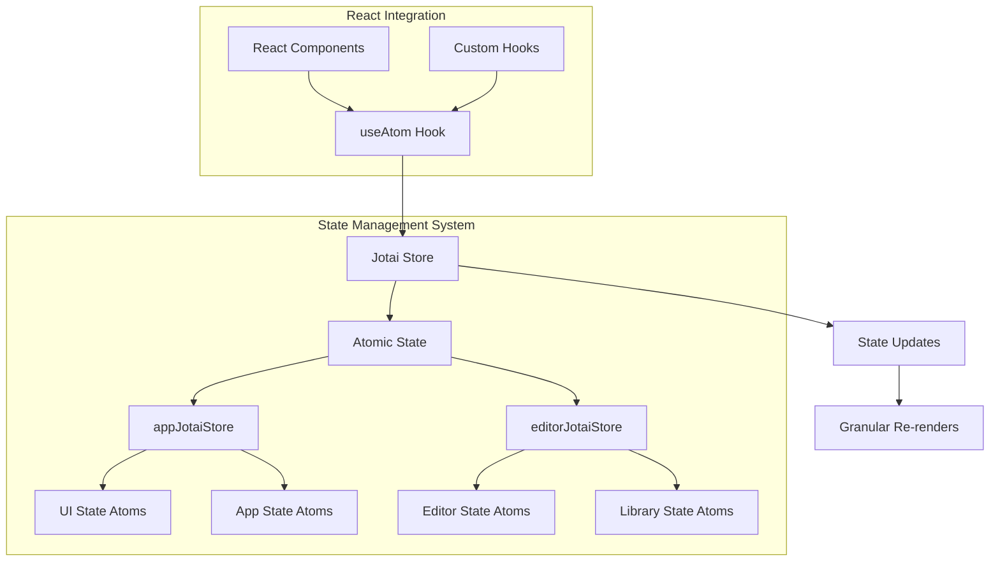
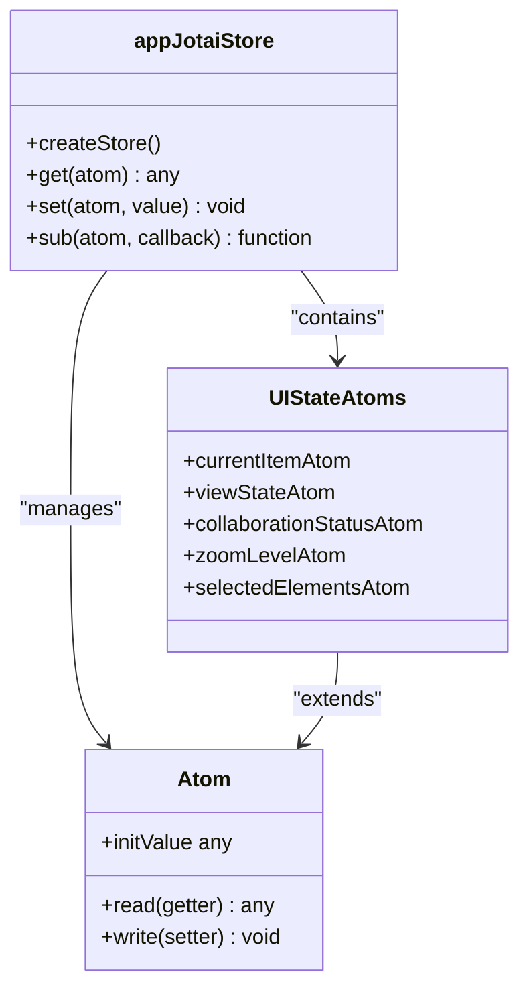
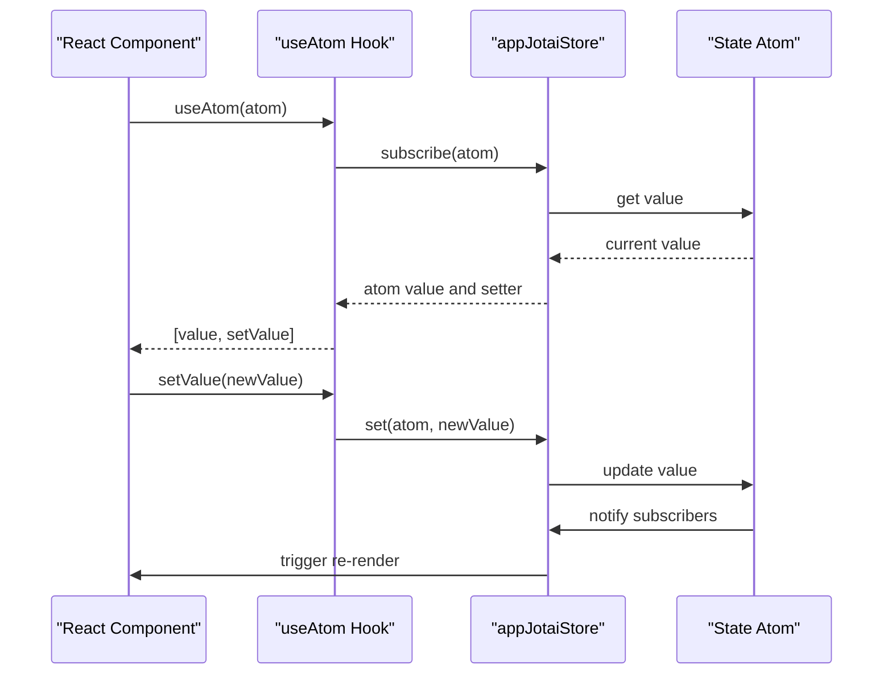
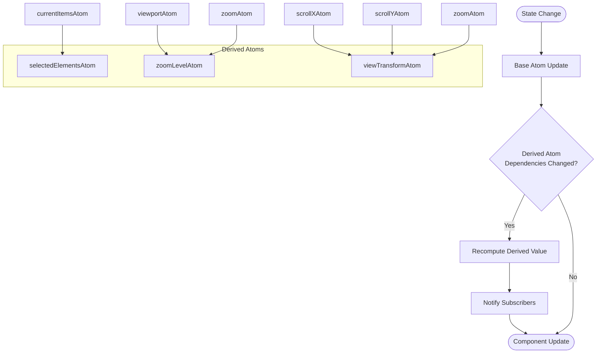
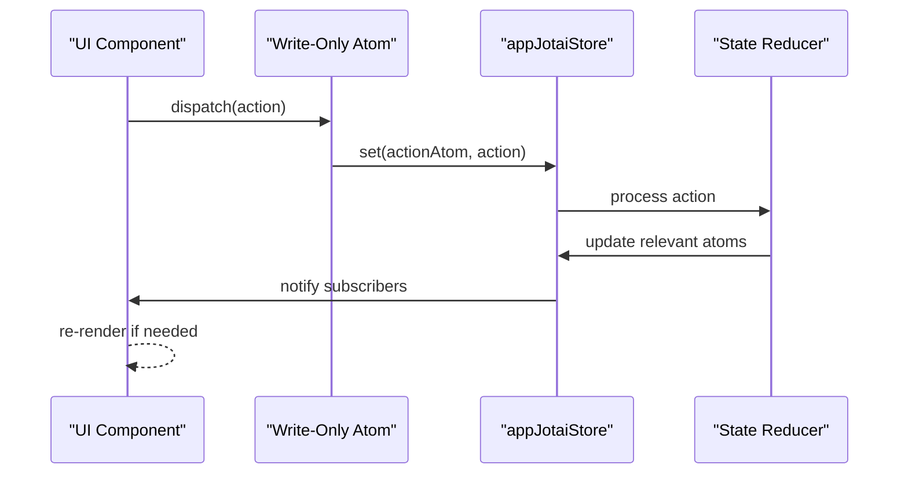

# Jotai State Management

<cite>
**Referenced Files in This Document**   
- [app-jotai.ts](file://excalidraw/excalidraw-app/app-jotai.ts)
- [ui-appState.ts](file://excalidraw/packages/excalidraw/context/ui-appState.ts)
- [editor-jotai.ts](file://excalidraw/packages/excalidraw/editor-jotai.ts)
</cite>

## Table of Contents
1. [Introduction](#introduction)
2. [Core Architecture](#core-architecture)
3. [Atomic State Implementation](#atomic-state-implementation)
4. [Jotai and React Integration](#jotai-and-react-integration)
5. [Derived Atoms and Computed Values](#derived-atoms-and-computed-values)
6. [Write-Only Atoms for Actions](#write-only-atoms-for-actions)
7. [Performance Benefits](#performance-benefits)
8. [Debugging and Development Tools](#debugging-and-development-tools)
9. [Side Effects Management](#side-effects-management)
10. [Best Practices and Pitfalls](#best-practices-and-pitfalls)

## Introduction
This document provides a comprehensive analysis of the Jotai state management implementation in Excalidraw, focusing on how atomic state principles are applied to manage application state efficiently. The documentation covers the core architecture, integration patterns with React, and specific implementation details for managing appState, view state, collaboration status, and user interactions.

**Section sources**
- [app-jotai.ts](file://excalidraw/excalidraw-app/app-jotai.ts#L1-L36)
- [ui-appState.ts](file://excalidraw/packages/excalidraw/context/ui-appState.ts#L1-L7)

## Core Architecture
The Jotai state management system in Excalidraw is built around a decentralized atomic state model, where each piece of state is represented as an independent atom. This architecture enables fine-grained reactivity and efficient state updates without unnecessary re-renders. The system utilizes multiple Jotai stores, including a dedicated `appJotaiStore` for application-level state and `editorJotaiStore` for editor-specific state management.

**Diagram sources**
- [app-jotai.ts](file://excalidraw/excalidraw-app/app-jotai.ts#L1-L10)
- [editor-jotai.ts](file://excalidraw/packages/excalidraw/editor-jotai.ts#L1-L17)

**Section sources**
- [app-jotai.ts](file://excalidraw/excalidraw-app/app-jotai.ts#L1-L36)
- [editor-jotai.ts](file://excalidraw/packages/excalidraw/editor-jotai.ts#L1-L17)

## Atomic State Implementation
The atomic state implementation in Excalidraw uses Jotai's `atom` primitive to create independent state units for different aspects of the application. Key state atoms include those for current items, view state, and collaboration status. Each atom represents a single source of truth for its respective state domain, enabling isolated updates and subscriptions.

The `appJotaiStore` is initialized as a dedicated store instance, providing isolation for application-level state management. This separation allows for better organization and prevents state pollution between different functional areas of the application.

**Diagram sources**
- [app-jotai.ts](file://excalidraw/excalidraw-app/app-jotai.ts#L1-L15)
- [ui-appState.ts](file://excalidraw/packages/excalidraw/context/ui-appState.ts#L1-L7)

**Section sources**
- [app-jotai.ts](file://excalidraw/excalidraw-app/app-jotai.ts#L1-L36)
- [ui-appState.ts](file://excalidraw/packages/excalidraw/context/ui-appState.ts#L1-L7)

## Jotai and React Integration
The integration between Jotai and React in Excalidraw is facilitated through the `useAtom` hook and related utilities. Components consume state atoms using `useAtom`, `useAtomValue`, and `useSetAtom` hooks, which provide read and write access to atomic state. This integration pattern enables components to subscribe to specific atoms, ensuring they only re-render when the observed state changes.

The `useAtomWithInitialValue` custom hook provides a mechanism for initializing atoms with default values, ensuring consistent state setup across component mounts. This hook uses `useLayoutEffect` to set initial values synchronously during component initialization.

**Diagram sources**
- [app-jotai.ts](file://excalidraw/excalidraw-app/app-jotai.ts#L20-L36)
- [ui-appState.ts](file://excalidraw/packages/excalidraw/context/ui-appState.ts#L1-L7)

**Section sources**
- [app-jotai.ts](file://excalidraw/excalidraw-app/app-jotai.ts#L20-L36)
- [ui-appState.ts](file://excalidraw/packages/excalidraw/context/ui-appState.ts#L1-L7)

## Derived Atoms and Computed Values
Derived atoms in Excalidraw compute values based on other atoms, enabling efficient calculation of derived state without manual subscription management. These atoms are used to calculate values such as selected elements, zoom level, and other computed properties that depend on multiple state sources.

Derived atoms automatically track their dependencies and only recompute when their dependencies change, providing optimal performance. This pattern eliminates the need for manual memoization and ensures that computed values are always up-to-date with the latest state.

**Diagram sources**
- [app-jotai.ts](file://excalidraw/excalidraw-app/app-jotai.ts#L1-L36)
- [ui-appState.ts](file://excalidraw/packages/excalidraw/context/ui-appState.ts#L1-L7)

**Section sources**
- [app-jotai.ts](file://excalidraw/excalidraw-app/app-jotai.ts#L1-L36)
- [ui-appState.ts](file://excalidraw/packages/excalidraw/context/ui-appState.ts#L1-L7)

## Write-Only Atoms for Actions
Write-only atoms are used in Excalidraw to manage actions and callbacks within the action manager system. These atoms serve as dispatch mechanisms for state mutations, allowing components to trigger actions without needing to read the current state. This pattern promotes unidirectional data flow and separates action dispatch from state reading.

The action system integrates with Jotai's write capabilities to ensure that actions are processed efficiently and consistently across the application. Write-only atoms provide a clean API for triggering state changes while maintaining the benefits of atomic state management.

**Diagram sources**
- [app-jotai.ts](file://excalidraw/excalidraw-app/app-jotai.ts#L1-L36)
- [editor-jotai.ts](file://excalidraw/packages/excalidraw/editor-jotai.ts#L1-L17)

**Section sources**
- [app-jotai.ts](file://excalidraw/excalidraw-app/app-jotai.ts#L1-L36)
- [editor-jotai.ts](file://excalidraw/packages/excalidraw/editor-jotai.ts#L1-L17)

## Performance Benefits
The granular reactivity model provided by Jotai offers significant performance benefits in Excalidraw. By allowing components to subscribe to specific atoms rather than entire state objects, the system minimizes unnecessary re-renders and optimizes rendering performance.

Key performance advantages include:
- Reduced re-rendering of components that don't depend on changed state
- Efficient updates through atomic state changes
- Minimal overhead from state subscription and notification
- Optimal memory usage through decentralized state storage

The atomic model ensures that only components directly affected by state changes are updated, leading to a more responsive user interface, especially in complex scenarios with multiple concurrent state modifications.

**Section sources**
- [app-jotai.ts](file://excalidraw/excalidraw-app/app-jotai.ts#L1-L36)
- [ui-appState.ts](file://excalidraw/packages/excalidraw/context/ui-appState.ts#L1-L7)

## Debugging and Development Tools
Jotai devtools provide essential debugging capabilities for the state management system in Excalidraw. These tools enable developers to inspect atom states, track state changes over time, and identify performance issues related to state updates.

The devtools integration allows for:
- Real-time monitoring of atom values
- Visualization of atom dependency graphs
- Tracking of state change history
- Identification of unnecessary re-renders
- Performance profiling of state updates

These debugging capabilities are crucial for maintaining the integrity of the state management system and ensuring optimal performance throughout the application lifecycle.

**Section sources**
- [app-jotai.ts](file://excalidraw/excalidraw-app/app-jotai.ts#L1-L36)
- [editor-jotai.ts](file://excalidraw/packages/excalidraw/editor-jotai.ts#L1-L17)

## Side Effects Management
Side effects in the Jotai implementation are managed using the `useUpdateAtom` hook and related patterns. This approach ensures that side effects are properly synchronized with state updates and React's rendering lifecycle.

The system handles side effects such as:
- Local storage persistence
- Collaboration state synchronization
- Analytics tracking
- External API calls
- File system operations

By using dedicated hooks and patterns for side effects, the implementation maintains a clean separation between state logic and side effect management, improving code maintainability and testability.

**Section sources**
- [app-jotai.ts](file://excalidraw/excalidraw-app/app-jotai.ts#L1-L36)
- [editor-jotai.ts](file://excalidraw/packages/excalidraw/editor-jotai.ts#L1-L17)

## Best Practices and Pitfalls
When working with the Jotai state management system in Excalidraw, several best practices should be followed to ensure optimal performance and maintainability:

### Recommended Practices:
- Create focused atoms with single responsibilities
- Use derived atoms for computed values
- Leverage write-only atoms for action dispatch
- Initialize atoms with appropriate default values
- Use `useAtomValue` when only reading state
- Use `useSetAtom` when only writing state

### Common Pitfalls to Avoid:
- Creating overly broad atoms that cause unnecessary re-renders
- Subscribing to atoms that trigger frequent updates
- Not cleaning up subscriptions in components
- Creating circular dependencies between atoms
- Using atoms for transient UI state that doesn't need persistence

Following these guidelines ensures that the state management system remains efficient, predictable, and maintainable as the application evolves.

**Section sources**
- [app-jotai.ts](file://excalidraw/excalidraw-app/app-jotai.ts#L1-L36)
- [ui-appState.ts](file://excalidraw/packages/excalidraw/context/ui-appState.ts#L1-L7)