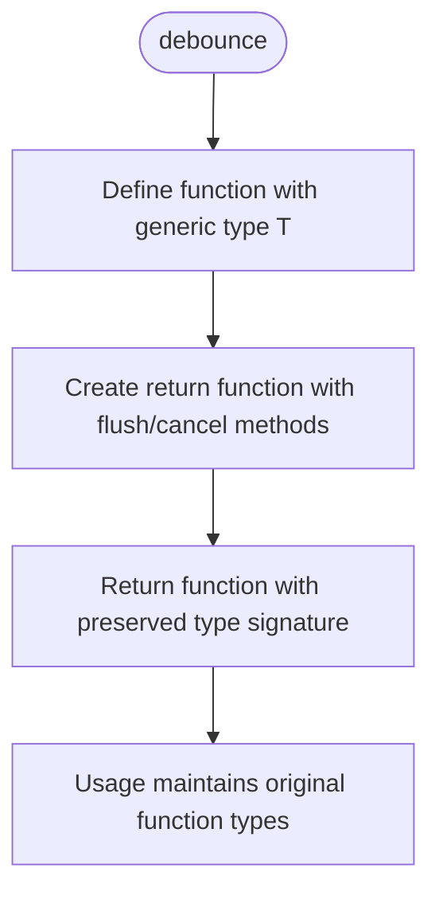
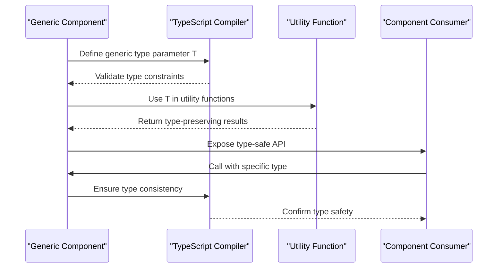
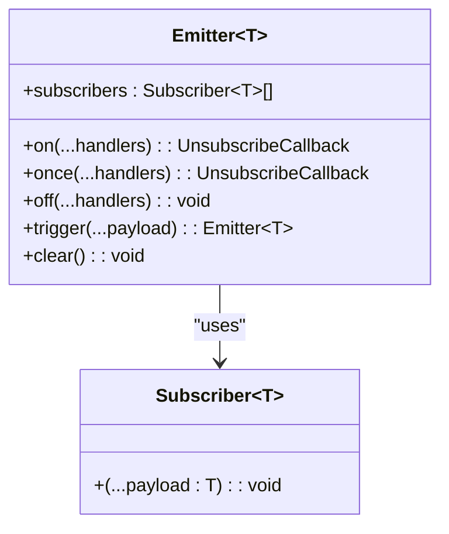
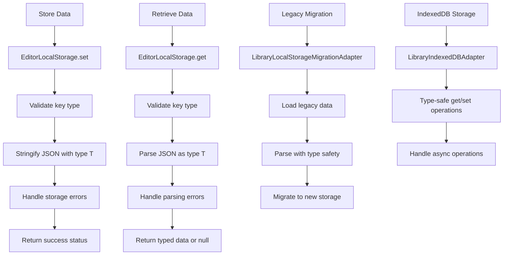
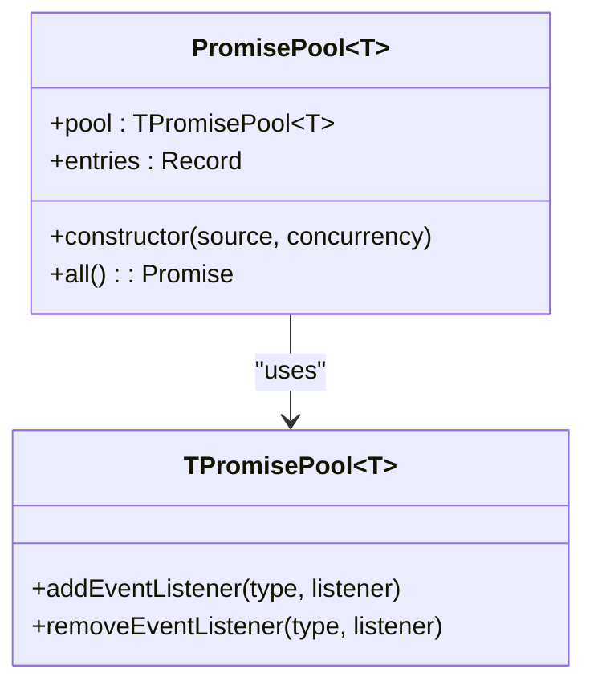

# Advanced Typing Patterns

<cite>
**Referenced Files in This Document**   
- [utils.ts](file://excalidraw/packages/common/src/utils.ts)
- [promise-pool.ts](file://excalidraw/packages/common/src/promise-pool.ts)
- [emitter.ts](file://excalidraw/packages/common/src/emitter.ts)
- [utility-types.ts](file://excalidraw/packages/common/src/utility-types.ts)
- [EditorLocalStorage.ts](file://excalidraw/packages/excalidraw/data/EditorLocalStorage.ts)
- [LocalData.ts](file://excalidraw/excalidraw-app/data/LocalData.ts)
- [app-jotai.ts](file://excalidraw/excalidraw-app/app-jotai.ts)
</cite>

## Table of Contents
1. [Introduction](#introduction)
2. [Generic Utility Functions](#generic-utility-functions)
3. [Conditional and Mapped Types](#conditional-and-mapped-types)
4. [Generic Components and Type Safety](#generic-components-and-type-safety)
5. [Discriminated Unions in State Management](#discriminated-unions-in-state-management)
6. [Type-Safe Event Handling](#type-safe-event-handling)
7. [Type-Safe Local Storage Operations](#type-safe-local-storage-operations)
8. [API Client and WebSocket Type Safety](#api-client-and-websocket-type-safety)
9. [Jotai Atom Type Enforcement](#jotai-atom-type-enforcement)
10. [Custom Integration Patterns](#custom-integration-patterns)
11. [Conclusion](#conclusion)

## Introduction
Excalidraw leverages advanced TypeScript patterns to ensure type safety across its codebase. This document explores the implementation of generic utility functions, conditional and mapped types, discriminated unions, and other sophisticated typing patterns that enable robust type inference and prevent runtime errors. The analysis focuses on how these patterns are applied in utility functions, state management, event handling, and data persistence layers.

## Generic Utility Functions

Excalidraw implements several generic utility functions with precise type inference, particularly in the `utils.ts` file. The `debounce` function is a prime example of a generic utility that maintains type safety while providing performance optimization.



**Diagram sources**
- [utils.ts](file://excalidraw/packages/common/src/utils.ts#L200-L220)

The `debounce` function uses a generic type parameter `T` that extends `any[]` to capture the argument types of the input function. This ensures that the debounced function maintains the same parameter types as the original function. The implementation also adds `flush` and `cancel` methods to the returned function while preserving the original function's type signature.

Similarly, the `throttleRAF` function implements throttling with requestAnimationFrame, using the same generic pattern to maintain type safety across different use cases.

**Section sources**
- [utils.ts](file://excalidraw/packages/common/src/utils.ts#L200-L300)

## Conditional and Mapped Types

Excalidraw employs sophisticated conditional and mapped types in the `utility-types.ts` file to create flexible type utilities. These patterns enable the creation of reactive state utilities and event emitters with strong typing guarantees.

```mermaid
classDiagram
class Mutable {
+Remove readonly modifier
}
class ValueOf {
+Extract value type
}
class Merge {
+Combine types
}
class SubtypeOf {
+Assert subtype relationship
}
class ResolutionType {
+Extract Promise resolution type
}
class MarkOptional {
+Make specific keys optional
}
class MarkRequired {
+Make specific keys required
}
class MarkNonNullable {
+Remove null/undefined
}
class NonOptional {
+Exclude undefined
}
class ForwardRef {
+Handle React forwardRef
}
class ExtractSetType {
+Extract Set element type
}
class SameType {
+Assert type equality
}
class Assert {
+Validate type assertions
}
class NestedKeyOf {
+Generate nested key paths
}
class SetLike {
+Union of Set and array
}
class ReadonlySetLike {
+Union of ReadonlySet and readonly array
}
class MakeBrand {
+Create branded types
}
class MaybePromise {
+Union of value and Promise
}
class AllPossibleKeys {
+Extract all keys from union
}
class DTO {
+Strip methods from type
}
class MapEntry {
+Extract Map key-value pair
}
Mutable --> ValueOf
ValueOf --> Merge
Merge --> SubtypeOf
SubtypeOf --> ResolutionType
ResolutionType --> MarkOptional
MarkOptional --> MarkRequired
MarkRequired --> MarkNonNullable
MarkNonNullable --> NonOptional
NonOptional --> ForwardRef
ForwardRef --> ExtractSetType
ExtractSetType --> SameType
SameType --> Assert
Assert --> NestedKeyOf
NestedKeyOf --> SetLike
SetLike --> ReadonlySetLike
ReadonlySetLike --> MakeBrand
MakeBrand --> MaybePromise
MaybePromise --> AllPossibleKeys
AllPossibleKeys --> DTO
DTO --> MapEntry
```



**Diagram sources**
- [utility-types.ts](file://excalidraw/packages/common/src/utility-types.ts#L1-L80)

The `ResolutionType` conditional type is particularly noteworthy, as it extracts the resolved type from a Promise-returning function. This enables type-safe handling of asynchronous operations throughout the codebase. The `MarkOptional` and `MarkRequired` mapped types allow for flexible type manipulation, making it easier to work with partial updates and required fields in different contexts.

**Section sources**
- [utility-types.ts](file://excalidraw/packages/common/src/utility-types.ts#L1-L80)

## Generic Components and Type Safety

Excalidraw's architecture includes generic components that handle different element types while maintaining type safety. The `ResolvablePromise<T>` type in `utils.ts` demonstrates this pattern, allowing promises to be resolved or rejected externally while preserving the generic type parameter.



**Diagram sources**
- [utils.ts](file://excalidraw/packages/common/src/utils.ts#L400-L420)

The `resolvablePromise` function returns a promise with added `resolve` and `reject` methods, all while maintaining the generic type parameter `T`. This pattern enables more flexible promise handling in asynchronous operations while ensuring type safety.

**Section sources**
- [utils.ts](file://excalidraw/packages/common/src/utils.ts#L400-L420)

## Discriminated Unions in State Management

Excalidraw uses discriminated unions in its action systems and client state management to ensure type safety and prevent invalid state transitions. The `EVENT` type in `constants.ts` (referenced in `utils.ts`) serves as a foundation for event-based communication with type safety.

The state management system leverages discriminated unions to represent different action types, each with their own payload structure. This pattern ensures that when handling actions, the type system can narrow down the specific action type and its associated payload, preventing access to invalid properties.

```mermaid
stateDiagram-v2
[*] --> Idle
Idle --> Processing : "Action with type"
Processing --> Success : "Complete with result"
Processing --> Failed : "Error with message"
Success --> Idle : "Reset"
Failed --> Idle : "Reset"
classDef actionClass fill : #e6f3ff,stroke : #3399ff;
class "Processing" actionClass
```

**Diagram sources**
- [utils.ts](file://excalidraw/packages/common/src/utils.ts#L50)
- [app-jotai.ts](file://excalidraw/excalidraw-app/app-jotai.ts)

**Section sources**
- [app-jotai.ts](file://excalidraw/excalidraw-app/app-jotai.ts)

## Type-Safe Event Handling

Excalidraw implements type-safe event handling through the `Emitter` class in `emitter.ts`, which uses generic type parameters to ensure that event payloads and callback interfaces are strongly typed.



**Diagram sources**
- [emitter.ts](file://excalidraw/packages/common/src/emitter.ts#L1-L52)

The `Emitter<T>` class is generic over the payload type `T`, ensuring that all subscribers receive the correct type of payload. The `on`, `once`, and `trigger` methods all maintain this type safety, preventing type errors when emitting and handling events. The `UnsubscribeCallback` return type from subscription methods ensures proper cleanup of event listeners.

**Section sources**
- [emitter.ts](file://excalidraw/packages/common/src/emitter.ts#L1-L52)

## Type-Safe Local Storage Operations

Excalidraw implements type-safe local storage operations through the `EditorLocalStorage` class in `EditorLocalStorage.ts` and various adapters in `LocalData.ts`. These implementations use generics to ensure type safety when storing and retrieving data.



**Diagram sources**
- [EditorLocalStorage.ts](file://excalidraw/packages/excalidraw/data/EditorLocalStorage.ts#L1-L52)
- [LocalData.ts](file://excalidraw/excalidraw-app/data/LocalData.ts#L188-L257)

The `EditorLocalStorage` class uses generics in its `get` method to ensure that retrieved data is properly typed. The `T extends JSONValue` constraint ensures that only serializable types can be stored, while the return type is properly inferred based on the generic parameter. Error handling is also type-safe, with appropriate return values for different error conditions.

**Section sources**
- [EditorLocalStorage.ts](file://excalidraw/packages/excalidraw/data/EditorLocalStorage.ts#L1-L52)
- [LocalData.ts](file://excalidraw/excalidraw-app/data/LocalData.ts#L188-L257)

## API Client and WebSocket Type Safety

While specific API client and WebSocket implementations are not fully visible in the provided code, the patterns established in the utility types and event systems suggest a consistent approach to type safety. The `promise-pool.ts` file demonstrates how Excalidraw handles asynchronous operations with type safety.



**Diagram sources**
- [promise-pool.ts](file://excalidraw/packages/common/src/promise-pool.ts#L1-L51)

The `PromisePool<T>` class maintains type safety across pooled promise operations, ensuring that results are properly typed and ordered. This pattern could be extended to API client responses and WebSocket message handling, where type safety is crucial for maintaining data integrity.

**Section sources**
- [promise-pool.ts](file://excalidraw/packages/common/src/promise-pool.ts#L1-L51)

## Jotai Atom Type Enforcement

Excalidraw uses Jotai for state management, with type enforcement implemented in `app-jotai.ts`. The patterns in the utility types suggest that Jotai atoms are defined with strong typing for both getters and setters, ensuring correct usage throughout the application.

The `Mutable` and `MarkRequired` utility types from `utility-types.ts` would be particularly useful in defining Jotai atom types, allowing for flexible yet type-safe state updates. The `DTO` type could be used to strip methods from complex objects when storing them in atoms, ensuring only data is persisted.

**Section sources**
- [app-jotai.ts](file://excalidraw/excalidraw-app/app-jotai.ts)

## Custom Integration Patterns

Excalidraw's advanced typing patterns can be extended for custom integrations by leveraging the existing utility types and design patterns. Developers can create new generic utilities based on the `debounce` and `throttleRAF` patterns, or extend the conditional and mapped types for specific use cases.

The `MakeBrand` type in `utility-types.ts` enables type branding, which can be used to create distinct types from primitive values, preventing accidental mixing of similar types. The `NestedKeyOf` type allows for deep property access with type safety, which could be useful in form handling or configuration systems.

**Section sources**
- [utility-types.ts](file://excalidraw/packages/common/src/utility-types.ts#L1-L80)

## Conclusion
Excalidraw demonstrates sophisticated use of TypeScript's advanced type system to ensure type safety across its codebase. The implementation of generic utility functions, conditional and mapped types, discriminated unions, and type-safe event handling creates a robust foundation for the application. These patterns not only prevent runtime errors but also provide excellent developer experience through intelligent code completion and error detection. The type-safe local storage operations and potential for extending these patterns to API clients and WebSocket handling show a comprehensive approach to type safety in all aspects of the application.