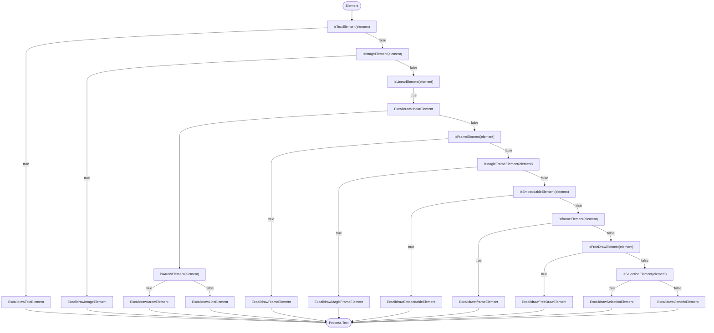
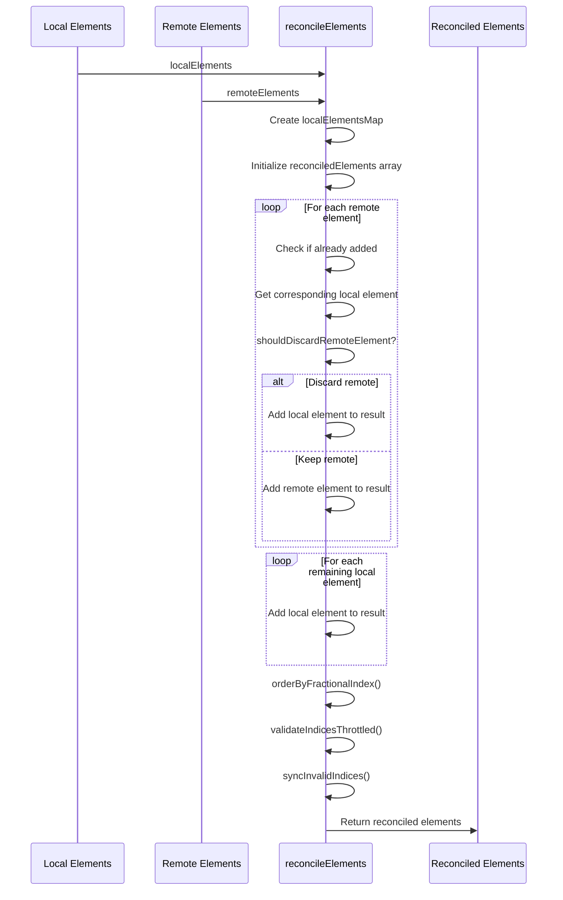
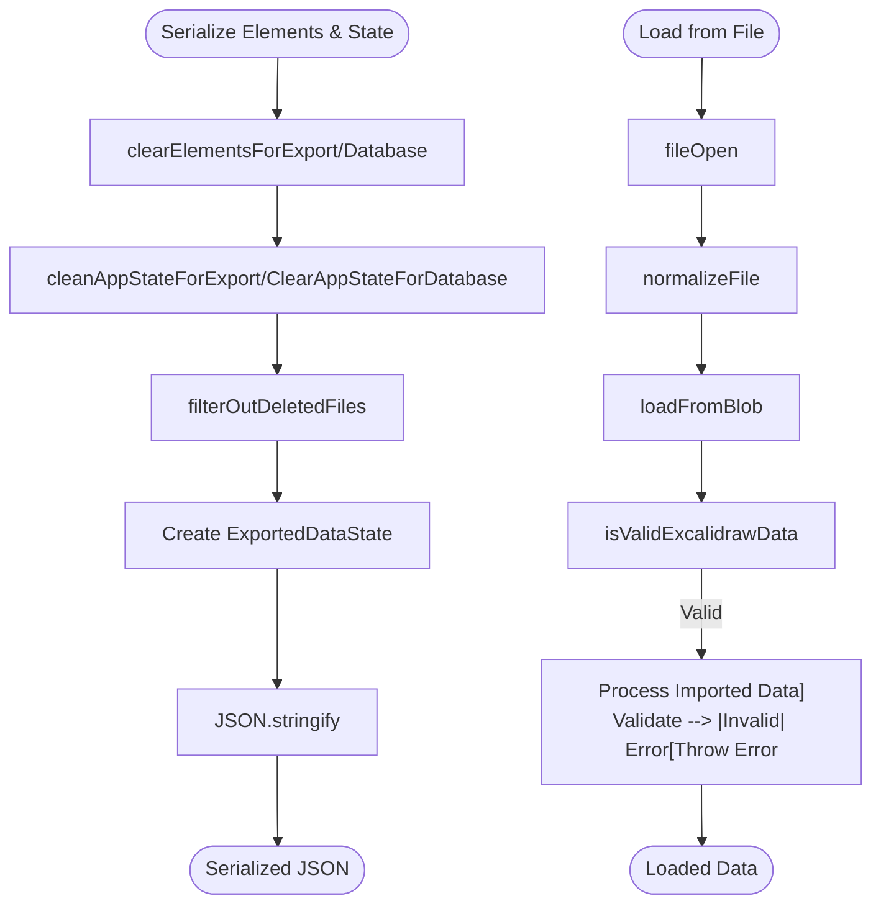
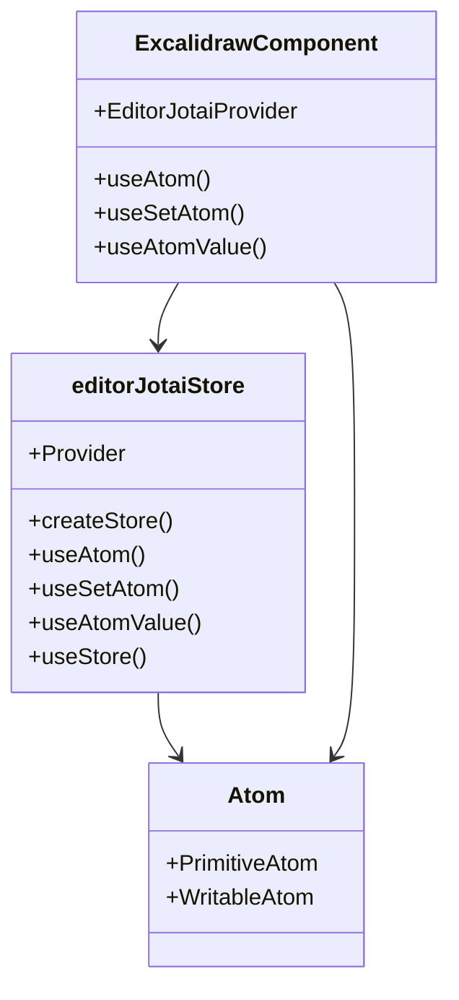

# Type System Design

<cite>
**Referenced Files in This Document**   
- [types.ts](file://excalidraw/packages/excalidraw/types.ts)
- [element/src/types.ts](file://excalidraw/packages/element/src/types.ts)
- [appState.ts](file://excalidraw/packages/excalidraw/appState.ts)
- [gesture.ts](file://excalidraw/packages/excalidraw/gesture.ts)
- [data/reconcile.ts](file://excalidraw/packages/excalidraw/data/reconcile.ts)
- [data/types.ts](file://excalidraw/packages/excalidraw/data/types.ts)
- [element/src/typeChecks.ts](file://excalidraw/packages/element/src/typeChecks.ts)
- [data/json.ts](file://excalidraw/packages/excalidraw/data/json.ts)
- [editor-jotai.ts](file://excalidraw/packages/excalidraw/editor-jotai.ts)
</cite>

## Table of Contents
1. [Introduction](#introduction)
2. [Core Data Model](#core-data-model)
3. [Element Type System](#element-type-system)
4. [Application State Structure](#application-state-structure)
5. [Type Guards and Discriminated Unions](#type-guards-and-discriminated-unions)
6. [Utility Types and Interaction Logic](#utility-types-and-interaction-logic)
7. [Data Integrity and Reconciliation](#data-integrity-and-reconciliation)
8. [Serialization and Persistence](#serialization-and-persistence)
9. [State Management with Jotai](#state-management-with-jotai)
10. [Extending Element Types](#extending-element-types)
11. [Conclusion](#conclusion)

## Introduction
The Excalidraw type system forms the foundation of its collaborative whiteboard functionality, providing a robust and type-safe architecture for managing drawing elements, application state, and user interactions. This document explores the comprehensive type system that enables Excalidraw to maintain data integrity across collaborative sessions, support rich drawing capabilities, and ensure type safety throughout the application. The system leverages TypeScript's advanced type features including discriminated unions, type guards, and utility types to create a maintainable and extensible codebase.

## Core Data Model
The Excalidraw data model is built around a hierarchical type system that represents all drawable elements and their relationships. At the foundation is the `ExcalidrawElement` interface, which defines the common properties shared by all elements on the canvas. This base interface includes essential attributes such as position (x, y), dimensions (width, height), styling properties (strokeColor, backgroundColor, fillStyle), and metadata (id, version, versionNonce). The type system employs a discriminated union pattern where each element type is distinguished by its `type` property, enabling type-safe operations based on element classification.

```mermaid
classDiagram
class ExcalidrawElement {
+string id
+number x
+number y
+number width
+number height
+string strokeColor
+string backgroundColor
+FillStyle fillStyle
+number strokeWidth
+StrokeStyle strokeStyle
+null | { type : RoundnessType; value? : number } roundness
+number roughness
+number opacity
+Radians angle
+number seed
+number version
+number versionNonce
+FractionalIndex | null index
+boolean isDeleted
+readonly GroupId[] groupIds
+string | null frameId
+readonly BoundElement[] | null boundElements
+number updated
+string | null link
+boolean locked
+Record<string, any> | undefined customData
}
class ExcalidrawTextElement {
+number fontSize
+FontFamilyValues fontFamily
+string text
+TextAlign textAlign
+VerticalAlign verticalAlign
+ExcalidrawGenericElement["id"] | null containerId
+string originalText
+boolean autoResize
+number & { _brand : "unitlessLineHeight" } lineHeight
}
class ExcalidrawLinearElement {
+readonly LocalPoint[] points
+LocalPoint | null lastCommittedPoint
+PointBinding | null startBinding
+PointBinding | null endBinding
+Arrowhead | null startArrowhead
+Arrowhead | null endArrowhead
}
ExcalidrawElement <|-- ExcalidrawTextElement
ExcalidrawElement <|-- ExcalidrawLinearElement
ExcalidrawElement <|-- ExcalidrawRectangleElement
ExcalidrawElement <|-- ExcalidrawDiamondElement
ExcalidrawElement <|-- ExcalidrawEllipseElement
ExcalidrawElement <|-- ExcalidrawImageElement
ExcalidrawElement <|-- ExcalidrawFrameElement
ExcalidrawElement <|-- ExcalidrawMagicFrameElement
ExcalidrawElement <|-- ExcalidrawIframeElement
ExcalidrawElement <|-- ExcalidrawEmbeddableElement
ExcalidrawElement <|-- ExcalidrawSelectionElement
ExcalidrawElement <|-- ExcalidrawFreeDrawElement
```

**Diagram sources**
- [element/src/types.ts](file://excalidraw/packages/element/src/types.ts#L45-L438)

**Section sources**
- [element/src/types.ts](file://excalidraw/packages/element/src/types.ts#L45-L438)

## Element Type System
The element type system in Excalidraw is implemented using discriminated unions, where the `type` property serves as the discriminant for narrowing types. This approach allows the system to represent different element types (line, rectangle, diamond, etc.) with both shared and specific properties. The base `_ExcalidrawElementBase` interface defines common properties, while specific element types extend this base with their unique characteristics. For example, `ExcalidrawTextElement` includes text-specific properties like `fontSize`, `fontFamily`, and `text`, while `ExcalidrawLinearElement` contains `points` for defining line segments and arrowheads.

The type system supports various element categories including geometric shapes (rectangle, diamond, ellipse), text elements, linear elements (line, arrow), freehand drawings, images, frames, and embeddable content. Each element type maintains a consistent interface for core properties while adding specialized attributes. The system also includes utility types like `NonDeleted<TElement>` and `Ordered<TElement>` that enhance the base element types with additional constraints for specific use cases, such as filtering out deleted elements or maintaining ordered collections.

**Section sources**
- [element/src/types.ts](file://excalidraw/packages/element/src/types.ts#L45-L438)

## Application State Structure
The `AppState` interface defines the comprehensive state structure for the Excalidraw application, encompassing user interface state, collaboration features, and editing context. This interface includes properties for canvas navigation (scrollX, scrollY, zoom), tool selection (activeTool, penMode), element selection (selectedElementIds, selectedGroupIds), and editing modes (editingTextElement, multiElement). The state also manages collaborative features such as `collaborators`, `snapLines`, and `userToFollow`, enabling real-time collaboration with multiple users.

The application state is designed with persistence and sharing in mind, as evidenced by the `APP_STATE_STORAGE_CONF` configuration that determines which state properties should be preserved across different storage contexts (browser, export, server). This selective persistence ensures that transient UI state is not unnecessarily saved while maintaining essential user preferences. The state structure also includes specialized properties for advanced features like element binding (`startBoundElement`, `suggestedBindings`), frame management (`frameToHighlight`, `editingFrame`), and search functionality (`searchMatches`).

```mermaid
classDiagram
class AppState {
+{ [id : string] : true } selectedElementIds
+{ [id : string] : true } hoveredElementIds
+{ [groupId : string] : boolean } selectedGroupIds
+GroupId | null editingGroupId
+ActiveTool activeTool
+boolean penMode
+boolean penDetected
+Zoom zoom
+number scrollX
+number scrollY
+number offsetTop
+number offsetLeft
+number width
+number height
+string theme
+string viewBackgroundColor
+number gridSize
+boolean gridModeEnabled
+boolean objectsSnapModeEnabled
+Map<SocketId, Collaborator> collaborators
+readonly SnapLine[] snapLines
+UserToFollow | null userToFollow
+Set<SocketId> followedBy
+{ name : SidebarName; tab? : SidebarTabName } | null openSidebar
+null | { name : "imageExport" | "help" | "jsonExport" } openDialog
+NonDeleted<ExcalidrawNonSelectionElement> | null newElement
+NonDeletedExcalidrawElement | null resizingElement
+NonDeleted<ExcalidrawLinearElement> | null multiElement
+NonDeletedExcalidrawElement | null selectionElement
+NonDeletedExcalidrawElement | null editingTextElement
+ExcalidrawElement["id"] | null croppingElementId
+Readonly<{ focusedId : ExcalidrawElement["id"] | null; matches : readonly SearchMatch[] }> | null searchMatches
}
class ActiveTool {
+ToolType type
+string | null customType
+ActiveTool | null lastActiveTool
+boolean locked
+boolean fromSelection
}
class Zoom {
+NormalizedZoomValue value
}
class Collaborator {
+CollaboratorPointer | undefined pointer
+string | null username
+UserIdleState | undefined userState
+{ background : string; stroke : string } | undefined color
+string | undefined avatarUrl
+string | undefined id
+SocketId | undefined socketId
+boolean | undefined isCurrentUser
+boolean | undefined isInCall
+boolean | undefined isSpeaking
+boolean | undefined isMuted
}
class SnapLine {
+string type
+number x1
+number y1
+number x2
+number y2
+number offset
}
AppState --> ActiveTool
AppState --> Zoom
AppState --> Collaborator
AppState --> SnapLine
```

**Diagram sources**
- [types.ts](file://excalidraw/packages/excalidraw/types.ts#L300-L799)
- [appState.ts](file://excalidraw/packages/excalidraw/appState.ts#L1-L300)

**Section sources**
- [types.ts](file://excalidraw/packages/excalidraw/types.ts#L300-L799)
- [appState.ts](file://excalidraw/packages/excalidraw/appState.ts#L1-L300)

## Type Guards and Discriminated Unions
Excalidraw employs a comprehensive system of type guards to ensure safe type narrowing when working with the discriminated union of element types. These type guards are implemented as functions that return type predicates, allowing TypeScript to narrow the type based on the result of the guard. The `isTextElement` function, for example, checks if an element is of type "text" and returns a type predicate that enables TypeScript to treat the element as an `ExcalidrawTextElement` within the guarded context.

The type guard system includes specialized functions for each element type, such as `isImageElement`, `isLinearElement`, `isFrameElement`, and `isArrowElement`, as well as more complex guards like `isBindableElement` and `isBindingElement` that incorporate additional logic beyond simple type checking. These guards are essential for maintaining type safety when performing operations that are specific to certain element types, such as text manipulation, image handling, or arrow binding. The system also includes utility guards like `isInitializedImageElement` that check both the element type and additional state conditions.



**Diagram sources**
- [element/src/typeChecks.ts](file://excalidraw/packages/element/src/typeChecks.ts#L0-L415)

**Section sources**
- [element/src/typeChecks.ts](file://excalidraw/packages/element/src/typeChecks.ts#L0-L415)

## Utility Types and Interaction Logic
The Excalidraw type system includes several utility types that support interaction logic and user input handling. The `Gesture` interface represents multi-touch gestures with properties for tracking multiple pointers, calculating the center point, and measuring scale changes. This interface works in conjunction with the `GestureEvent` class to handle touch-based interactions on mobile devices and touch-enabled desktops.

The `PointerCoords` type defines the coordinate structure for pointer events, while the `PointerDownState` interface captures the complete state of a pointer interaction from initial press through movement and release. This state includes origin coordinates, drag offsets, and references to original elements for undo operations. The system also includes specialized types for handling complex interactions like element binding (`PointBinding`, `FixedPointBinding`) and snapping (`SnapLine`), which enable precise alignment and connection of elements on the canvas.

```mermaid
classDiagram
class Gesture {
+Map<number, PointerCoords> pointers
+{ x : number; y : number } | null lastCenter
+number | null initialDistance
+number | null initialScale
}
class PointerCoords {
+number x
+number y
}
class PointerDownState {
+{ x : number; y : number } origin
+{ x : number; y : number } originInGrid
+ReturnType<typeof isOverScrollBars> scrollbars
+{ x : number; y : number } lastCoords
+Map<string, NonDeleted<ExcalidrawElement>> originalElements
+Resize resize
+Hit hit
+boolean withCmdOrCtrl
+Drag drag
+EventListeners eventListeners
+BoxSelection boxSelection
}
class Resize {
+MaybeTransformHandleType handleType
+boolean isResizing
+{ x : number; y : number } offset
+"origin" | "end" arrowDirection
+{ x : number; y : number } center
}
class Hit {
+NonDeleted<ExcalidrawElement> | null element
+NonDeleted<ExcalidrawElement>[] allHitElements
+boolean wasAddedToSelection
+boolean hasBeenDuplicated
+boolean hasHitCommonBoundingBoxOfSelectedElements
}
class Drag {
+boolean hasOccurred
+{ x : number; y : number } | null offset
+{ x : number; y : number } origin
}
class EventListeners {
+null | ReturnType<typeof throttleRAF> onMove
+null | ((event : PointerEvent) => void) onUp
+null | ((event : KeyboardEvent) => void) onKeyDown
+null | ((event : KeyboardEvent) => void) onKeyUp
}
class BoxSelection {
+boolean hasOccurred
}
class SnapLine {
+string type
+number x1
+number y1
+number x2
+number y2
+number offset
}
Gesture --> PointerCoords
PointerDownState --> Resize
PointerDownState --> Hit
PointerDownState --> Drag
PointerDownState --> EventListeners
PointerDownState --> BoxSelection
```

**Diagram sources**
- [types.ts](file://excalidraw/packages/excalidraw/types.ts#L300-L799)
- [gesture.ts](file://excalidraw/packages/excalidraw/gesture.ts#L0-L15)

**Section sources**
- [types.ts](file://excalidraw/packages/excalidraw/types.ts#L300-L799)
- [gesture.ts](file://excalidraw/packages/excalidraw/gesture.ts#L0-L15)

## Data Integrity and Reconciliation
Excalidraw ensures data integrity through a sophisticated reconciliation system that resolves conflicts during collaborative editing. The `reconcileElements` function implements a conflict resolution strategy that compares local and remote elements based on their version numbers and version nonces. When conflicts occur, the system prioritizes local edits that are currently being modified (such as text being edited or elements being resized) and resolves identical version conflicts deterministically using the version nonce.

The reconciliation process maintains element ordering through the use of fractional indices, which allow for efficient insertion and reordering of elements without requiring complete reindexing. The system validates and synchronizes these indices to prevent corruption, with throttled validation to avoid performance issues during high-frequency updates. The `ReconciledExcalidrawElement` and `RemoteExcalidrawElement` branded types ensure type safety during the reconciliation process, preventing accidental mixing of local and remote elements.



**Diagram sources**
- [data/reconcile.ts](file://excalidraw/packages/excalidraw/data/reconcile.ts#L0-L118)

**Section sources**
- [data/reconcile.ts](file://excalidraw/packages/excalidraw/data/reconcile.ts#L0-L118)

## Serialization and Persistence
The serialization system in Excalidraw handles the conversion of application state and elements to JSON format for storage and sharing. The `serializeAsJSON` function creates a structured representation of the drawing that includes elements, application state, and binary files, with different filtering applied based on the target storage type (local, database). The system uses utility functions like `cleanAppStateForExport` and `clearElementsForExport` to remove transient state properties that should not be persisted.

The serialization process maintains data integrity by filtering out files that are only referenced by deleted elements, ensuring that the saved file does not contain unnecessary binary data. The system also supports library serialization through `serializeLibraryAsJSON`, which follows a similar pattern but is specialized for library items. The deserialization process includes validation functions like `isValidExcalidrawData` and `isValidLibrary` to ensure that imported data conforms to the expected structure before being processed.



**Diagram sources**
- [data/json.ts](file://excalidraw/packages/excalidraw/data/json.ts#L0-L163)
- [data/types.ts](file://excalidraw/packages/excalidraw/data/types.ts#L0-L61)

**Section sources**
- [data/json.ts](file://excalidraw/packages/excalidraw/data/json.ts#L0-L163)
- [data/types.ts](file://excalidraw/packages/excalidraw/data/types.ts#L0-L61)

## State Management with Jotai
Excalidraw integrates with Jotai for state management, using the `editor-jotai.ts` module to create an isolated state management system. The implementation creates a scoped Jotai store using `createIsolation`, which prevents state collisions when multiple Excalidraw instances are used on the same page. The module exports Jotai primitives like `atom`, `useAtom`, `useSetAtom`, and `useAtomValue`, along with a custom `EditorJotaiProvider` component and `editorJotaiStore` instance.

This approach allows Excalidraw to maintain a reactive state system while encapsulating its state management within the component. The isolated store ensures that state updates are contained within each Excalidraw instance, preventing unintended side effects between multiple editors on the same page. The integration with Jotai enables fine-grained reactivity, where components can subscribe to specific atoms and re-render only when their subscribed state changes.



**Diagram sources**
- [editor-jotai.ts](file://excalidraw/packages/excalidraw/editor-jotai.ts#L0-L18)

**Section sources**
- [editor-jotai.ts](file://excalidraw/packages/excalidraw/editor-jotai.ts#L0-L18)

## Extending Element Types
The Excalidraw type system is designed to be extensible, allowing for the addition of custom shapes and annotations while maintaining type safety. The discriminated union pattern makes it straightforward to add new element types by creating interfaces that extend the base `ExcalidrawElement` and specifying a unique `type` value. Custom elements can include specialized properties relevant to their functionality while inheriting the core properties for position, styling, and metadata.

To integrate custom elements, developers can create corresponding type guards using the same pattern as the built-in guards, ensuring that the type system can properly narrow types when working with the new element type. The rendering system can be extended by adding new cases to the element rendering logic, while the serialization and deserialization processes will automatically handle the new type as long as it conforms to the base element interface. This extensibility enables developers to create domain-specific annotations or specialized shapes while leveraging Excalidraw's robust collaboration and persistence features.

**Section sources**
- [element/src/types.ts](file://excalidraw/packages/element/src/types.ts#L45-L438)
- [element/src/typeChecks.ts](file://excalidraw/packages/element/src/typeChecks.ts#L0-L415)

## Conclusion
The Excalidraw type system demonstrates a sophisticated approach to type-safe application development, leveraging TypeScript's advanced features to create a robust and maintainable codebase. By employing discriminated unions, type guards, and utility types, the system ensures data integrity across all aspects of the application, from element creation and manipulation to collaborative editing and persistence. The integration with Jotai provides a reactive state management solution that is both powerful and encapsulated, while the extensible design allows for customization and domain-specific enhancements. This comprehensive type system forms the foundation of Excalidraw's reliability and flexibility as a collaborative whiteboard application.