# TypeScript Configuration and Typing

<cite>
**Referenced Files in This Document**   
- [tsconfig.json](file://packages/excalidraw/tsconfig.json)
- [types.ts](file://packages/excalidraw/types.ts)
- [appState.ts](file://packages/excalidraw/appState.ts)
- [reconcile.ts](file://packages/excalidraw/data/reconcile.ts)
- [transform.ts](file://packages/excalidraw/data/transform.ts)
</cite>

## Table of Contents
1. [TypeScript Configuration](#typescript-configuration)
2. [Core Type System Design](#core-type-system-design)
3. [AppState and Element Modeling](#appstate-and-element-modeling)
4. [Data Integrity and Reconciliation](#data-integrity-and-reconciliation)
5. [Generic Components and Type Patterns](#generic-components-and-type-patterns)
6. [API Boundaries and Integration Typing](#api-boundaries-and-integration-typing)
7. [Best Practices for Type Extension](#best-practices-for-type-extension)

## TypeScript Configuration

The Excalidraw codebase uses a well-structured TypeScript configuration that extends from a shared base configuration. The `tsconfig.json` file in the `@excalidraw/excalidraw` package extends from `../tsconfig.base.json`, establishing a consistent type-checking foundation across the monorepo.

The configuration includes specific compiler options tailored for the package's needs, with the `outDir` set to `"./dist/types"` to organize compiled type definitions. The `include` field specifies that all files in the package should be included in the compilation process, while the `exclude` field omits test files, test directories, examples, and distribution folders to prevent unnecessary type checking of non-production code.

This configuration enables strict type checking across the codebase, ensuring that type safety is maintained throughout development. The setup supports modern TypeScript features and JSX syntax, which is essential for the React-based UI components in the application. The configuration also facilitates proper module resolution, allowing for clean imports from other packages within the monorepo like `@excalidraw/common`, `@excalidraw/element`, and others.

**Section sources**
- [tsconfig.json](file://packages/excalidraw/tsconfig.json)

## Core Type System Design

The Excalidraw codebase employs a sophisticated type system built on TypeScript's advanced type features to ensure data integrity and provide excellent developer experience. The type system is centered around several key interfaces and utility types that model the application's core entities.

The codebase extensively uses discriminated unions to represent different element types, with `ExcalidrawElementType` serving as the base type that includes various shapes like "rectangle", "diamond", "ellipse", "arrow", "line", and others. This approach allows for type-safe handling of different element types throughout the application. The type system also includes utility types like `Partial` and `Omit` which are used to create variations of existing types for specific use cases, such as when updating only certain properties of an element.

Type guards are implemented throughout the codebase to provide runtime type checking that complements the static type system. Functions like `isArrowElement`, `isLinearElement`, and `isFreeDrawElement` are used to narrow types in conditional blocks, enabling type-safe operations on specific element types. These type guards are essential for maintaining type safety when working with the heterogeneous collection of elements that can exist on a whiteboard.

The codebase also makes extensive use of branded types to prevent type confusion. For example, `SocketId` is defined as `string & { _brand: "SocketId" }`, which creates a distinct type that cannot be accidentally substituted with a regular string. This pattern is used for other identifiers like `FileId` and `NormalizedZoomValue`, providing compile-time protection against incorrect usage of these values.

**Section sources**
- [types.ts](file://packages/excalidraw/types.ts)

## AppState and Element Modeling

The state management in Excalidraw is built around a comprehensive type system that precisely models the application's state and elements. The `AppState` interface in `types.ts` defines the complete state of the application, including UI state, tool state, collaboration state, and rendering preferences. This interface is used throughout the codebase to ensure consistency in how application state is accessed and modified.

The `AppState` type includes properties for tracking the current tool (`activeTool`), zoom level (`zoom`), scroll position (`scrollX`, `scrollY`), and various UI flags like `zenModeEnabled` and `gridModeEnabled`. It also includes more complex state like `selectedElementIds`, which is a readonly object with string keys and boolean values, providing an efficient way to check if an element is selected.

The `getDefaultAppState` function in `appState.ts` provides a factory function for creating initial application state with sensible defaults. This function returns an object that conforms to the `AppState` interface but omits certain properties like `offsetTop`, `offsetLeft`, `width`, and `height` which are typically determined by the container element. The default state includes configuration for element properties like `currentItemStrokeColor`, `currentItemBackgroundColor`, and `currentItemFontFamily`, which define the default appearance of newly created elements.

The codebase also defines specialized state types for different contexts. For example, `UIAppState` is an `Omit` type that excludes certain properties from `AppState` that are not needed for UI rendering. Similarly, `ObservedAppState` combines `ObservedStandaloneAppState` and `ObservedElementsAppState` to define the subset of state that should be observed for re-renders in React components.

**Section sources**
- [types.ts](file://packages/excalidraw/types.ts#L1000-L2000)
- [appState.ts](file://packages/excalidraw/appState.ts#L0-L300)

## Data Integrity and Reconciliation

Excalidraw employs a robust system for maintaining data integrity, particularly in collaborative scenarios where multiple clients may be editing the same document simultaneously. The `reconcileElements` function in `reconcile.ts` implements a sophisticated algorithm for merging changes from different sources while preserving data consistency.

The reconciliation process uses versioning and versionNonce to determine which changes should take precedence. When reconciling local and remote elements, the algorithm compares the `version` property of each element, with higher versions taking precedence. In cases where versions are equal, the `versionNonce` is used as a tiebreaker, with lower nonces taking precedence to ensure deterministic resolution of conflicts.

The `shouldDiscardRemoteElement` function implements the core logic for determining whether a remote element should be discarded in favor of a local one. This function considers several factors, including whether the local element is currently being edited (indicated by properties like `editingTextElement`, `resizingElement`, or `newElement`), whether the local version is newer, or whether the versionNonce is lower in case of a tie.

The reconciliation process also handles the ordering of elements using fractional indices, which allows for efficient insertion of elements between existing ones without requiring re-indexing of the entire array. The `orderByFractionalIndex` function sorts elements based on their fractional index, and `syncInvalidIndices` ensures that indices remain valid after modifications.

```mermaid
sequenceDiagram
participant LocalClient
participant RemoteClient
participant ReconciliationService
LocalClient->>ReconciliationService : Send local elements (with versions)
RemoteClient->>ReconciliationService : Send remote elements (with versions)
ReconciliationService->>ReconciliationService : Compare versions and nonces
ReconciliationService->>ReconciliationService : Apply shouldDiscardRemoteElement logic
ReconciliationService->>ReconciliationService : Merge elements with higher precedence
ReconciliationService->>ReconciliationService : Order by fractional index
ReconciliationService->>ReconciliationService : Validate indices
ReconciliationService->>LocalClient : Return reconciled elements
ReconciliationService->>RemoteClient : Return reconciled elements
```

**Diagram sources**
- [reconcile.ts](file://packages/excalidraw/data/reconcile.ts#L0-L119)

**Section sources**
- [reconcile.ts](file://packages/excalidraw/data/reconcile.ts#L0-L119)
- [reconcile.test.ts](file://packages/excalidraw/tests/data/reconcile.test.ts#L0-L400)

## Generic Components and Type Patterns

The Excalidraw codebase makes extensive use of generic components and advanced type patterns to create flexible and reusable code. One prominent example is the `convertToExcalidrawElements` function in `transform.ts`, which uses generics to handle the conversion of various element types from a skeleton format to fully instantiated Excalidraw elements.

The function employs a discriminated union pattern with the `ExcalidrawElementSkeleton` type, which represents a union of different element types with their required properties. This allows the function to handle different element types in a type-safe manner, using a switch statement on the `type` property to determine how to instantiate each element.

The codebase also uses generic utility types like `Merge` and `MakeBrand` from the `@excalidraw/common/utility-types` package. The `Merge` type is used to combine multiple types, such as when creating the `AppProps` type by merging `ExcalidrawProps` with additional properties. The `MakeBrand` type is used to create branded types that prevent type confusion, as seen with `ReconciledExcalidrawElement` and `RemoteExcalidrawElement`.

Another example of generic programming is the `ElementStore` class in `transform.ts`, which uses a map to store elements by their ID. This class provides type-safe methods for adding, retrieving, and manipulating elements, ensuring that the element types are preserved throughout the application.

The codebase also implements a sophisticated system for handling element conversion between different types. The `convertElementType` function uses generics to ensure type safety when converting between different element types, such as from a rectangle to a diamond or from an elbow arrow to a line. This function validates the conversion using the `isValidConversion` check and updates the element properties appropriately for the target type.

**Diagram sources**
- [types.ts](file://packages/excalidraw/types.ts#L0-L1000)
- [transform.ts](file://packages/excalidraw/data/transform.ts#L0-L800)

**Section sources**
- [types.ts](file://packages/excalidraw/types.ts#L0-L1000)
- [transform.ts](file://packages/excalidraw/data/transform.ts#L0-L800)

## API Boundaries and Integration Typing

The Excalidraw codebase defines clear API boundaries with comprehensive typing to ensure robust integration with external systems and components. The `ExcalidrawProps` interface in `types.ts` serves as the primary API contract for the main Excalidraw component, defining all the props that can be passed to customize its behavior.

This interface includes optional callback functions like `onChange`, `onPointerUpdate`, and `onPaste`, which allow parent components to respond to various events in the Excalidraw editor. The `onChange` callback is particularly important as it provides a way for external systems to receive updates whenever the elements, app state, or files change. The callback receives parameters that are strongly typed, ensuring that consumers of the API can rely on the structure of the data they receive.

The API also includes props for controlling the editor's appearance and behavior, such as `theme`, `viewModeEnabled`, `zenModeEnabled`, and `gridModeEnabled`. These props are typed to accept specific values, providing autocomplete and type checking for developers using the component. The `langCode` prop is typed using the `Language` type, which ensures that only valid language codes can be passed to the component.

For more advanced integration scenarios, the API includes props like `renderTopRightUI` and `renderCustomStats`, which allow for custom UI to be rendered within the Excalidraw interface. These props accept React elements, providing flexibility while maintaining type safety through the use of the `JSX.Element` type.

The codebase also defines types for third-party integrations, such as the `validateEmbeddable` prop which can accept a boolean, string array, regular expression, or a function that validates embeddable links. This flexible typing allows for various approaches to link validation while still providing type safety.

**Diagram sources**
- [types.ts](file://packages/excalidraw/types.ts#L1500-L2500)

**Section sources**
- [types.ts](file://packages/excalidraw/types.ts#L1500-L2500)

## Best Practices for Type Extension

When extending the Excalidraw codebase with custom functionality, several best practices should be followed to maintain type safety and code quality. First, when creating new element types, they should be added to the appropriate discriminated union types like `ExcalidrawElementType` and `ConvertibleTypes` to ensure they are properly recognized by the type system.

When adding new properties to existing types, consider whether they should be optional or required, and whether they should be included in all contexts or only specific ones. For example, properties that are only relevant for local state should not be included in exported data, as demonstrated by the `APP_STATE_STORAGE_CONF` configuration in `appState.ts` which specifies which properties should be included when exporting to different storage types.

When creating new utility functions, they should be typed to accept and return the most specific types possible. For example, instead of using `any` or `unknown`, functions should use specific interfaces or generics to ensure type safety. The codebase provides excellent examples of this with functions like `reconcileElements` and `convertToExcalidrawElements` which use generics and specific types to ensure type safety.

When modifying existing types, care should be taken to maintain backward compatibility. This can be achieved by making new properties optional or by providing default values in factory functions like `getDefaultAppState`. The codebase also uses utility types like `Partial` and `Omit` to create variations of existing types for specific use cases, which can be a useful pattern when extending functionality.

Finally, when creating new components that integrate with Excalidraw, they should use the existing type definitions rather than creating new ones. This ensures consistency across the codebase and reduces the risk of type errors. The `AppClassProperties` type in `types.ts` provides a good example of how to expose a subset of the application's properties and methods for use by other components while maintaining type safety.

**Section sources**
- [types.ts](file://packages/excalidraw/types.ts)
- [appState.ts](file://packages/excalidraw/appState.ts)
- [reconcile.ts](file://packages/excalidraw/data/reconcile.ts)
- [transform.ts](file://packages/excalidraw/data/transform.ts)