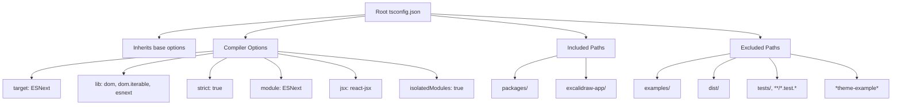
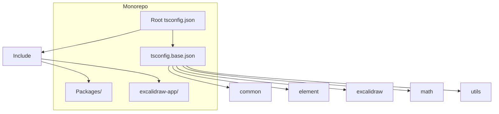
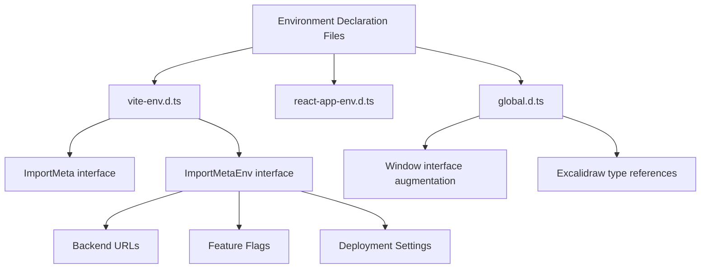
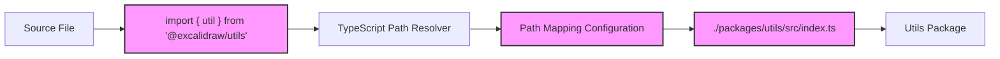

# TypeScript Configuration

<cite>
**Referenced Files in This Document**   
- [tsconfig.json](file://tsconfig.json)
- [packages/tsconfig.base.json](file://packages/tsconfig.base.json)
- [excalidraw-app/vite-env.d.ts](file://excalidraw-app/vite-env.d.ts)
- [excalidraw-app/global.d.ts](file://excalidraw-app/global.d.ts)
- [packages/common/global.d.ts](file://packages/common/global.d.ts)
- [packages/excalidraw/react-app-env.d.ts](file://packages/excalidraw/react-app-env.d.ts)
- [packages/excalidraw/vite-env.d.ts](file://packages/excalidraw/vite-env.d.ts)
</cite>

## Table of Contents
1. [Root tsconfig.json Configuration](#root-tsconfigjson-configuration)
2. [Strict Type Checking and Compiler Options](#strict-type-checking-and-compiler-options)
3. [Module Resolution and JSX Handling](#module-resolution-and-jsx-handling)
4. [Composite Project Setup and Package References](#composite-project-setup-and-package-references)
5. [Ambient Type Declarations and Environment Files](#ambient-type-declarations-and-environment-files)
6. [Path Mapping for Cleaner Imports](#path-mapping-for-cleaner-imports)
7. [Global Type Extensions and Third-Party Module Augmentation](#global-type-extensions-and-third-party-module-augmentation)
8. [Development and Production Compiler Settings](#development-and-production-compiler-settings)
9. [Best Practices for Type Consistency Across Packages](#best-practices-for-type-consistency-across-packages)
10. [Web Workers and WASM Module Type Handling](#web-workers-and-wasm-module-type-handling)

## Root tsconfig.json Configuration

The root `tsconfig.json` file serves as the primary TypeScript configuration for the Excalidraw monorepo, establishing consistent compiler options across all packages and applications. It defines the foundational settings that govern type checking, module resolution, and build behavior for the entire codebase.



**Diagram sources**
- [tsconfig.json](file://tsconfig.json#L1-L38)

**Section sources**
- [tsconfig.json](file://tsconfig.json#L1-L38)

## Strict Type Checking and Compiler Options

The TypeScript configuration enforces strict type checking across the entire monorepo to maintain code quality and prevent common type-related errors. The `strict: true` setting enables a comprehensive set of strict type-checking options that help catch potential bugs at compile time.

Key strictness settings include:
- `strict: true` - Enables all strict type-checking options
- `noFallthroughCasesInSwitch: true` - Ensures switch statements have proper fallthrough handling
- `forceConsistentCasingInFileNames: true` - Prevents issues with case-sensitive file systems
- `skipLibCheck: true` - Skips type checking of declaration files for improved build performance

The configuration also enables modern JavaScript features through `target: "ESNext"` and supports the latest DOM APIs with the `lib` array specifying `"dom"`, `"dom.iterable"`, and `"esnext"`.

**Section sources**
- [tsconfig.json](file://tsconfig.json#L4-L15)

## Module Resolution and JSX Handling

The TypeScript configuration specifies modern module resolution strategies and JSX handling to ensure compatibility with the Vite-based build system and React application architecture.

Key module resolution settings:
- `module: "ESNext"` - Uses ES modules for both compilation and module resolution
- `moduleResolution: "node"` - Follows Node.js module resolution strategy
- `allowSyntheticDefaultImports: true` - Allows default imports from modules with no default export
- `esModuleInterop: true` - Enables interoperability between CommonJS and ES modules

For JSX handling:
- `jsx: "react-jsx"` - Uses the new React JSX transform (automatic runtime)
- `resolveJsonModule: true` - Allows importing JSON files as modules

The `isolatedModules: true` setting ensures that each file can be transpiled independently, which is required for compatibility with Vite and other modern build tools that perform per-file transpilation.

**Section sources**
- [tsconfig.json](file://tsconfig.json#L16-L25)

## Composite Project Setup and Package References

The monorepo employs a composite project setup that enables type checking across multiple packages while maintaining independent compilation. The base configuration in `tsconfig.base.json` is shared across all packages in the monorepo, ensuring consistent TypeScript settings.

The root configuration includes all packages and the main application:
- `include: ["packages", "excalidraw-app"]` - Specifies which directories to include in type checking
- The configuration excludes example projects, build artifacts, and test files from type checking

Each package in the monorepo can extend the base configuration while adding package-specific settings as needed. This approach allows for consistent type checking across the entire codebase while maintaining the flexibility to customize settings for individual packages.



**Diagram sources**
- [tsconfig.json](file://tsconfig.json#L35-L38)
- [packages/tsconfig.base.json](file://packages/tsconfig.base.json#L1-L27)

**Section sources**
- [tsconfig.json](file://tsconfig.json#L35-L38)
- [packages/tsconfig.base.json](file://packages/tsconfig.base.json#L1-L27)

## Ambient Type Declarations and Environment Files

The configuration includes several ambient type declaration files that provide type information for environment-specific variables and third-party libraries.

Key environment declaration files:
- `vite-env.d.ts` - Defines types for Vite's `import.meta.env` variables
- `react-app-env.d.ts` - Extends types for React application environment
- `global.d.ts` - Provides global type augmentations

The `vite-env.d.ts` file in the `excalidraw-app` directory defines a comprehensive `ImportMetaEnv` interface that types all environment variables used in the application, including backend URLs, feature flags, and deployment settings. This ensures type safety when accessing environment variables at runtime.



**Diagram sources**
- [excalidraw-app/vite-env.d.ts](file://excalidraw-app/vite-env.d.ts#L1-L50)
- [excalidraw-app/global.d.ts](file://excalidraw-app/global.d.ts#L1-L7)

**Section sources**
- [excalidraw-app/vite-env.d.ts](file://excalidraw-app/vite-env.d.ts#L1-L50)
- [excalidraw-app/global.d.ts](file://excalidraw-app/global.d.ts#L1-L7)
- [packages/common/global.d.ts](file://packages/common/global.d.ts#L1-L4)

## Path Mapping for Cleaner Imports

The TypeScript configuration implements path mapping to enable cleaner, more maintainable imports across the monorepo. This allows packages to import modules using logical names rather than relative paths, improving code readability and reducing the risk of broken imports when files are moved.

Path mappings defined in the root `tsconfig.json`:
- `@excalidraw/common` - Maps to `./packages/common/src/index.ts`
- `@excalidraw/excalidraw` - Maps to `./packages/excalidraw/index.tsx`
- `@excalidraw/element` - Maps to `./packages/element/src/index.ts`
- `@excalidraw/math` - Maps to `./packages/math/src/index.ts`
- `@excalidraw/utils` - Maps to `./packages/utils/src/index.ts`

These mappings use the `baseUrl: "."` setting and the `paths` compiler option to create aliases for package imports. The configuration includes both direct package imports (without trailing slash) and wildcard imports (with trailing slash) to support importing specific modules within packages.



**Diagram sources**
- [tsconfig.json](file://tsconfig.json#L26-L34)

**Section sources**
- [tsconfig.json](file://tsconfig.json#L26-L34)

## Global Type Extensions and Third-Party Module Augmentation

The configuration includes global type extensions that augment existing types and provide type safety for third-party modules and global objects.

Key global type extensions:
- `global.d.ts` files in various packages extend global interfaces
- Window interface augmentation for application-specific properties
- Module augmentation for third-party libraries

The `global.d.ts` file in `excalidraw-app` extends the `Window` interface to include the `__EXCALIDRAW_SHA__` property, which is set at runtime to track the Git commit SHA of the deployed application. This allows type-safe access to this global variable throughout the application.

Additionally, the configuration includes references to Vite's types through `/// <reference types="vite/client" />`, which provides types for Vite-specific features like environment variables and asset imports.

```mermaid
classDiagram
class Window {
+__EXCALIDRAW_SHA__ : string | undefined
}
class ImportMeta {
+env : ImportMetaEnv
}
class ImportMetaEnv {
+VITE_APP_PORT : string
+VITE_APP_BACKEND_V2_GET_URL : string
+VITE_APP_BACKEND_V2_POST_URL : string
+VITE_APP_WS_SERVER_URL : string
+VITE_APP_PORTAL_URL : string
+VITE_APP_AI_BACKEND : string
+VITE_APP_FIREBASE_CONFIG : string
+VITE_APP_DEV_DISABLE_LIVE_RELOAD : string
+VITE_APP_DISABLE_SENTRY : string
+VITE_APP_COLLAPSE_OVERLAY : string
+VITE_APP_ENABLE_ESLINT : string
+VITE_APP_ENABLE_PWA : string
+VITE_APP_PLUS_LP : string
+VITE_APP_PLUS_APP : string
+VITE_APP_GIT_SHA : string
+MODE : string
+DEV : string
+PROD : string
}
note right of Window
Augmented global interface
for Excalidraw-specific properties
end
note right of ImportMeta
Extended by Vite environment
variable types
end
```

**Diagram sources**
- [excalidraw-app/global.d.ts](file://excalidraw-app/global.d.ts#L1-L7)
- [excalidraw-app/vite-env.d.ts](file://excalidraw-app/vite-env.d.ts#L1-L50)

**Section sources**
- [excalidraw-app/global.d.ts](file://excalidraw-app/global.d.ts#L1-L7)
- [excalidraw-app/vite-env.d.ts](file://excalidraw-app/vite-env.d.ts#L1-L50)
- [packages/common/global.d.ts](file://packages/common/global.d.ts#L1-L4)

## Development and Production Compiler Settings

The TypeScript configuration includes settings optimized for both development experience and production output.

Development-focused settings:
- `noEmit: true` - Prevents TypeScript from emitting JavaScript files, leaving transpilation to Vite
- `isolatedModules: true` - Ensures compatibility with Vite's per-file transpilation
- `allowJs: true` - Allows JavaScript files to be included in the project
- Types for testing libraries included in `types` array

Production considerations:
- The base configuration in `tsconfig.base.json` includes `declaration: true` and `emitDeclarationOnly: true` for generating type declaration files
- `skipLibCheck: true` improves build performance by skipping type checking of declaration files
- `forceConsistentCasingInFileNames: true` prevents issues when deploying to case-sensitive file systems

The configuration strikes a balance between strict type checking for code quality and practical settings that enable efficient development workflows with modern tooling.

**Section sources**
- [tsconfig.json](file://tsconfig.json#L4-L25)
- [packages/tsconfig.base.json](file://packages/tsconfig.base.json#L1-L27)

## Best Practices for Type Consistency Across Packages

The monorepo implements several best practices to maintain type consistency across packages:

1. **Shared Base Configuration**: All packages extend the common `tsconfig.base.json` to ensure consistent compiler options
2. **Standardized Path Mapping**: Uniform import aliases across all packages
3. **Centralized Type Declarations**: Shared ambient types and global augmentations
4. **Strict Type Checking**: Enabled across the entire codebase
5. **Consistent Module Resolution**: Standardized module and JSX settings

These practices ensure that types are consistent and interoperable across package boundaries, reducing the risk of type-related errors when packages depend on each other. The composite project setup allows for type checking across package boundaries while maintaining independent compilation units.

**Section sources**
- [tsconfig.json](file://tsconfig.json#L1-L38)
- [packages/tsconfig.base.json](file://packages/tsconfig.base.json#L1-L27)

## Web Workers and WASM Module Type Handling

While not explicitly configured in the provided files, the TypeScript configuration supports modern web technologies including Web Workers and WASM modules through its general settings.

The `lib: ["dom", "dom.iterable", "esnext"]` setting includes type definitions for Web Workers and related web APIs. The `isolatedModules: true` setting is particularly important for Web Worker code, as it ensures that each module can be transpiled independently.

For WASM modules, the `resolveJsonModule: true` and `allowJs: true` settings support the loading and integration of WASM modules, while the modern `target: "ESNext"` ensures compatibility with the latest JavaScript features used in WASM integration patterns.

Future enhancements could include specific type declarations for Web Worker message passing patterns and WASM module interfaces to provide stronger type safety for these advanced web technologies.

**Section sources**
- [tsconfig.json](file://tsconfig.json#L5-L6)
- [packages/tsconfig.base.json](file://packages/tsconfig.base.json#L3-L4)