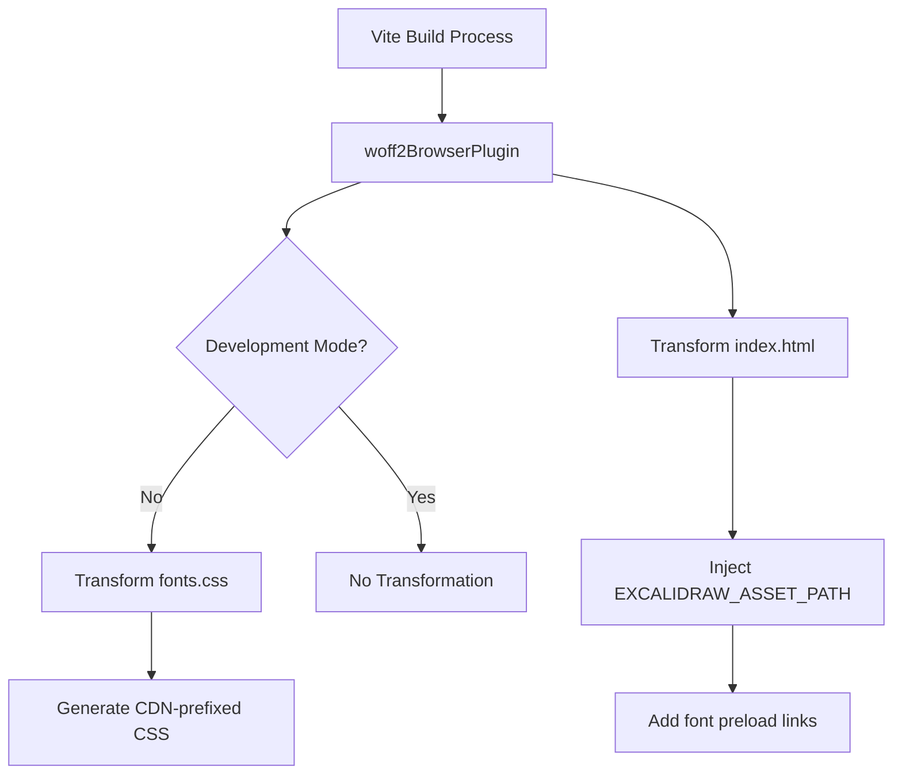
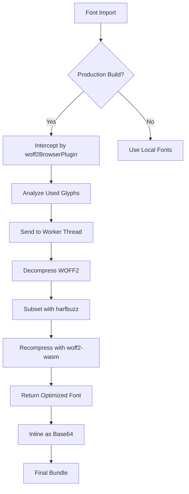
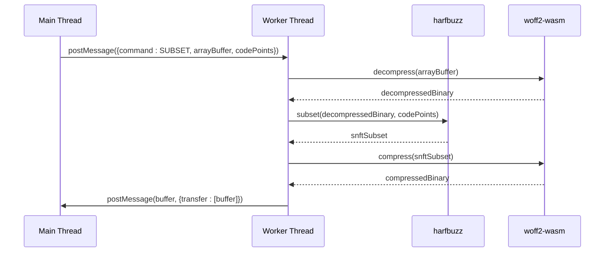

# Custom Plugins

<cite>
**Referenced Files in This Document**   
- [woff2-vite-plugins.js](file://scripts/woff2/woff2-vite-plugins.js)
- [subset-worker.chunk.ts](file://packages/excalidraw/subset/subset-worker.chunk.ts)
- [subset-shared.chunk.ts](file://packages/excalidraw/subset/subset-shared.chunk.ts)
- [woff2-loader.ts](file://packages/excalidraw/subset/woff2/woff2-loader.ts)
- [woff2-bindings.ts](file://packages/excalidraw/subset/woff2/woff2-bindings.ts)
- [woff2-wasm](file://packages/excalidraw/subset/woff2/woff2-wasm)
- [harfbuzz-loader](file://packages/excalidraw/subset/harfbuzz/harfbuzz-loader)
</cite>

## Table of Contents
1. [Introduction](#introduction)
2. [Plugin Architecture Overview](#plugin-architecture-overview)
3. [woff2-vite-plugins.js Implementation](#woff2-vite-pluginsjs-implementation)
4. [Font Subsetting Pipeline](#font-subsetting-pipeline)
5. [Worker Thread Integration](#worker-thread-integration)
6. [Development vs Production Behavior](#development-vs-production-behavior)
7. [Error Handling and Fallbacks](#error-handling-and-fallbacks)
8. [Performance Impact and Bundle Optimization](#performance-impact-and-bundle-optimization)
9. [Plugin Registration and Configuration](#plugin-registration-and-configuration)
10. [Conclusion](#conclusion)

## Introduction

The Excalidraw project implements a sophisticated font optimization system using custom Vite plugins to enable dynamic font subsetting. This documentation details the architecture and implementation of the `woff2-vite-plugins.js` plugin, which integrates with the build process to optimize font assets through dynamic subsetting using harfbuzz and woff2-wasm. The system is designed to reduce bundle sizes for font-heavy components by analyzing used glyphs and generating optimized subsets during the build process.

**Section sources**
- [woff2-vite-plugins.js](file://scripts/woff2/woff2-vite-plugins.js#L1-L105)

## Plugin Architecture Overview

The font optimization system in Excalidraw consists of multiple components working together to achieve efficient font subsetting:

1. **Vite Plugin Layer**: The `woff2BrowserPlugin` intercepts font imports and modifies build output
2. **Worker Thread Layer**: Offloads computationally intensive subsetting operations to web workers
3. **WASM Layer**: Utilizes harfbuzz and woff2-wasm for font processing in the browser
4. **Shared Logic Layer**: Provides common functionality between main and worker threads

The architecture is designed to separate concerns while maintaining efficient communication between components. The plugin operates in the Vite build pipeline, transforming font assets before they are included in the final bundle.

**Diagram sources**
- [woff2-vite-plugins.js](file://scripts/woff2/woff2-vite-plugins.js#L1-L105)

**Section sources**
- [woff2-vite-plugins.js](file://scripts/woff2/woff2-vite-plugins.js#L1-L105)

## woff2-vite-plugins.js Implementation

The `woff2-vite-plugins.js` file implements the `woff2BrowserPlugin` which serves as the entry point for font optimization in the Excalidraw build process. This plugin operates with "pre" enforcement to ensure it runs before other plugins in the Vite pipeline.

The plugin's primary responsibilities include:
- Detecting the build mode (development vs production) through the config hook
- Transforming the `fonts.css` file to use CDN-prefixed URLs for font assets
- Modifying the `index.html` file to inject the `EXCALIDRAW_ASSET_PATH` variable and preload critical fonts

The transformation logic specifically targets production builds, leaving development builds unchanged to maintain fast refresh cycles. When processing the `fonts.css` file, the plugin generates new @font-face rules that point to both the CDN and local fallback paths.

**Section sources**
- [woff2-vite-plugins.js](file://scripts/woff2/woff2-vite-plugins.js#L1-L105)

## Font Subsetting Pipeline

The font subsetting pipeline in Excalidraw follows a multi-stage process to optimize font assets:

1. **Font Import Interception**: The Vite plugin intercepts font imports during the build process
2. **CDN URL Generation**: Production builds are configured to use CDN-hosted font assets
3. **Code Point Analysis**: The system analyzes which glyphs are actually used in the application
4. **Subset Generation**: harfbuzz is used to create font subsets containing only necessary glyphs
5. **WOFF2 Compression**: The subsetted fonts are compressed using woff2-wasm
6. **Base64 Encoding**: The optimized fonts are encoded as base64 data URLs for inline usage

The pipeline leverages the `subsetToBinary` and `subsetToBase64` functions from the shared chunk, which coordinate between the main thread and worker threads to perform the subsetting operations efficiently.

**Diagram sources**
- [woff2-vite-plugins.js](file://scripts/woff2/woff2-vite-plugins.js#L1-L105)
- [subset-shared.chunk.ts](file://packages/excalidraw/subset/subset-shared.chunk.ts#L1-L82)

**Section sources**
- [woff2-vite-plugins.js](file://scripts/woff2/woff2-vite-plugins.js#L1-L105)
- [subset-shared.chunk.ts](file://packages/excalidraw/subset/subset-shared.chunk.ts#L1-L82)

## Worker Thread Integration

The Excalidraw font subsetting system utilizes web workers to offload computationally intensive operations from the main thread. The `subset-worker.chunk.ts` file defines a worker module that runs in a separate thread context, preventing UI blocking during font processing.

The worker implementation follows these key principles:
- **Lazy Loading**: The worker code is included automatically as a separate chunk without requiring special plugin configuration
- **Isolation**: The worker does not depend on external modules to prevent bundling the entire application
- **Message Passing**: Communication occurs through the standard Web Workers API using postMessage

When the main thread needs to subset a font, it sends a message to the worker containing the font ArrayBuffer and the code points to include. The worker processes this request using harfbuzz for subsetting and woff2-wasm for compression, then returns the optimized font buffer with transferable objects to avoid unnecessary copying.

**Diagram sources**
- [subset-worker.chunk.ts](file://packages/excalidraw/subset/subset-worker.chunk.ts#L1-L43)
- [subset-shared.chunk.ts](file://packages/excalidraw/subset/subset-shared.chunk.ts#L1-L82)

**Section sources**
- [subset-worker.chunk.ts](file://packages/excalidraw/subset/subset-worker.chunk.ts#L1-L43)
- [subset-shared.chunk.ts](file://packages/excalidraw/subset/subset-shared.chunk.ts#L1-L82)

## Development vs Production Behavior

The font optimization system exhibits different behaviors between development and production environments to balance performance and developer experience.

In **development mode**:
- No font transformations are applied
- Local font files are used directly
- Full fonts are loaded to ensure all characters are available
- Fast rebuild times are prioritized over bundle size

In **production mode**:
- Font URLs are prefixed with the CDN base path
- Critical fonts are preloaded via link tags
- Dynamic subsetting is enabled for optimized font delivery
- Bundle size reduction is prioritized

The detection of build mode occurs in the plugin's config hook, which sets the `isDev` flag based on the Vite command. This flag is then used in the transform hook to determine whether to modify the font assets.

**Section sources**
- [woff2-vite-plugins.js](file://scripts/woff2/woff2-vite-plugins.js#L1-L105)

## Error Handling and Fallbacks

The font subsetting system implements robust error handling to ensure application stability even when subsetting operations fail. The error handling strategy includes multiple layers of fallbacks:

1. **Worker Communication**: Errors in the worker thread are caught and appropriate fallbacks are implemented
2. **Subsetting Failures**: If glyph subsetting fails, the system falls back to serving the complete font
3. **CDN Failures**: Multiple CDN endpoints are configured to ensure font availability
4. **Local Fallbacks**: When CDN resources are unavailable, local font files serve as backup

The `subsetToBase64` function implements a try-catch wrapper around the subsetting process, ensuring that any errors during subsetting result in the complete font being encoded and served. This prevents text rendering issues at the cost of larger bundle sizes in error scenarios.

**Section sources**
- [subset-shared.chunk.ts](file://packages/excalidraw/subset/subset-shared.chunk.ts#L1-L82)

## Performance Impact and Bundle Optimization

The custom Vite plugin significantly reduces bundle size for font-heavy components by implementing dynamic font subsetting. The optimization impact can be measured in several dimensions:

- **Bundle Size Reduction**: By including only used glyphs, font files can be reduced by 50-90% depending on the character set used
- **Faster Initial Load**: Preloading critical fonts and reducing their size improves Time to Interactive
- **Bandwidth Savings**: Smaller font assets consume less bandwidth, particularly beneficial for mobile users
- **Memory Efficiency**: Subsetted fonts consume less memory when loaded in the browser

The plugin contributes to bundle optimization by:
- Eliminating unused glyphs from font files
- Leveraging CDN delivery for font assets
- Preloading critical fonts to avoid render-blocking
- Using efficient WOFF2 compression with Brotli

**Section sources**
- [woff2-vite-plugins.js](file://scripts/woff2/woff2-vite-plugins.js#L1-L105)
- [subset-shared.chunk.ts](file://packages/excalidraw/subset/subset-shared.chunk.ts#L1-L82)

## Plugin Registration and Configuration

The `woff2BrowserPlugin` is registered in the Vite configuration to integrate with the build process. The plugin is designed to be used without additional configuration, automatically detecting the build environment and applying appropriate transformations.

Key configuration aspects include:
- **Pre-enforcement**: The plugin runs before other plugins to ensure font transformations occur early in the pipeline
- **Environment Detection**: The plugin distinguishes between serve (development) and build (production) commands
- **File Targeting**: Specific file paths are targeted for transformation (fonts.css and index.html)
- **CDN Configuration**: The OSS_FONTS_CDN constant defines the primary CDN endpoint

The plugin is implemented as a CommonJS module with a named export (`woff2BrowserPlugin`), allowing it to be imported and used in Vite configuration files.

**Section sources**
- [woff2-vite-plugins.js](file://scripts/woff2/woff2-vite-plugins.js#L1-L105)

## Conclusion

The custom Vite plugins in Excalidraw provide a sophisticated solution for font optimization through dynamic subsetting. By leveraging harfbuzz and woff2-wasm in worker threads, the system efficiently reduces font bundle sizes while maintaining text rendering quality. The `woff2-vite-plugins.js` implementation demonstrates a well-architected approach to build-time optimization, with clear separation between development and production behaviors. This system significantly improves application performance by reducing bundle sizes and optimizing font loading strategies, particularly benefiting font-heavy components in the Excalidraw application.