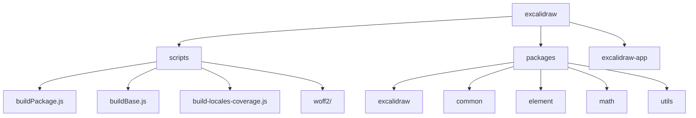
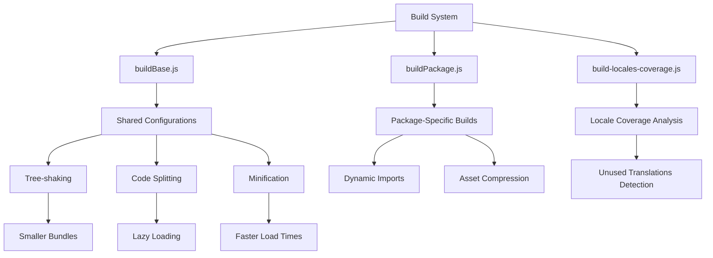
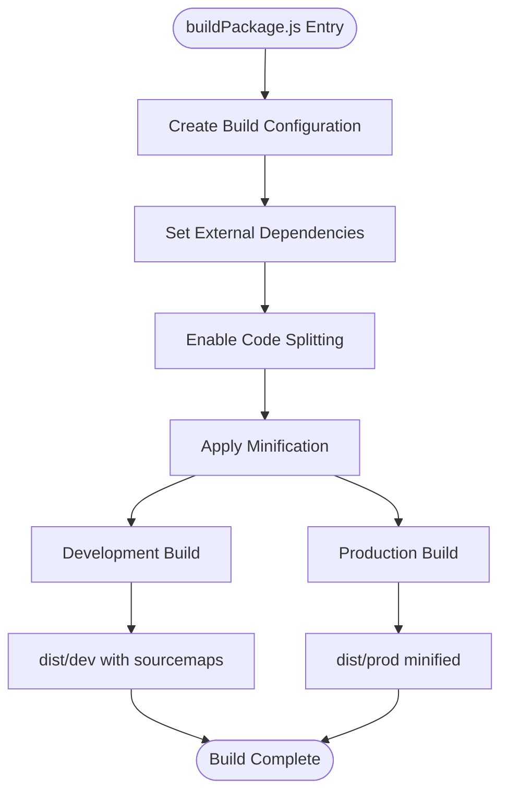
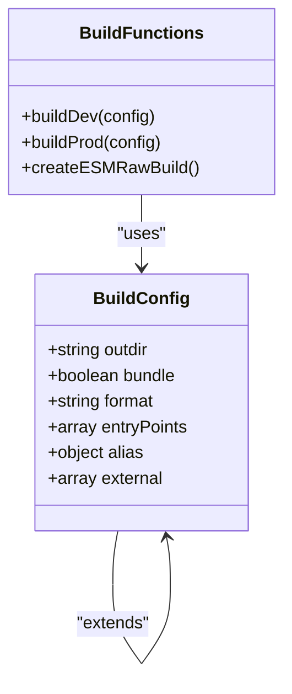
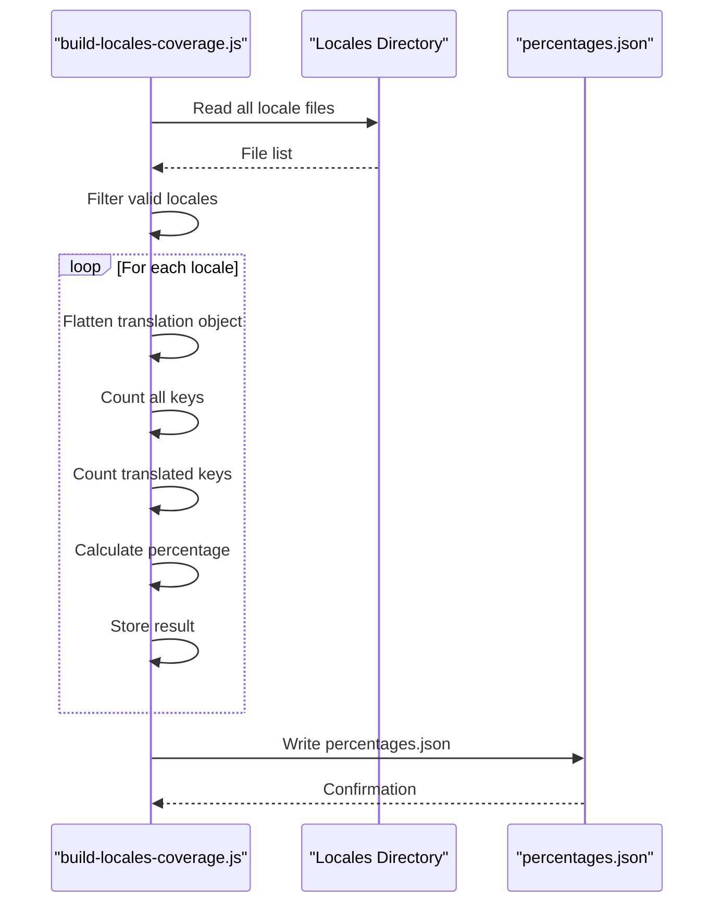
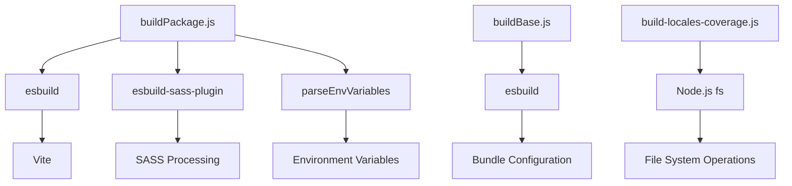

# Optimization Strategies

<cite>
**Referenced Files in This Document**   
- [buildPackage.js](file://scripts/buildPackage.js)
- [buildBase.js](file://scripts/buildBase.js)
- [build-locales-coverage.js](file://scripts/build-locales-coverage.js)
- [locales-coverage-description.js](file://scripts/locales-coverage-description.js)
- [woff2-vite-plugins.js](file://scripts/woff2/woff2-vite-plugins.js)
</cite>

## Table of Contents
1. [Introduction](#introduction)
2. [Project Structure](#project-structure)
3. [Core Components](#core-components)
4. [Architecture Overview](#architecture-overview)
5. [Detailed Component Analysis](#detailed-component-analysis)
6. [Dependency Analysis](#dependency-analysis)
7. [Performance Considerations](#performance-considerations)
8. [Troubleshooting Guide](#troubleshooting-guide)
9. [Conclusion](#conclusion)

## Introduction
This document provides an in-depth analysis of the optimization strategies implemented in Excalidraw's Vite build process. It details how the build scripts orchestrate tree-shaking, code splitting, and minification across the monorepo's packages. The documentation covers the shared build configurations, locale coverage analysis, dynamic imports, and various performance optimization techniques that contribute to efficient production bundles.

## Project Structure
The Excalidraw repository follows a monorepo structure with multiple packages and applications. The build optimization scripts are centralized in the `scripts` directory, serving the entire monorepo. The structure enables shared configurations while allowing package-specific optimizations.

**Diagram sources**
- [scripts/buildPackage.js](file://scripts/buildPackage.js)
- [scripts/buildBase.js](file://scripts/buildBase.js)

**Section sources**
- [scripts/buildPackage.js](file://scripts/buildPackage.js)
- [scripts/buildBase.js](file://scripts/buildBase.js)

## Core Components
The core optimization components include buildPackage.js for package-specific builds, buildBase.js for shared configurations, and locale coverage analysis scripts. These components work together to implement tree-shaking, code splitting, and minification across the monorepo.

**Section sources**
- [scripts/buildPackage.js](file://scripts/buildPackage.js#L1-L80)
- [scripts/buildBase.js](file://scripts/buildBase.js#L1-L49)

## Architecture Overview
The build architecture follows a layered approach with shared base configurations and specialized build scripts for different use cases. The system leverages esbuild for fast compilation and implements various optimization techniques to reduce bundle size and improve performance.

**Diagram sources**
- [scripts/buildBase.js](file://scripts/buildBase.js#L1-L49)
- [scripts/buildPackage.js](file://scripts/buildPackage.js#L1-L80)
- [scripts/build-locales-coverage.js](file://scripts/build-locales-coverage.js#L1-L37)

## Detailed Component Analysis

### buildPackage.js Analysis
The buildPackage.js script orchestrates the build process for Excalidraw packages, implementing advanced optimization techniques through esbuild. It configures tree-shaking by marking external dependencies, enables code splitting for better lazy loading, and applies minification for production builds.

**Diagram sources**
- [scripts/buildPackage.js](file://scripts/buildPackage.js#L1-L80)

**Section sources**
- [scripts/buildPackage.js](file://scripts/buildPackage.js#L1-L80)

### buildBase.js Analysis
The buildBase.js script establishes shared build configurations that can be reused across different packages in the monorepo. It defines the foundational settings for bundling, formatting, and external dependencies, ensuring consistency in the build process.

**Diagram sources**
- [scripts/buildBase.js](file://scripts/buildBase.js#L1-L49)

**Section sources**
- [scripts/buildBase.js](file://scripts/buildBase.js#L1-L49)

### Locale Coverage Analysis
The locale coverage analysis script identifies unused translations and their impact on bundle size. By analyzing the translation files and calculating coverage percentages, it helps optimize the inclusion of locale data in the final bundle.

**Diagram sources**
- [scripts/build-locales-coverage.js](file://scripts/build-locales-coverage.js#L1-L37)

**Section sources**
- [scripts/build-locales-coverage.js](file://scripts/build-locales-coverage.js#L1-L37)

## Dependency Analysis
The build system dependencies are carefully managed to ensure optimal tree-shaking and code splitting. External dependencies are properly configured to prevent bundling third-party packages while maintaining the ability to resolve internal monorepo packages.

**Diagram sources**
- [scripts/buildPackage.js](file://scripts/buildPackage.js#L1-L80)
- [scripts/buildBase.js](file://scripts/buildBase.js#L1-L49)
- [scripts/build-locales-coverage.js](file://scripts/build-locales-coverage.js#L1-L37)

**Section sources**
- [scripts/buildPackage.js](file://scripts/buildPackage.js#L1-L80)
- [scripts/buildBase.js](file://scripts/buildBase.js#L1-L49)
- [scripts/build-locales-coverage.js](file://scripts/build-locales-coverage.js#L1-L37)

## Performance Considerations
The build optimization strategies significantly impact application performance. The combination of tree-shaking, code splitting, and minification reduces bundle sizes and improves load times. The locale coverage analysis helps eliminate unused translation data, further optimizing bundle size.

**Section sources**
- [scripts/buildPackage.js](file://scripts/buildPackage.js#L1-L80)
- [scripts/buildBase.js](file://scripts/buildBase.js#L1-L49)
- [scripts/build-locales-coverage.js](file://scripts/build-locales-coverage.js#L1-L37)

## Troubleshooting Guide
When encountering build optimization issues, consider checking the external dependencies configuration, verifying code splitting settings, and ensuring proper tree-shaking implementation. The locale coverage script can help identify unnecessary translation files that may be increasing bundle size.

**Section sources**
- [scripts/buildPackage.js](file://scripts/buildPackage.js#L1-L80)
- [scripts/buildBase.js](file://scripts/buildBase.js#L1-L49)
- [scripts/build-locales-coverage.js](file://scripts/build-locales-coverage.js#L1-L37)

## Conclusion
Excalidraw's build optimization strategy effectively combines shared configurations with package-specific optimizations to deliver efficient production bundles. The use of esbuild for fast compilation, combined with tree-shaking, code splitting, and minification, results in optimized bundles. The locale coverage analysis further enhances optimization by identifying and potentially eliminating unused translations. These strategies work together to ensure fast load times and optimal performance in production environments.