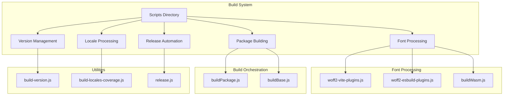
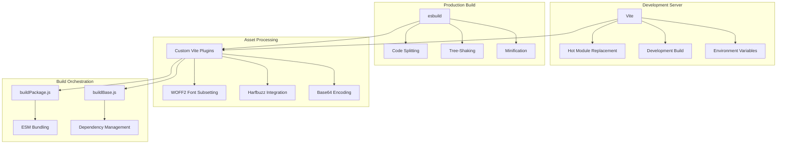
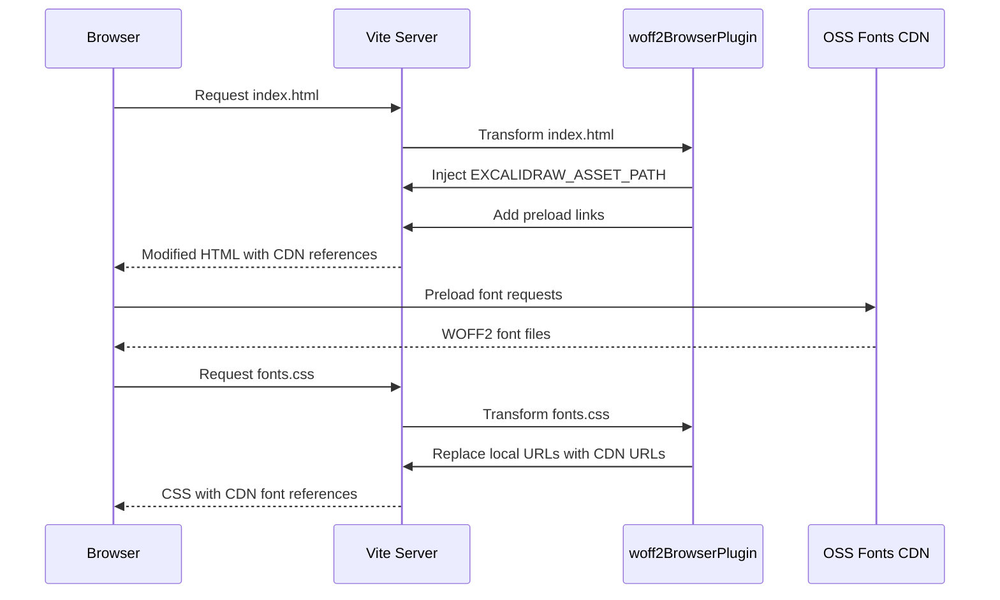
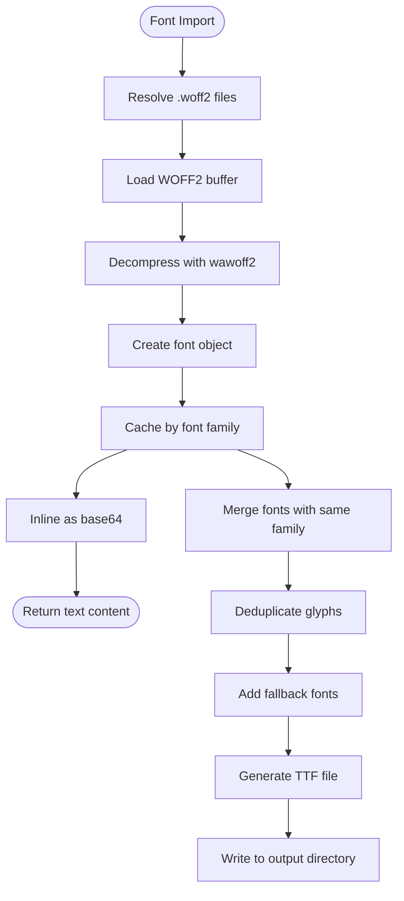
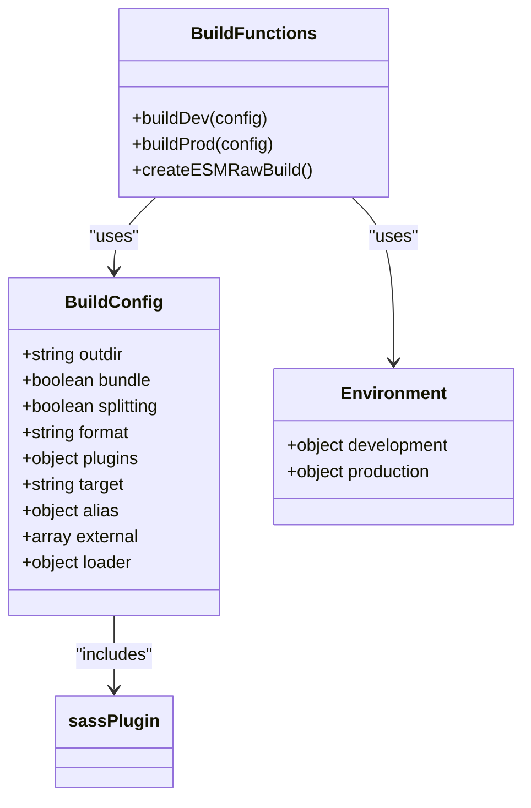
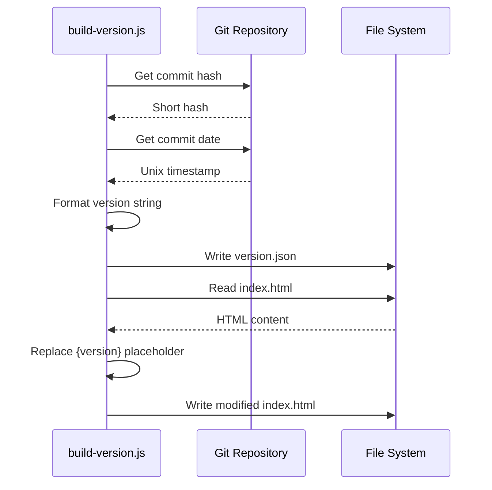
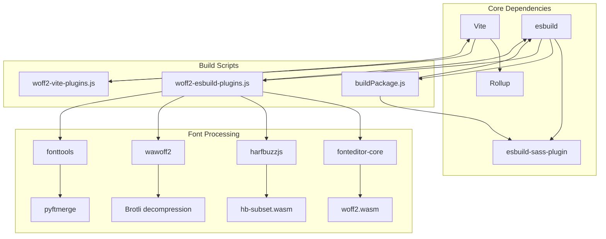

# Vite Build System and Tooling

<cite>
**Referenced Files in This Document**   
- [woff2-vite-plugins.js](file://scripts/woff2/woff2-vite-plugins.js)
- [buildPackage.js](file://scripts/buildPackage.js)
- [buildWasm.js](file://scripts/buildWasm.js)
- [buildBase.js](file://scripts/buildBase.js)
- [build-version.js](file://scripts/build-version.js)
- [build-locales-coverage.js](file://scripts/build-locales-coverage.js)
- [woff2-esbuild-plugins.js](file://scripts/woff2/woff2-esbuild-plugins.js)
- [buildDocs.js](file://scripts/buildDocs.js)
- [release.js](file://scripts/release.js)
</cite>

## Table of Contents
1. [Introduction](#introduction)
2. [Project Structure](#project-structure)
3. [Core Components](#core-components)
4. [Architecture Overview](#architecture-overview)
5. [Detailed Component Analysis](#detailed-component-analysis)
6. [Dependency Analysis](#dependency-analysis)
7. [Performance Considerations](#performance-considerations)
8. [Troubleshooting Guide](#troubleshooting-guide)
9. [Conclusion](#conclusion)

## Introduction
This document provides comprehensive documentation for the Vite build system used in Excalidraw, focusing on its configuration, custom plugins, and tooling infrastructure. The system enables advanced font handling through WOFF2 subsetting, integrates harfbuzz for text shaping, and implements efficient asset processing. The build scripts in the `/scripts` directory orchestrate package compilation, versioning, and locale processing. This documentation details the use of environment variables, code splitting strategies, optimization techniques like tree-shaking and dynamic imports, and development server features including hot module replacement and build performance metrics.

## Project Structure

The Excalidraw project structure reveals a sophisticated build system centered around the `/scripts` directory, which contains specialized build scripts and plugins for handling fonts, locales, versioning, and package management. The Vite configuration is extended through custom plugins that process font assets and integrate with external tools like harfbuzz.

**Diagram sources**
- [scripts/woff2/woff2-vite-plugins.js](file://scripts/woff2/woff2-vite-plugins.js)
- [scripts/buildPackage.js](file://scripts/buildPackage.js)
- [scripts/build-version.js](file://scripts/build-version.js)
- [scripts/build-locales-coverage.js](file://scripts/build-locales-coverage.js)
- [scripts/release.js](file://scripts/release.js)

**Section sources**
- [scripts/woff2/woff2-vite-plugins.js](file://scripts/woff2/woff2-vite-plugins.js)
- [scripts/buildPackage.js](file://scripts/buildPackage.js)
- [scripts/buildWasm.js](file://scripts/buildWasm.js)

## Core Components

The Vite build system in Excalidraw is built around several core components that handle font subsetting, asset optimization, and package compilation. The custom Vite plugins process WOFF2 font files during both development and production builds, ensuring optimal font loading and rendering performance. The build scripts leverage esbuild for fast compilation and implement code splitting to optimize bundle sizes. Environment variables are used to configure different build targets, and tree-shaking is enabled to eliminate unused code.

**Section sources**
- [scripts/woff2/woff2-vite-plugins.js](file://scripts/woff2/woff2-vite-plugins.js)
- [scripts/buildPackage.js](file://scripts/buildPackage.js)
- [scripts/buildBase.js](file://scripts/buildBase.js)

## Architecture Overview

The build architecture of Excalidraw follows a modular approach where different scripts handle specific aspects of the build process. The system is designed to separate concerns between font processing, package compilation, version management, and release automation. Vite serves as the primary development server and build tool, enhanced with custom plugins that extend its capabilities for font handling and asset optimization.

**Diagram sources**
- [scripts/woff2/woff2-vite-plugins.js](file://scripts/woff2/woff2-vite-plugins.js)
- [scripts/buildPackage.js](file://scripts/buildPackage.js)
- [scripts/buildBase.js](file://scripts/buildBase.js)

## Detailed Component Analysis

### Font Processing System

The font processing system in Excalidraw is a sophisticated pipeline that handles WOFF2 font files through multiple stages of optimization and transformation. Custom Vite plugins intercept font imports and apply different processing strategies based on the build environment.

#### Font Subsetting and CDN Integration

**Diagram sources**
- [scripts/woff2/woff2-vite-plugins.js](file://scripts/woff2/woff2-vite-plugins.js)

#### Server-Side Font Processing

**Diagram sources**
- [scripts/woff2/woff2-esbuild-plugins.js](file://scripts/woff2/woff2-esbuild-plugins.js)

### Build Script Orchestration

The build scripts in Excalidraw are designed to handle different aspects of the compilation process, from package building to version management and release automation.

#### Package Compilation Pipeline

**Diagram sources**
- [scripts/buildPackage.js](file://scripts/buildPackage.js)

#### Version Management System

**Diagram sources**
- [scripts/build-version.js](file://scripts/build-version.js)

## Dependency Analysis

The build system in Excalidraw has a well-defined dependency structure that separates concerns between different build aspects. The core dependencies include Vite for development server and build orchestration, esbuild for fast compilation, and various specialized packages for font processing.

**Diagram sources**
- [scripts/woff2/woff2-vite-plugins.js](file://scripts/woff2/woff2-vite-plugins.js)
- [scripts/woff2/woff2-esbuild-plugins.js](file://scripts/woff2/woff2-esbuild-plugins.js)
- [scripts/buildPackage.js](file://scripts/buildPackage.js)
- [scripts/buildWasm.js](file://scripts/buildWasm.js)

**Section sources**
- [scripts/woff2/woff2-vite-plugins.js](file://scripts/woff2/woff2-vite-plugins.js)
- [scripts/woff2/woff2-esbuild-plugins.js](file://scripts/woff2/woff2-esbuild-plugins.js)
- [scripts/buildPackage.js](file://scripts/buildPackage.js)
- [scripts/buildWasm.js](file://scripts/buildWasm.js)

## Performance Considerations

The build system in Excalidraw incorporates several performance optimization techniques to ensure fast development iterations and efficient production bundles. During development, the system leverages Vite's native ES module serving, which eliminates the need for bundling and enables instant startup times. For production builds, esbuild's highly optimized compilation pipeline delivers fast build times with advanced optimizations.

The font processing system implements multiple performance enhancements, including CDN-based font delivery, preloading of critical fonts, and base64 inlining for server-side use cases. Code splitting is enabled to break the application into smaller chunks that can be loaded on demand, reducing initial load times. Tree-shaking eliminates unused code from the final bundle, and minification reduces file sizes for production deployment.

The build process also includes performance metrics through console logging of font generation details, including units per em, ascent, and descent values, which helps monitor the efficiency of the font processing pipeline.

## Troubleshooting Guide

When encountering issues with the Excalidraw build system, consider the following common problems and solutions:

**Section sources**
- [scripts/woff2/woff2-esbuild-plugins.js](file://scripts/woff2/woff2-esbuild-plugins.js)
- [scripts/buildPackage.js](file://scripts/buildPackage.js)
- [scripts/release.js](file://scripts/release.js)

## Conclusion

The Vite build system in Excalidraw represents a sophisticated and well-architected solution for modern web application development. By combining Vite's rapid development server with esbuild's high-performance compilation, the system delivers an excellent developer experience with fast build times and efficient production bundles. The custom plugins for font processing demonstrate an advanced approach to asset optimization, leveraging CDN delivery, subsetting, and server-side font generation to ensure optimal performance. The modular build script architecture allows for clear separation of concerns between different aspects of the build process, from package compilation to version management and release automation. This comprehensive build system enables Excalidraw to maintain high performance standards while providing developers with a productive and efficient development workflow.