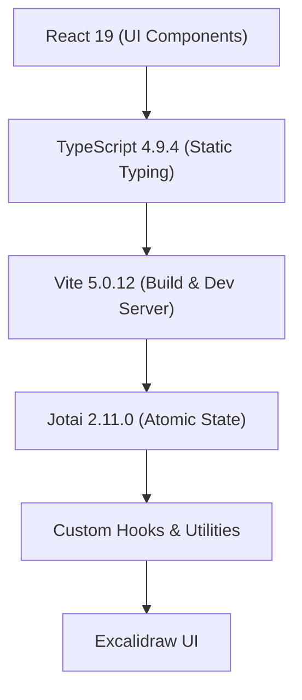
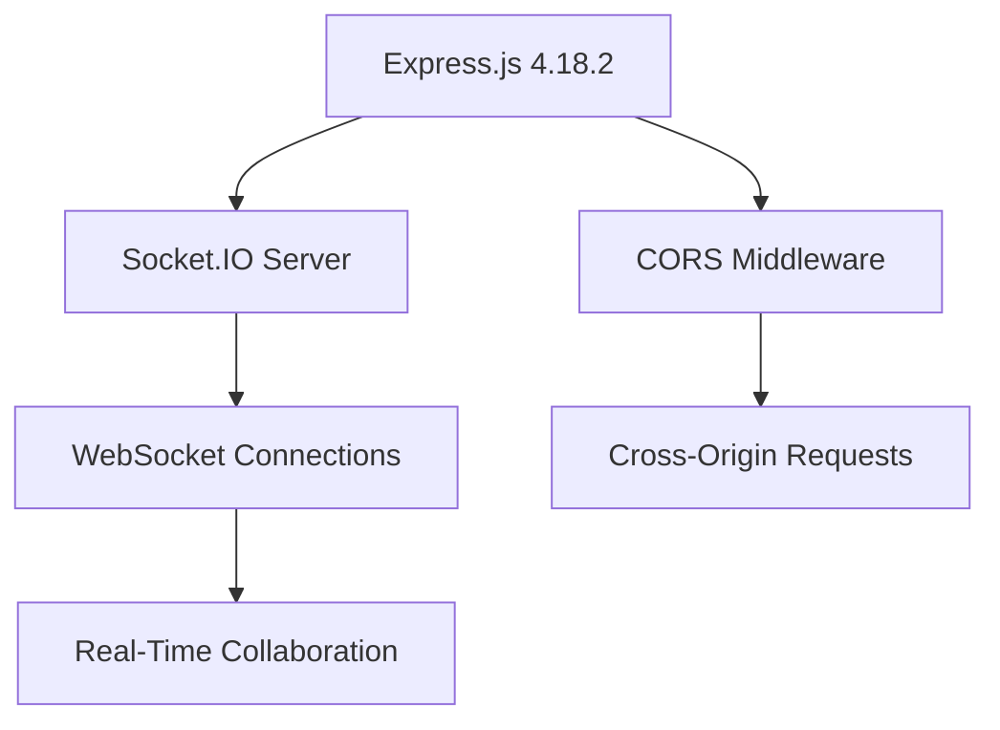
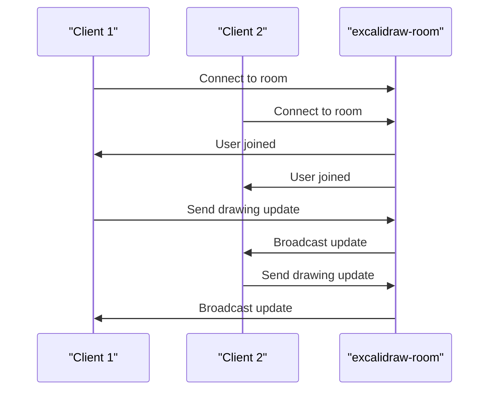
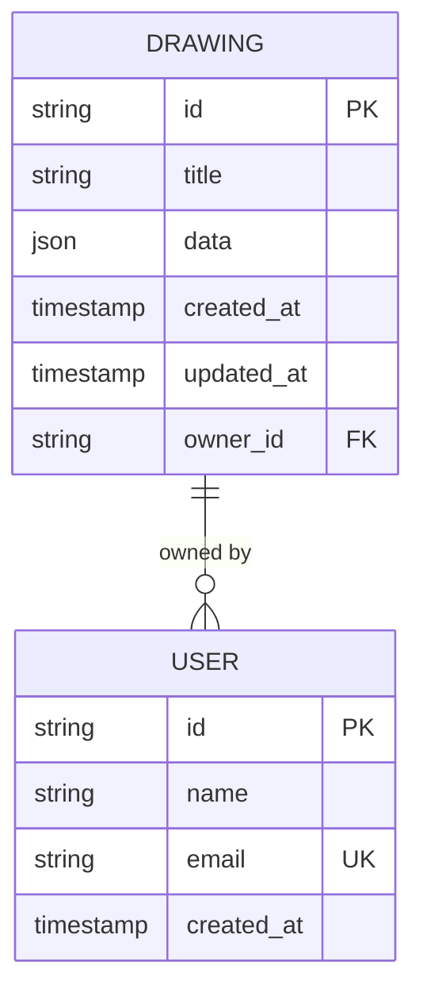
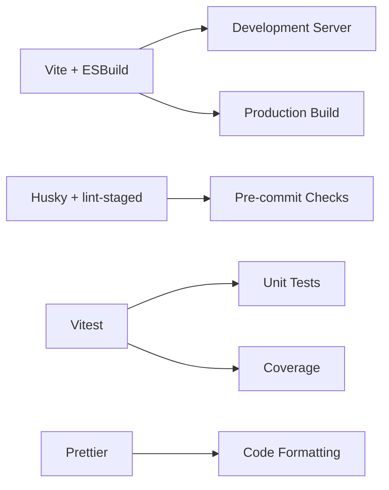
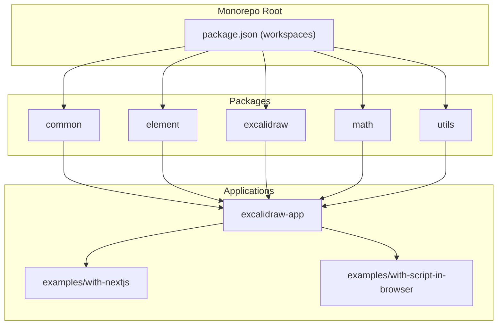
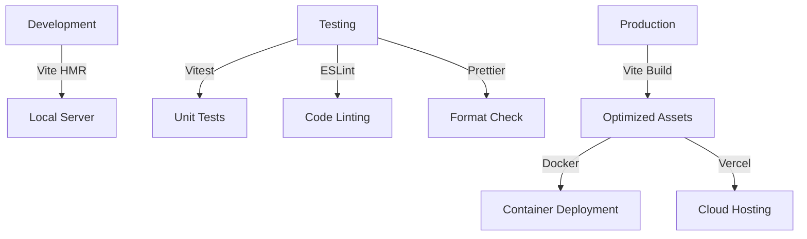

# Technology Stack

<cite>
**Referenced Files in This Document**   
- [package.json](file://excalidraw/package.json)
- [package.json](file://excalidraw/excalidraw-app/package.json)
- [package.json](file://excalidraw/excalidraw-room/package.json)
- [app-jotai.ts](file://excalidraw/excalidraw-app/app-jotai.ts)
- [tsconfig.json](file://excalidraw/tsconfig.json)
- [Dockerfile](file://excalidraw/Dockerfile)
- [docker-compose.yml](file://excalidraw/docker-compose.yml)
- [init-db.sql](file://excalidraw/init-db.sql)
</cite>

## Table of Contents
1. [Frontend Technologies](#frontend-technologies)  
2. [Backend Frameworks](#backend-frameworks)  
3. [Real-Time Communication](#real-time-communication)  
4. [Database Systems](#database-systems)  
5. [Build Tools and Development Environment](#build-tools-and-development-environment)  
6. [Monorepo Architecture and Integration](#monorepo-architecture-and-integration)  
7. [Development, Testing, and Production Environments](#development-testing-and-production-environments)  
8. [Performance and Ecosystem Considerations](#performance-and-ecosystem-considerations)

## Frontend Technologies

The Excalidraw frontend is built using a modern JavaScript stack centered around React, TypeScript, Vite, and Jotai for state management. The application leverages React 19.0.0 for its component model, enabling efficient UI rendering and lifecycle management. TypeScript 4.9.4 provides static typing across the codebase, enhancing code quality and developer experience through early error detection and improved IDE support.

Vite 5.0.12 serves as the primary build tool and development server, offering fast cold starts and instant hot module replacement (HMR) during development. Its integration with the `@vitejs/plugin-react` plugin ensures seamless React support, while `vite-plugin-svgr` enables direct import of SVG assets as React components. The `vite-plugin-pwa` enhances offline capabilities, and `vite-plugin-html` allows dynamic HTML template injection.

State management is handled by Jotai 2.11.0, a minimalistic and flexible state management library that provides atomic state primitives. The `app-jotai.ts` file defines a custom store (`appJotaiStore`) and utility hooks like `useAtomWithInitialValue`, enabling scoped state initialization and efficient reactivity patterns without the complexity of traditional Redux-style stores.

**Diagram sources**  
- [package.json](file://excalidraw/excalidraw-app/package.json#L15-L20)  
- [app-jotai.ts](file://excalidraw/excalidraw-app/app-jotai.ts#L1-L38)

**Section sources**  
- [package.json](file://excalidraw/excalidraw-app/package.json#L15-L20)  
- [app-jotai.ts](file://excalidraw/excalidraw-app/app-jotai.ts#L1-L38)  
- [tsconfig.json](file://excalidraw/tsconfig.json#L1-L10)

## Backend Frameworks

The backend infrastructure for Excalidraw's collaborative features is implemented using Node.js and Express.js. The `excalidraw-room` service acts as a dedicated WebSocket server for real-time collaboration, built on Express 4.18.2 as the HTTP framework. This lightweight server handles WebSocket connections via Socket.IO and manages cross-origin resource sharing (CORS) using the `cors` middleware.

The server is designed to be minimal and focused, with no complex build step required, as indicated by the `"build": "echo 'No build step required'"` script in its `package.json`. It runs using Node.js 16+, with development support provided by `nodemon` for automatic restarts during code changes.

**Diagram sources**  
- [package.json](file://excalidraw/excalidraw-room/package.json#L10-L15)  
- [package.json](file://excalidraw/excalidraw-room/package.json#L7-L9)

**Section sources**  
- [package.json](file://excalidraw/excalidraw-room/package.json#L7-L15)

## Real-Time Communication

Real-time collaboration in Excalidraw is powered by Socket.IO, a robust WebSocket library that enables bidirectional, low-latency communication between clients and the collaboration server. The client-side application uses `socket.io-client` 4.7.2 to establish persistent connections to the `excalidraw-room` server, while the server-side uses `socket.io` 4.7.2 to manage room-based messaging, presence, and synchronization.

This architecture allows multiple users to collaborate on the same whiteboard in real time, with changes propagated instantly across all connected clients. The use of Socket.IO provides fallback mechanisms for environments where WebSockets are not available, ensuring broad compatibility.

**Diagram sources**  
- [package.json](file://excalidraw/excalidraw-app/package.json#L20)  
- [package.json](file://excalidraw/excalidraw-room/package.json#L11)

**Section sources**  
- [package.json](file://excalidraw/excalidraw-app/package.json#L20)  
- [package.json](file://excalidraw/excalidraw-room/package.json#L11)

## Database Systems

Excalidraw supports multiple database backends for persistent data storage, including PostgreSQL and SQLite. The application uses the `pg` library (version 8.11.3) to interface with PostgreSQL, enabling robust, scalable storage for user data, drawings, and collaboration metadata. PostgreSQL is used in production environments where high availability and transactional integrity are required.

For simpler deployments or local development, SQLite is supported through the `init-db.sql` schema file, which defines the initial database structure. This dual-database strategy allows flexibility in deployment scenarios, from cloud-native PostgreSQL clusters to lightweight SQLite instances.

**Diagram sources**  
- [package.json](file://excalidraw/excalidraw-app/package.json#L19)  
- [init-db.sql](file://excalidraw/init-db.sql#L1-L20)

**Section sources**  
- [package.json](file://excalidraw/excalidraw-app/package.json#L19)  
- [init-db.sql](file://excalidraw/init-db.sql#L1-L20)

## Build Tools and Development Environment

The Excalidraw monorepo leverages a comprehensive suite of build tools and development utilities. Vite is the core build system, supported by plugins such as `vite-plugin-checker` for type checking, `vite-plugin-ejs` for template processing, and `vite-plugin-sitemap` for SEO optimization. ESBuild underpins Vite's performance, enabling rapid bundling and transpilation.

The development workflow is enhanced with `husky` for Git hooks, `lint-staged` for pre-commit linting, and `prettier` for code formatting. Testing is handled by `vitest` 3.0.6 with `@vitest/coverage-v8` for coverage reporting and `vitest-canvas-mock` for browser API simulation. The `test:all` script orchestrates type checking, linting, formatting, and unit tests to ensure code quality.

**Diagram sources**  
- [package.json](file://excalidraw/package.json#L10-L30)  
- [package.json](file://excalidraw/package.json#L50-L60)

**Section sources**  
- [package.json](file://excalidraw/package.json#L10-L60)

## Monorepo Architecture and Integration

Excalidraw employs a monorepo structure managed by Yarn workspaces, as defined in the root `package.json`. The workspace configuration includes `excalidraw-app`, `packages/*`, and `examples/*`, enabling shared dependencies and unified tooling. This architecture promotes code reuse through shared packages like `@excalidraw/common`, `@excalidraw/element`, and `@excalidraw/excalidraw`.

The build system is orchestrated through a series of interdependent scripts. For example, `build:packages` sequentially builds shared components, ensuring that the `excalidraw-app` can consume the latest versions. The `workspaces` field in `package.json` enables seamless linking of local packages, eliminating the need for publishing to a registry during development.

**Diagram sources**  
- [package.json](file://excalidraw/package.json#L3-L7)  
- [package.json](file://excalidraw/package.json#L65-L75)

**Section sources**  
- [package.json](file://excalidraw/package.json#L3-L75)

## Development, Testing, and Production Environments

Excalidraw maintains distinct configurations for development, testing, and production environments. The `browserslist` configuration in `excalidraw-app/package.json` defines target browsers, ensuring compatibility with modern browsers while dropping support for legacy ones like IE11. Development uses last versions of Chrome, Firefox, and Safari, while production targets broader compatibility.

Testing is comprehensive, with `vitest` handling unit tests, `eslint` enforcing code quality, and `prettier` ensuring consistent formatting. The `test:all` script combines type checking, linting, and testing into a single command. Production builds are optimized through Vite's tree-shaking and minification, with environment variables like `VITE_APP_ENABLE_TRACKING` and `VITE_APP_DISABLE_SENTRY` controlling feature flags.

Deployment is supported through Docker, with `Dockerfile` and `docker-compose.yml` enabling containerized execution. The `railway.toml` and `vercel.json` files indicate support for Railway and Vercel deployments, respectively.

**Diagram sources**  
- [package.json](file://excalidraw/excalidraw-app/package.json#L25-L35)  
- [Dockerfile](file://excalidraw/Dockerfile#L1-L10)  
- [docker-compose.yml](file://excalidraw/docker-compose.yml#L1-L5)

**Section sources**  
- [package.json](file://excalidraw/excalidraw-app/package.json#L25-L35)  
- [Dockerfile](file://excalidraw/Dockerfile#L1-L10)  
- [docker-compose.yml](file://excalidraw/docker-compose.yml#L1-L5)

## Performance and Ecosystem Considerations

Each technology in the Excalidraw stack was selected for its performance characteristics, community support, and ecosystem maturity. React 19 offers improved rendering performance and new APIs, while TypeScript's strong typing reduces runtime errors. Vite's ESBuild-based architecture ensures fast builds, critical for developer productivity in a large codebase.

Jotai provides a lightweight yet powerful state solution, avoiding the boilerplate of Redux while maintaining predictability. Socket.IO's reliability in real-time communication is well-established, with extensive documentation and community support. PostgreSQL offers ACID compliance and scalability, while SQLite provides simplicity for lightweight use cases.

The ecosystem around these tools is mature, with active maintenance, regular security updates, and extensive plugin ecosystems. The use of standard tools like ESLint, Prettier, and Vitest ensures compatibility with industry best practices and easy onboarding for new developers.

**Section sources**  
- [package.json](file://excalidraw/package.json#L10-L30)  
- [package.json](file://excalidraw/excalidraw-app/package.json#L15-L25)  
- [package.json](file://excalidraw/excalidraw-room/package.json#L10-L15)