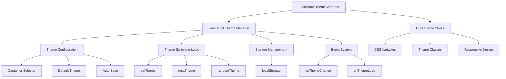
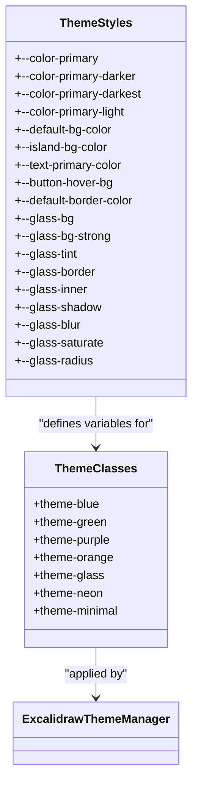
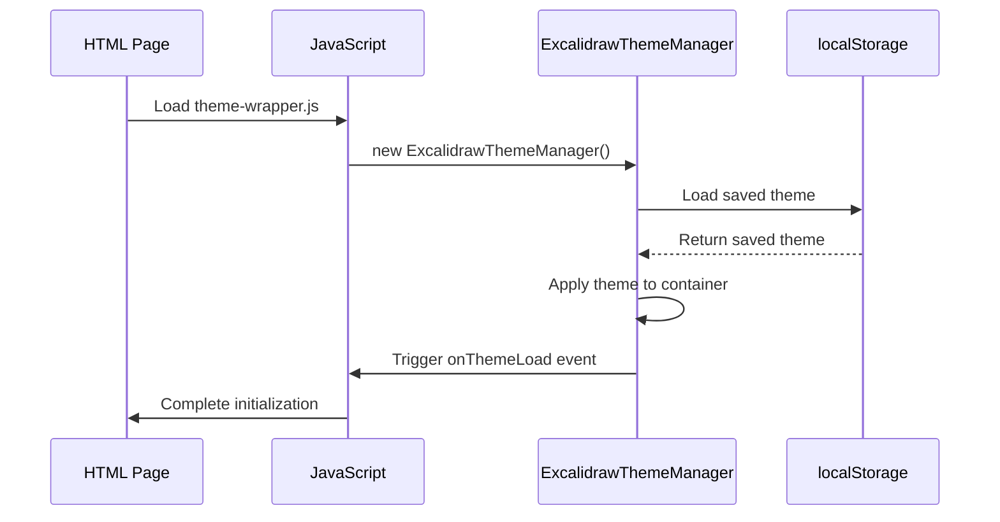
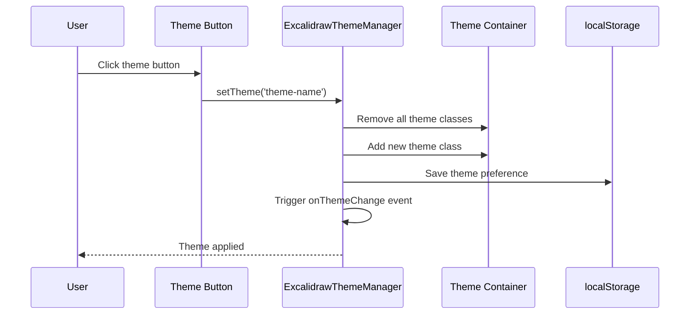
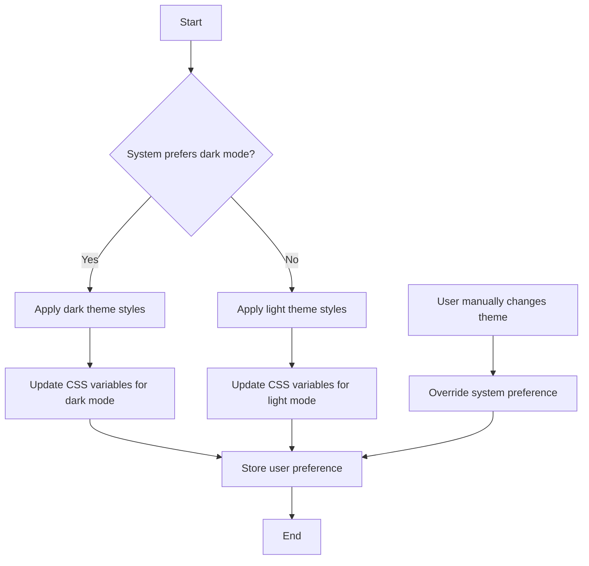
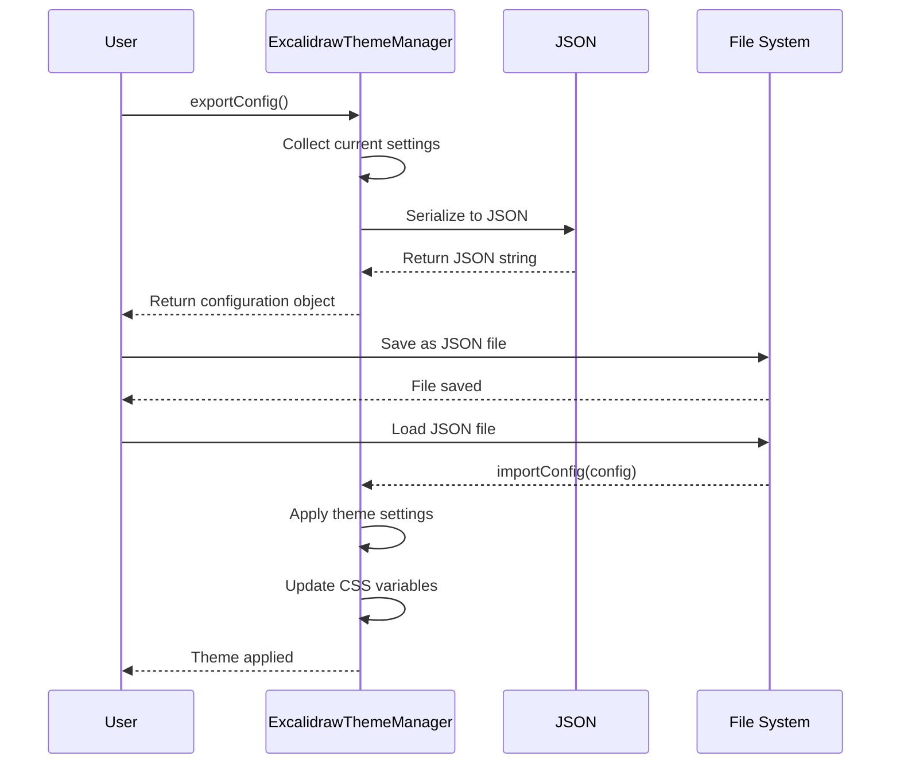
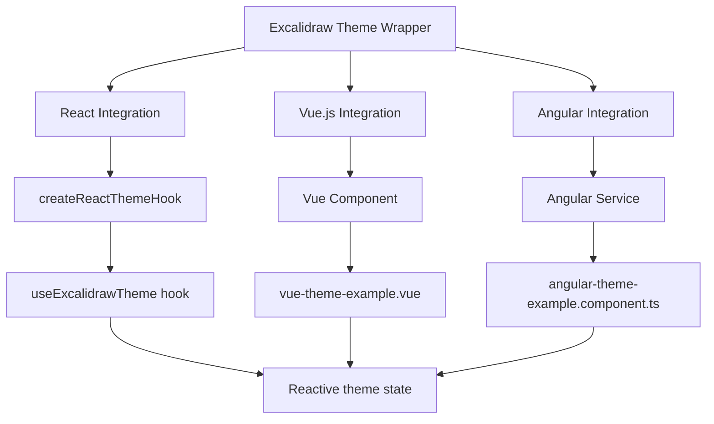
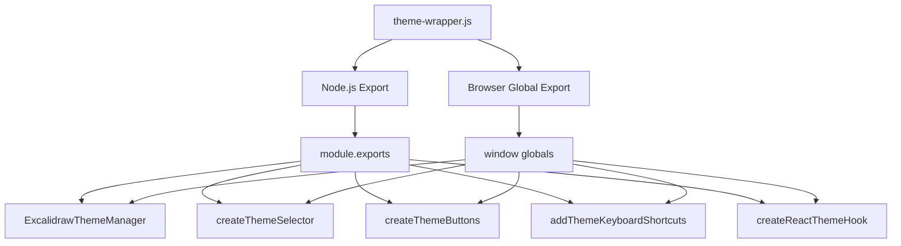
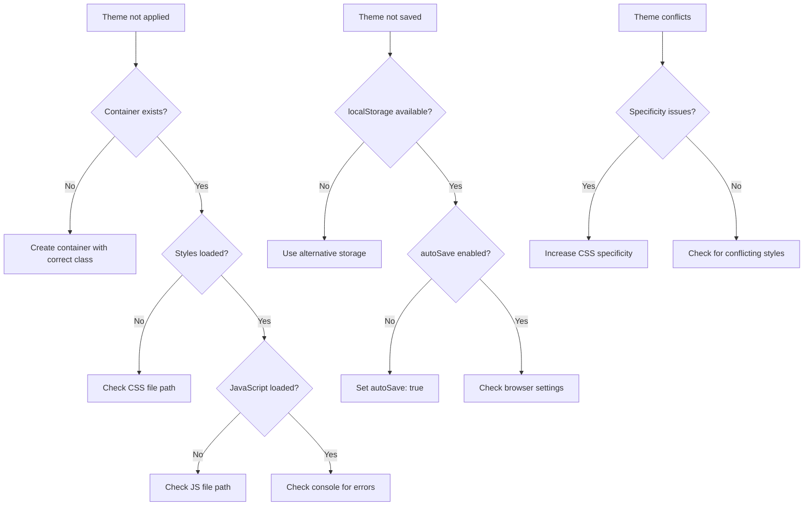
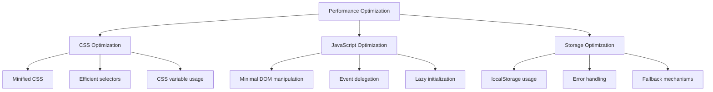

# Complete Theme Wrapper

<cite>
**Referenced Files in This Document**   
- [theme-wrapper.js](file://excalidraw/excalidraw-app/theme-wrapper.js)
- [theme-wrapper.scss](file://excalidraw/excalidraw-app/theme-wrapper.scss)
- [theme-wrapper-example.html](file://excalidraw/excalidraw-app/theme-wrapper-example.html)
- [README-THEME-WRAPPER.md](file://excalidraw/excalidraw-app/README-THEME-WRAPPER.md)
- [COMPLETE-THEME-WRAPPER-GUIDE.md](file://excalidraw/excalidraw-app/COMPLETE-THEME-WRAPPER-GUIDE.md)
- [MINIMAL-THEME-GUIDE.md](file://excalidraw/excalidraw-app/MINIMAL-THEME-GUIDE.md)
</cite>

## Table of Contents
1. [Introduction](#introduction)
2. [Architecture Overview](#architecture-overview)
3. [Core Components](#core-components)
4. [Configuration Options](#configuration-options)
5. [Usage Examples](#usage-examples)
6. [Advanced Customization](#advanced-customization)
7. [Integration with Build Systems](#integration-with-build-systems)
8. [Debugging Techniques](#debugging-techniques)
9. [Performance Optimization](#performance-optimization)
10. [Conclusion](#conclusion)

## Introduction

The Excalidraw Theme Wrapper system provides a comprehensive solution for advanced theme customization without modifying the core Excalidraw source code. This documentation details the architecture and implementation of the theme-wrapper.js and theme-wrapper.scss files, explaining how the JavaScript wrapper dynamically injects CSS variables and handles theme switching at runtime.

The system enables complete personalization of Excalidraw's appearance through CSS Custom Properties (CSS variables) and overlay classes that override default styles. It supports dark/light mode toggling, brand color palettes, typography settings, and layout adjustments while maintaining high performance and compatibility across different frameworks and devices.

**Section sources**
- [README-THEME-WRAPPER.md](file://excalidraw/excalidraw-app/README-THEME-WRAPPER.md#L1-L50)
- [COMPLETE-THEME-WRAPPER-GUIDE.md](file://excalidraw/excalidraw-app/COMPLETE-THEME-WRAPPER-GUIDE.md#L1-L30)

## Architecture Overview

The Excalidraw Theme Wrapper system follows a modular architecture that separates concerns between JavaScript logic for theme management and CSS styling for visual presentation. The system operates as an overlay that applies custom styles without requiring modifications to the Excalidraw source code.



**Diagram sources**
- [theme-wrapper.js](file://excalidraw/excalidraw-app/theme-wrapper.js#L1-L100)
- [theme-wrapper.scss](file://excalidraw/excalidraw-app/theme-wrapper.scss#L1-L20)

**Section sources**
- [theme-wrapper.js](file://excalidraw/excalidraw-app/theme-wrapper.js#L1-L150)
- [theme-wrapper.scss](file://excalidraw/excalidraw-app/theme-wrapper.scss#L1-L50)

## Core Components

The Excalidraw Theme Wrapper system consists of two core components: the JavaScript theme manager (theme-wrapper.js) and the CSS theme styles (theme-wrapper.scss). These components work together to provide a seamless theme customization experience.

### JavaScript Theme Manager

The ExcalidrawThemeManager class is the central component responsible for managing theme state, applying themes, and handling theme-related events. It provides a comprehensive API for theme manipulation and configuration.

```mermaid
classDiagram
class ExcalidrawThemeManager {
+string containerSelector
+string storageKey
+string defaultTheme
+boolean autoSave
+Object themes
+string currentTheme
+Object callbacks
+constructor(options)
+init()
+setTheme(themeName)
+getCurrentTheme()
+getAvailableThemes()
+applyTheme(themeClass)
+saveTheme(theme)
+loadTheme()
+nextTheme()
+previousTheme()
+randomTheme()
+addTheme(name, className)
+removeTheme(name)
+on(event, callback)
+off(event, callback)
+triggerCallback(event, data)
+watchDarkMode()
+getCSSVariables()
+setCSSVariable(varName, value)
+resetCSSVariables()
+exportConfig()
+importConfig(config)
}
class ExcalidrawThemeManager : "Manages theme state and operations"
ExcalidrawThemeManager --> "uses" CSSVariables : "CSS Custom Properties"
ExcalidrawThemeManager --> "stores in" localStorage : "Persistent storage"
ExcalidrawThemeManager --> "triggers" ThemeEvents : "Event system"
```

**Diagram sources**
- [theme-wrapper.js](file://excalidraw/excalidraw-app/theme-wrapper.js#L15-L528)

**Section sources**
- [theme-wrapper.js](file://excalidraw/excalidraw-app/theme-wrapper.js#L15-L528)

### CSS Theme Styles

The theme-wrapper.scss file contains the CSS styles that define the visual appearance of different themes. It uses CSS Custom Properties (variables) to enable dynamic theme customization and provides predefined theme classes for common styling patterns.



**Diagram sources**
- [theme-wrapper.scss](file://excalidraw/excalidraw-app/theme-wrapper.scss#L1-L153)

**Section sources**
- [theme-wrapper.scss](file://excalidraw/excalidraw-app/theme-wrapper.scss#L1-L153)

## Configuration Options

The Excalidraw Theme Wrapper system provides extensive configuration options for customizing the appearance and behavior of themes. These options can be set during initialization of the ExcalidrawThemeManager instance.

### Theme Manager Configuration

The ExcalidrawThemeManager constructor accepts an options object that allows customization of various aspects of theme management:

| Configuration Option | Default Value | Description |
|----------------------|-------------|-------------|
| `containerSelector` | `.excalidraw-theme-wrapper` | CSS selector for the theme container element |
| `storageKey` | `excalidraw-theme` | localStorage key for saving theme preferences |
| `defaultTheme` | `''` | Default theme to apply on initialization |
| `autoSave` | `true` | Whether to automatically save theme preferences to localStorage |

```javascript
const themeManager = new ExcalidrawThemeManager({
    containerSelector: '.excalidraw-theme-wrapper',
    storageKey: 'excalidraw-theme',
    defaultTheme: 'blue',
    autoSave: true
});
```

**Section sources**
- [theme-wrapper.js](file://excalidraw/excalidraw-app/theme-wrapper.js#L15-L50)
- [README-THEME-WRAPPER.md](file://excalidraw/excalidraw-app/README-THEME-WRAPPER.md#L100-L150)

### Color Palette Configuration

The system supports comprehensive color palette customization through CSS variables. These variables define the primary colors, background colors, text colors, and other visual elements:

| CSS Variable | Description | Example Value |
|--------------|-------------|---------------|
| `--color-primary` | Primary theme color | `#4285f4` |
| `--color-primary-darker` | Darker shade of primary color | `#3367d6` |
| `--color-primary-darkest` | Darkest shade of primary color | `#1a73e8` |
| `--color-primary-light` | Light shade of primary color | `#e8f0fe` |
| `--default-bg-color` | Default background color | `#ffffff` |
| `--island-bg-color` | Background color for panels and islands | `#f8f9fa` |
| `--text-primary-color` | Primary text color | `#1e1e1e` |
| `--button-hover-bg` | Background color for button hover states | `#f8f9fa` |
| `--default-border-color` | Default border color | `#e0e0e0` |

**Section sources**
- [theme-wrapper.scss](file://excalidraw/excalidraw-app/theme-wrapper.scss#L10-L30)
- [MINIMAL-THEME-GUIDE.md](file://excalidraw/excalidraw-app/MINIMAL-THEME-GUIDE.md#L9-L26)

### Typography and Layout Settings

The theme system allows customization of typography and layout through CSS variables:

| CSS Variable | Description | Example Value |
|--------------|-------------|---------------|
| `--default-button-size` | Default button size | `2.5rem` |
| `--default-icon-size` | Default icon size | `1.25rem` |
| `--border-radius-md` | Medium border radius | `4px` |
| `--border-radius-lg` | Large border radius | `6px` |
| `--shadow-island` | Shadow for panels and islands | `0 1px 3px rgba(0,0,0,0.1)` |
| `--modal-shadow` | Shadow for modal dialogs | `0 4px 12px rgba(0,0,0,0.15)` |

**Section sources**
- [MINIMAL-THEME-GUIDE.md](file://excalidraw/excalidraw-app/MINIMAL-THEME-GUIDE.md#L35-L46)

## Usage Examples

The Excalidraw Theme Wrapper system provides several usage examples that demonstrate different integration scenarios and customization options.

### Basic Initialization

The basic example shows how to initialize the theme wrapper with default settings:



**Diagram sources**
- [theme-wrapper-example.html](file://excalidraw/excalidraw-app/theme-wrapper-example.html#L1-L270)
- [theme-wrapper.js](file://excalidraw/excalidraw-app/theme-wrapper.js#L15-L100)

**Section sources**
- [theme-wrapper-example.html](file://excalidraw/excalidraw-app/theme-wrapper-example.html#L1-L270)

### Theme Switching

The theme switching example demonstrates how to change themes programmatically and through user interaction:



**Diagram sources**
- [theme-wrapper-example.html](file://excalidraw/excalidraw-app/theme-wrapper-example.html#L100-L150)
- [theme-wrapper.js](file://excalidraw/excalidraw-app/theme-wrapper.js#L100-L150)

**Section sources**
- [theme-wrapper-example.html](file://excalidraw/excalidraw-app/theme-wrapper-example.html#L100-L150)

### Dark/Light Mode Toggling

The system supports automatic detection and handling of dark/light mode preferences through the `watchDarkMode` method:



**Diagram sources**
- [theme-wrapper.js](file://excalidraw/excalidraw-app/theme-wrapper.js#L400-L450)

**Section sources**
- [theme-wrapper.js](file://excalidraw/excalidraw-app/theme-wrapper.js#L400-L450)

## Advanced Customization

The Excalidraw Theme Wrapper system supports advanced customization options for developers who need more control over the theming process.

### Dynamic CSS Variable Manipulation

The system provides methods to dynamically manipulate CSS variables at runtime:

```mermaid
classDiagram
class CSSVariableManager {
+setCSSVariable(varName, value)
+getCSSVariables()
+resetCSSVariables()
}
CSSVariableManager --> ExcalidrawThemeManager : "part of"
ExcalidrawThemeManager --> CSSVariableManager : "delegates to"
class CSSVariableManager : "Handles dynamic CSS variable manipulation"
CSSVariableManager --> "modifies" CSSStyleSheet : "CSS styles"
CSSVariableManager --> "affects" DOMElements : "DOM elements"
```

**Diagram sources**
- [theme-wrapper.js](file://excalidraw/excalidraw-app/theme-wrapper.js#L450-L500)

**Section sources**
- [theme-wrapper.js](file://excalidraw/excalidraw-app/theme-wrapper.js#L450-L500)

### Theme Configuration Export/Import

The system supports exporting and importing theme configurations, allowing users to save and share their custom themes:



**Diagram sources**
- [theme-wrapper.js](file://excalidraw/excalidraw-app/theme-wrapper.js#L500-L528)
- [COMPLETE-THEME-WRAPPER-GUIDE.md](file://excalidraw/excalidraw-app/COMPLETE-THEME-WRAPPER-GUIDE.md#L300-L350)

**Section sources**
- [theme-wrapper.js](file://excalidraw/excalidraw-app/theme-wrapper.js#L500-L528)

### Framework Integration

The system provides integration helpers for popular JavaScript frameworks:



**Diagram sources**
- [theme-wrapper.js](file://excalidraw/excalidraw-app/theme-wrapper.js#L500-L528)
- [README-THEME-WRAPPER.md](file://excalidraw/excalidraw-app/README-THEME-WRAPPER.md#L200-L250)

**Section sources**
- [theme-wrapper.js](file://excalidraw/excalidraw-app/theme-wrapper.js#L500-L528)
- [react-theme-example.jsx](file://excalidraw/excalidraw-app/react-theme-example.jsx)
- [vue-theme-example.vue](file://excalidraw/excalidraw-app/vue-theme-example.vue)
- [angular-theme-example.component.ts](file://excalidraw/excalidraw-app/angular-theme-example.component.ts)

## Integration with Build Systems

The Excalidraw Theme Wrapper system can be integrated with various build systems and module bundlers.

### Module Exports

The theme-wrapper.js file provides exports for different module systems:



**Diagram sources**
- [theme-wrapper.js](file://excalidraw/excalidraw-app/theme-wrapper.js#L500-L528)

**Section sources**
- [theme-wrapper.js](file://excalidraw/excalidraw-app/theme-wrapper.js#L500-L528)

### Build System Compatibility

The system is compatible with various build systems and module bundlers:

| Build System | Integration Method | Notes |
|--------------|--------------------|-------|
| Webpack | Import as ES6 module | Supports tree-shaking |
| Vite | Import as ES6 module | Native ES module support |
| Rollup | Import as ES6 module | Tree-shaking support |
| Parcel | Automatic detection | Zero-configuration |
| Browserify | CommonJS require | Legacy support |

**Section sources**
- [README-THEME-WRAPPER.md](file://excalidraw/excalidraw-app/README-THEME-WRAPPER.md#L250-L300)

## Debugging Techniques

The Excalidraw Theme Wrapper system includes several debugging techniques to help identify and resolve issues.

### Common Issues and Solutions



**Diagram sources**
- [README-THEME-WRAPPER.md](file://excalidraw/excalidraw-app/README-THEME-WRAPPER.md#L350-L400)

**Section sources**
- [README-THEME-WRAPPER.md](file://excalidraw/excalidraw-app/README-THEME-WRAPPER.md#L350-L400)

### Debug Methods

The system provides several methods to help with debugging:

| Method | Purpose | Usage |
|--------|--------|-------|
| `getCurrentTheme()` | Get current theme name | `themeManager.getCurrentTheme()` |
| `getAvailableThemes()` | List all available themes | `themeManager.getAvailableThemes()` |
| `getCSSVariables()` | Get current CSS variable values | `themeManager.getCSSVariables()` |
| `exportConfig()` | Export complete theme configuration | `themeManager.exportConfig()` |

**Section sources**
- [theme-wrapper.js](file://excalidraw/excalidraw-app/theme-wrapper.js#L450-L500)

## Performance Optimization

The Excalidraw Theme Wrapper system is designed with performance in mind for large-scale deployments.

### Performance Characteristics



**Diagram sources**
- [theme-wrapper.js](file://excalidraw/excalidraw-app/theme-wrapper.js#L1-L528)
- [theme-wrapper.scss](file://excalidraw/excalidraw-app/theme-wrapper.scss#L1-L153)

**Section sources**
- [README-THEME-WRAPPER.md](file://excalidraw/excalidraw-app/README-THEME-WRAPPER.md#L400-L450)

### Best Practices for Large-Scale Deployments

1. **Minimize re-renders**: Use the theme manager's event system to update only necessary components
2. **Optimize CSS**: Keep CSS file size minimal by removing unused themes
3. **Lazy load themes**: Load themes on demand rather than all at once
4. **Cache theme configurations**: Store frequently used theme configurations
5. **Use efficient selectors**: Avoid overly complex CSS selectors
6. **Limit DOM manipulation**: Apply theme changes in batches when possible

**Section sources**
- [README-THEME-WRAPPER.md](file://excalidraw/excalidraw-app/README-THEME-WRAPPER.md#L400-L450)

## Conclusion

The Excalidraw Theme Wrapper system provides a comprehensive solution for advanced theme customization without requiring modifications to the core Excalidraw source code. By leveraging CSS Custom Properties and a well-designed JavaScript API, the system enables complete personalization of Excalidraw's appearance while maintaining high performance and compatibility.

Key features of the system include:
- Dynamic theme switching at runtime
- Support for dark/light mode toggling
- Comprehensive color palette customization
- Typography and layout adjustments
- Framework integration for React, Vue.js, and Angular
- Export/import functionality for theme configurations
- Keyboard shortcuts for quick theme switching
- Responsive design for different screen sizes

The system's modular architecture separates concerns between JavaScript logic and CSS styling, making it easy to extend and customize. With proper implementation and optimization, the Excalidraw Theme Wrapper can enhance the user experience while maintaining excellent performance characteristics.