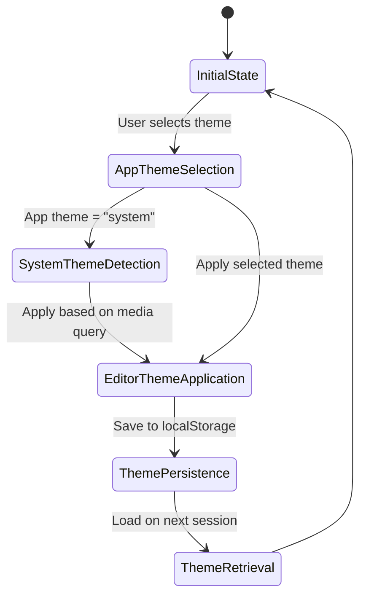
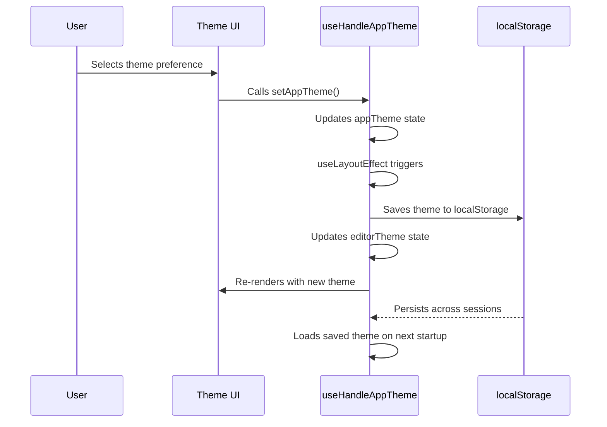
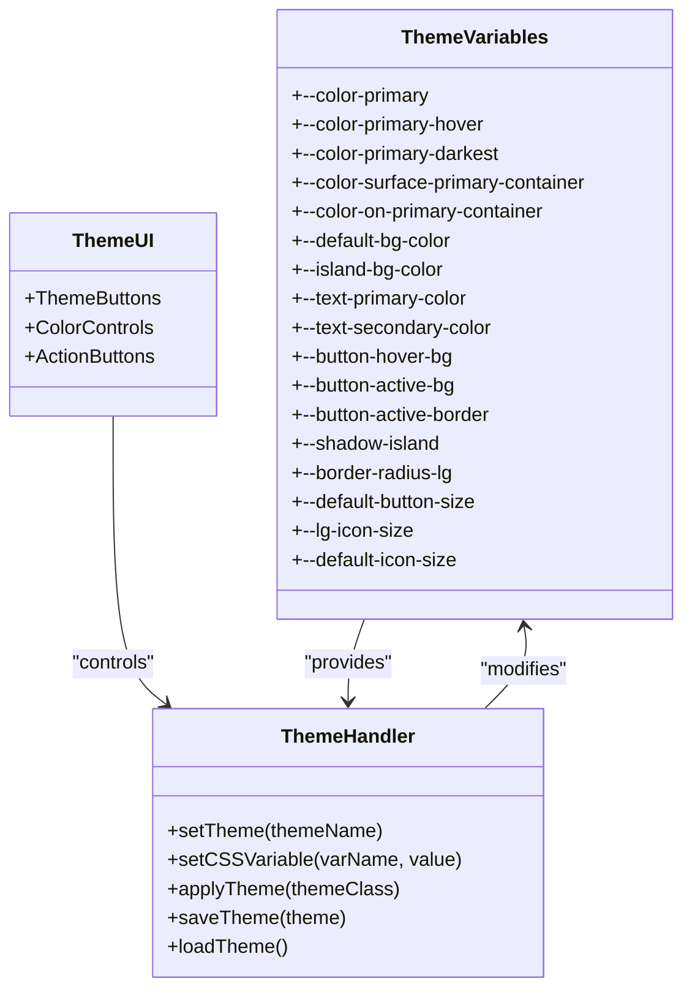
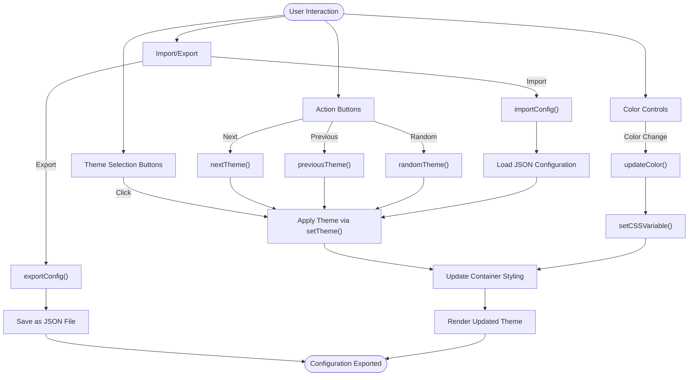
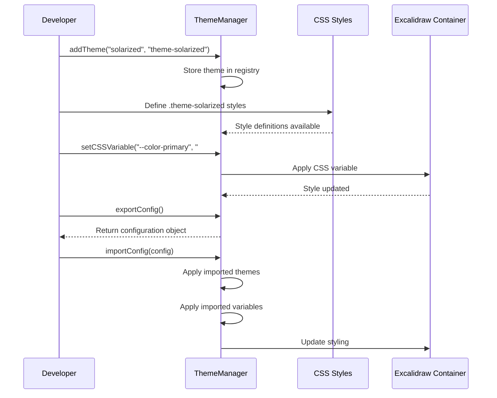
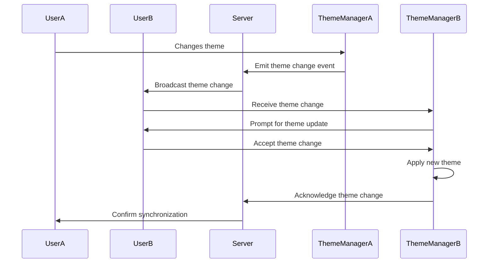
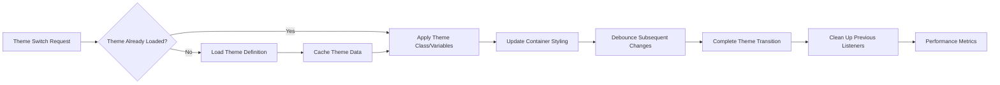
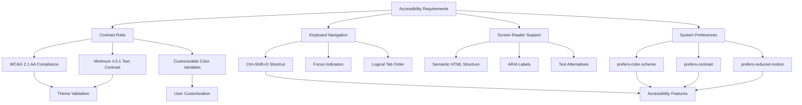
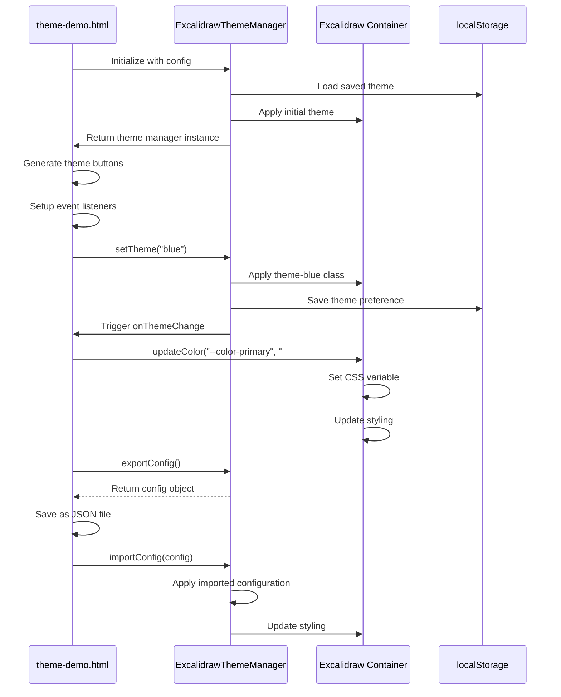

# Dynamic Theme Management

<cite>
**Referenced Files in This Document**   
- [useHandleAppTheme.ts](file://excalidraw/excalidraw-app/useHandleAppTheme.ts)
- [variables.module.scss](file://excalidraw/packages/excalidraw/css/variables.module.scss)
- [theme-demo.html](file://excalidraw/excalidraw-app/theme-demo.html)
- [app_constants.ts](file://excalidraw/excalidraw-app/app_constants.ts)
- [theme-wrapper.js](file://excalidraw/excalidraw-app/theme-wrapper.js)
</cite>

## Table of Contents
1. [Introduction](#introduction)
2. [Theme State Management](#theme-state-management)
3. [Theme Persistence Mechanism](#theme-persistence-mechanism)
4. [SCSS Variables Integration](#scss-variables-integration)
5. [UI Controls and Real-time Preview](#ui-controls-and-real-time-preview)
6. [Adding New Theme Variants](#adding-new-theme-variants)
7. [Theme Synchronization in Collaborative Sessions](#theme-synchronization-in-collaborative-sessions)
8. [Performance Considerations](#performance-considerations)
9. [Accessibility and Contrast Requirements](#accessibility-and-contrast-requirements)
10. [Implementation Examples](#implementation-examples)

## Introduction
The Excalidraw application implements a comprehensive dynamic theme management system that enables runtime theme switching with persistent user preferences. This system combines React hooks, localStorage persistence, SCSS variables, and JavaScript theme handlers to provide a seamless theming experience. The architecture supports both predefined themes and custom color configurations, allowing users to personalize their interface while maintaining accessibility standards.

**Section sources**
- [useHandleAppTheme.ts](file://excalidraw/excalidraw-app/useHandleAppTheme.ts)
- [theme-demo.html](file://excalidraw/excalidraw-app/theme-demo.html)

## Theme State Management
The theme state management in Excalidraw is implemented through the `useHandleAppTheme` React hook, which manages both application-level and editor-level theme states. The hook maintains two distinct theme states: `appTheme` representing the user's theme preference (light, dark, or system), and `editorTheme` reflecting the currently applied editor theme.

The hook utilizes `useState` with an initialization function that first checks localStorage for a saved theme preference, defaulting to light theme if no preference is found. When the app theme is set to "system", the hook listens to the `prefers-color-scheme` media query to automatically adapt to the user's system preferences.

**Diagram sources**
- [useHandleAppTheme.ts](file://excalidraw/excalidraw-app/useHandleAppTheme.ts#L15-L70)

**Section sources**
- [useHandleAppTheme.ts](file://excalidraw/excalidraw-app/useHandleAppTheme.ts#L15-L70)

## Theme Persistence Mechanism
Theme persistence in Excalidraw is achieved through localStorage, ensuring user preferences are maintained across application reloads. The system uses a dedicated storage key `matsin-theme` defined in `app_constants.ts` to store the user's theme selection.

The `useHandleAppTheme` hook implements persistence through a `useLayoutEffect` that triggers whenever the `appTheme` state changes. This effect saves the current theme preference to localStorage and updates the `editorTheme` state accordingly. When `appTheme` is set to "system", the editor theme is determined by the `prefers-color-scheme` media query; otherwise, it directly reflects the selected app theme.

The theme wrapper system extends this persistence mechanism with additional features, including automatic theme saving when `autoSave` is enabled, and the ability to export and import theme configurations as JSON files. This allows users to backup their theme preferences or share them across different installations.

**Diagram sources**
- [useHandleAppTheme.ts](file://excalidraw/excalidraw-app/useHandleAppTheme.ts#L50-L70)
- [app_constants.ts](file://excalidraw/excalidraw-app/app_constants.ts#L50-L55)

**Section sources**
- [useHandleAppModel.ts](file://excalidraw/excalidraw-app/useHandleAppTheme.ts#L50-L70)
- [app_constants.ts](file://excalidraw/excalidraw-app/app_constants.ts#L50-L55)

## SCSS Variables Integration
The Excalidraw theming system leverages SCSS variables defined in `variables.module.scss` to create a flexible and maintainable styling architecture. These variables serve as the foundation for the application's visual design, encompassing color palettes, spacing, typography, and component-specific styles.

The SCSS variables are organized into logical groups, including color definitions from the Open Color library, button styling mixins, avatar styles, and outline button configurations. Key variables include `--color-primary` for the primary brand color, `--default-bg-color` for background colors, `--island-bg-color` for card-like components, and `--text-primary-color` for text elements.

The JavaScript theme handlers interact with these SCSS variables through CSS custom properties (CSS variables). When a theme is applied, the theme wrapper dynamically sets these CSS variables on the container element, allowing for real-time theme switching without requiring page reloads. This approach enables both class-based theming (using predefined theme classes) and property-based theming (directly setting CSS variables).

**Diagram sources**
- [variables.module.scss](file://excalidraw/packages/excalidraw/css/variables.module.scss#L1-L190)
- [theme-wrapper.js](file://excalidraw/excalidraw-app/theme-wrapper.js#L278-L324)

**Section sources**
- [variables.module.scss](file://excalidraw/packages/excalidraw/css/variables.module.scss#L1-L190)

## UI Controls and Real-time Preview
The theme-demo.html file provides a comprehensive demonstration of UI controls for theme selection and real-time preview. The interface includes multiple control sections that allow users to interact with the theming system through various mechanisms.

The primary theme selection is implemented through a series of theme buttons that represent different predefined themes. These buttons are generated dynamically based on the available themes in the theme manager. When a user clicks a theme button, the corresponding theme is applied immediately, providing instant visual feedback.

Additional UI controls include action buttons for navigating through themes (next, previous, random), custom color controls that allow users to modify specific CSS variables in real-time, and import/export functionality for theme configurations. The custom color controls use HTML5 color input elements bound to specific CSS variables, enabling users to create personalized color schemes.

The real-time preview is implemented by applying theme changes directly to the Excalidraw container element. This approach ensures that theme modifications are reflected immediately in the preview area, allowing users to see the impact of their changes without delay. The demo also includes a current theme indicator and keyboard shortcut documentation to enhance usability.

**Diagram sources**
- [theme-demo.html](file://excalidraw/excalidraw-app/theme-demo.html#L150-L550)

**Section sources**
- [theme-demo.html](file://excalidraw/excalidraw-app/theme-demo.html#L150-L550)

## Adding New Theme Variants
Adding new theme variants to the Excalidraw application is accomplished through the theme wrapper's extensible API. The system provides methods to programmatically add and remove theme variants, enabling dynamic theme management without requiring modifications to the core application code.

New themes can be added using the `addTheme(name, className)` method, which accepts a theme name and corresponding CSS class name. This approach allows for both class-based themes (where a CSS class applies a complete theme) and variable-based themes (where individual CSS variables are modified). The theme manager maintains an internal registry of available themes, which can be accessed via the `getAvailableThemes()` method.

When adding a new theme variant, developers can either create a new CSS class that defines the complete theme styling or modify individual CSS variables to create a custom appearance. The latter approach is particularly useful for creating variations of existing themes or implementing user-customizable color schemes.

The theme system also supports importing theme configurations from JSON files, which can include both theme definitions and custom CSS variable values. This feature enables users to share and distribute theme packages, creating an ecosystem of community-developed themes.

**Diagram sources**
- [theme-wrapper.js](file://excalidraw/excalidraw-app/theme-wrapper.js#L147-L198)
- [theme-wrapper.js](file://excalidraw/excalidraw-app/theme-wrapper.js#L278-L324)

**Section sources**
- [theme-wrapper.js](file://excalidraw/excalidraw-app/theme-wrapper.js#L147-L198)

## Theme Synchronization in Collaborative Sessions
While the current theme management system primarily focuses on individual user preferences, the architecture provides a foundation for potential theme synchronization in collaborative sessions. The separation of theme state management from the core application logic allows for integration with collaborative features.

The theme state is currently stored in localStorage, which is local to each user's browser. In a collaborative environment, theme preferences could be synchronized through the existing real-time collaboration infrastructure. This would involve extending the message protocol to include theme change events, allowing participants to optionally follow the theme preferences of other users.

The theme wrapper's event system, with its `onThemeChange` callback, provides a mechanism for responding to theme changes. In a collaborative context, these events could trigger updates to other participants' views, either automatically or with user confirmation. The system could also support different synchronization modes, such as leader-based theme control or consensus-based theme selection.

For collaborative sessions, the theme system could be enhanced with features like theme negotiation, where participants vote on a shared theme, or theme zones, where different parts of a collaborative canvas use different themes based on ownership or content type.

**Section sources**
- [theme-wrapper.js](file://excalidraw/excalidraw-app/theme-wrapper.js#L147-L198)

## Performance Considerations
The dynamic theme management system in Excalidraw has been designed with performance in mind, particularly regarding frequent theme switching and memory usage patterns. The implementation minimizes re-renders and DOM manipulations to ensure smooth transitions between themes.

Theme switching performance is optimized through several mechanisms. First, the use of CSS classes and variables allows for efficient style changes without requiring React component re-renders. When a theme is applied, the system only modifies the container element's class list and inline styles, leaving the rest of the component tree unaffected.

The theme wrapper implements debouncing for rapid theme changes, preventing excessive DOM updates when users quickly cycle through themes. Additionally, the system caches theme configurations and CSS variable values to avoid redundant calculations during theme switching.

Memory usage is optimized by storing theme data efficiently in localStorage and maintaining a compact theme registry. The system avoids memory leaks by properly cleaning up event listeners in the `useHandleAppTheme` hook's cleanup function, particularly for the `prefers-color-scheme` media query listener and keyboard event listener.

For applications with many theme variants, the system supports lazy loading of theme definitions, loading CSS files only when a specific theme is selected. This approach reduces initial load time and memory footprint, particularly for installations with extensive theme libraries.

**Section sources**
- [useHandleAppTheme.ts](file://excalidraw/excalidraw-app/useHandleAppTheme.ts#L30-L70)
- [theme-wrapper.js](file://excalidraw/excalidraw-app/theme-wrapper.js#L54-L106)

## Accessibility and Contrast Requirements
The Excalidraw theme management system incorporates accessibility considerations to ensure usable contrast ratios and support for users with visual impairments. The default themes are designed to meet WCAG 2.1 AA contrast requirements, with careful selection of color combinations that provide sufficient contrast between text and background elements.

The system supports high-contrast modes through both predefined themes and custom color configuration. Users can create high-contrast themes by adjusting the CSS variables for text and background colors, ensuring that the resulting combinations meet accessibility standards. The theme demo includes controls for modifying key color variables, enabling users to create personalized high-contrast configurations.

For users with specific visual needs, the system respects the `prefers-contrast` media query when available, potentially automatically selecting higher-contrast themes when the user has indicated a preference for increased contrast. The keyboard navigation system, including the Ctrl+Shift+D shortcut for toggling between light and dark themes, ensures that theme switching is accessible to keyboard-only users.

The theme variables are structured to maintain semantic meaning rather than hardcoded colors, allowing for systematic adjustments to contrast levels across the entire interface. For example, the `--text-primary-color` and `--default-bg-color` variables can be modified together to maintain appropriate contrast ratios while changing the overall color scheme.

**Section sources**
- [variables.module.scss](file://excalidraw/packages/excalidraw/css/variables.module.scss#L1-L190)
- [useHandleAppTheme.ts](file://excalidraw/excalidraw-app/useHandleAppTheme.ts#L15-L70)

## Implementation Examples
The theme-demo.html file serves as a comprehensive implementation example, demonstrating how to integrate the Excalidraw theme management system into a web application. The demo showcases various aspects of the theming API, including theme selection, custom color configuration, and theme persistence.

Key implementation patterns demonstrated in the demo include:

1. **Theme Manager Initialization**: The demo initializes the `ExcalidrawThemeManager` with configuration options including the container selector, default theme, and auto-save setting.

2. **Dynamic UI Generation**: The theme buttons are generated programmatically based on the available themes in the theme manager, ensuring the UI stays synchronized with the available theme options.

3. **Event Handling**: The demo attaches event listeners to the theme manager's `onThemeChange` event, allowing the UI to update when themes are changed programmatically or through user interaction.

4. **Custom Color Controls**: The demo implements real-time color customization through HTML5 color input elements that directly modify CSS variables using the theme manager's `setCSSVariable` method.

5. **Configuration Import/Export**: The demo includes functionality to export the current theme configuration as a JSON file and import configurations from previously exported files, enabling theme sharing and backup.

6. **Keyboard Shortcuts**: The demo implements keyboard navigation for theme switching, enhancing accessibility and providing power-user functionality.

These implementation examples provide a blueprint for integrating the Excalidraw theme management system into various frontend frameworks, including React, Angular, and Vue, as demonstrated by the corresponding example files in the repository.

**Diagram sources**
- [theme-demo.html](file://excalidraw/excalidraw-app/theme-demo.html#L150-L550)
- [theme-wrapper.js](file://excalidraw/excalidraw-app/theme-wrapper.js#L54-L198)

**Section sources**
- [theme-demo.html](file://excalidraw/excalidraw-app/theme-demo.html#L150-L550)
- [theme-wrapper.js](file://excalidraw/excalidraw-app/theme-wrapper.js#L54-L198)