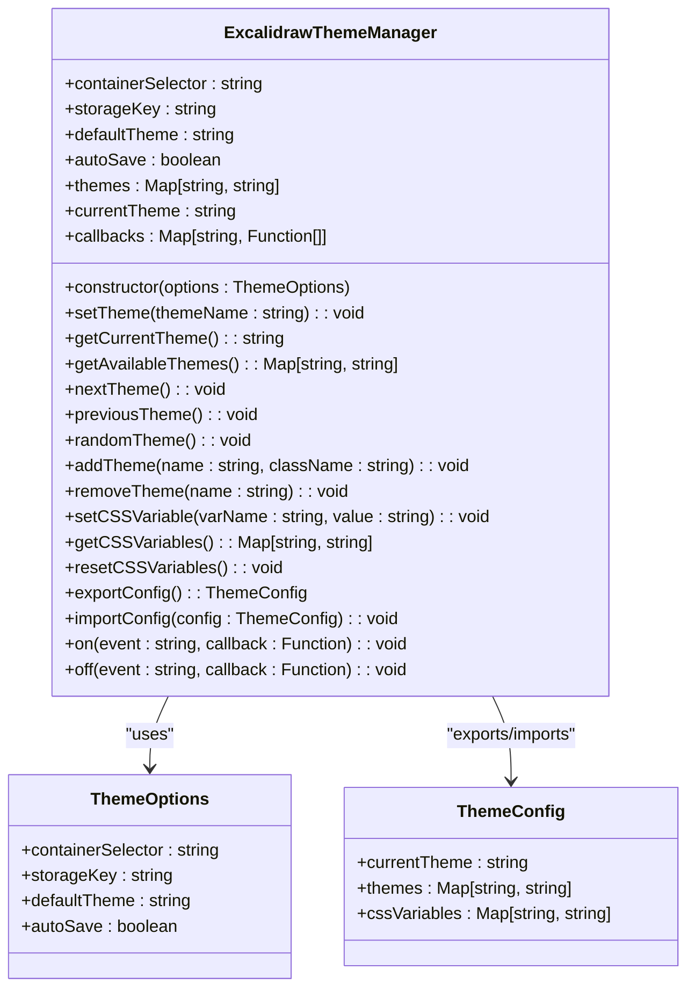
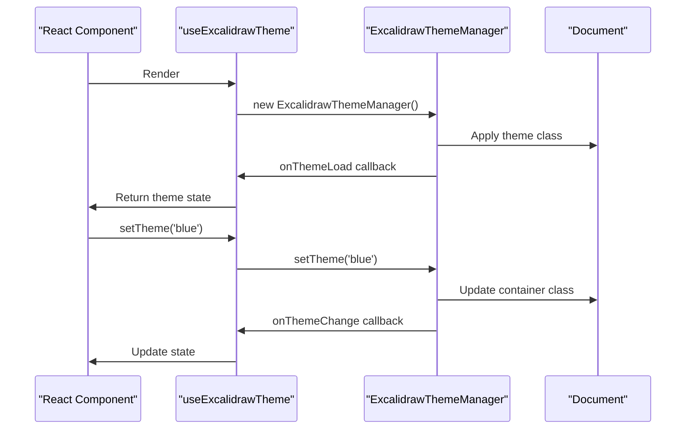
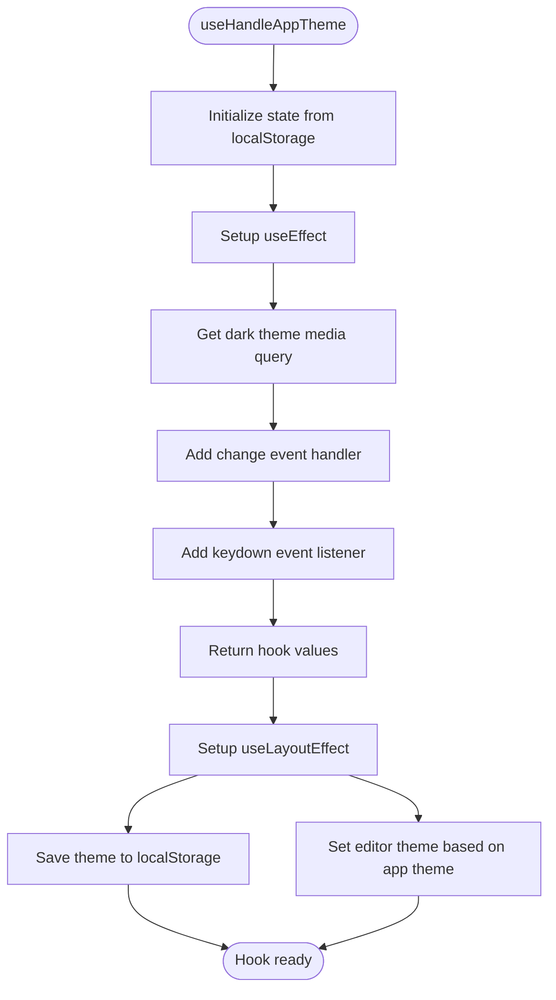
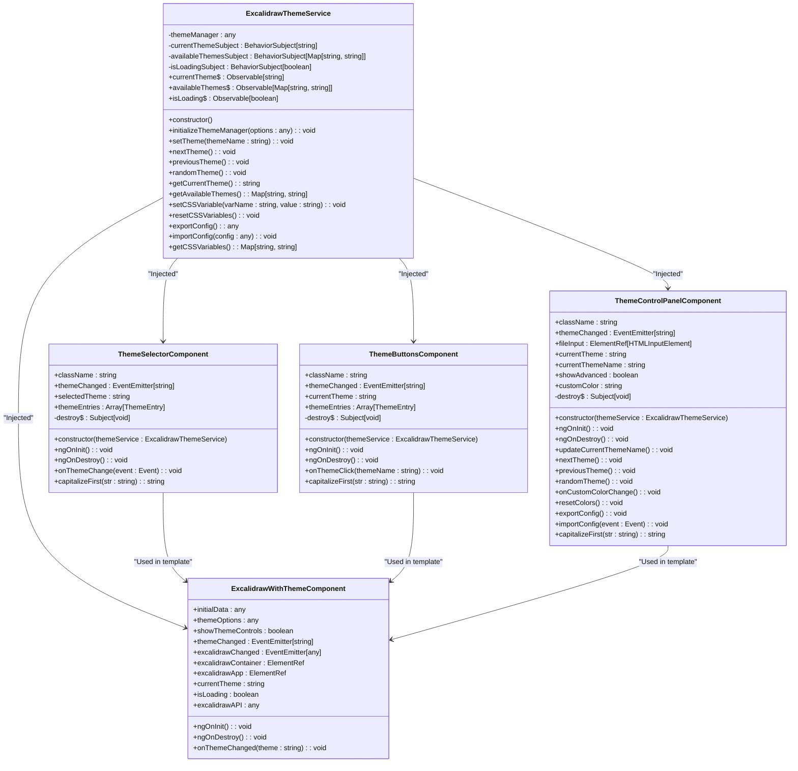
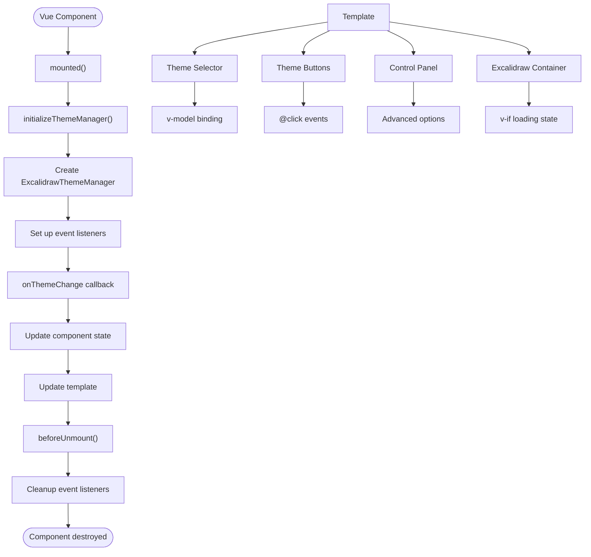
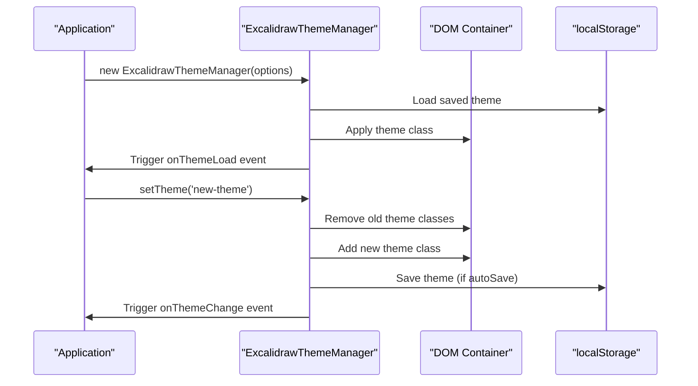
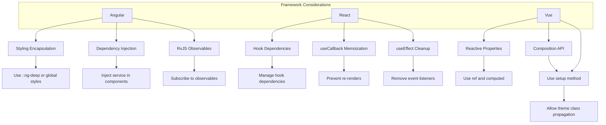
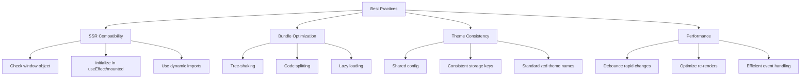
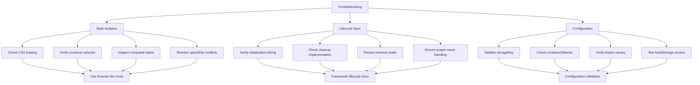

# Framework Integration

<cite>
**Referenced Files in This Document**   
- [angular-theme-example.component.ts](file://excalidraw/excalidraw-app/angular-theme-example.component.ts)
- [react-theme-example.jsx](file://excalidraw/excalidraw-app/react-theme-example.jsx)
- [vue-theme-example.vue](file://excalidraw/excalidraw-app/vue-theme-example.vue)
- [useHandleAppTheme.ts](file://excalidraw/excalidraw-app/useHandleAppTheme.ts)
- [theme-wrapper.js](file://excalidraw/excalidraw-app/theme-wrapper.js)
- [theme-wrapper.scss](file://excalidraw/excalidraw-app/theme-wrapper.scss)
- [app_constants.ts](file://excalidraw/excalidraw-app/app_constants.ts)
- [README-THEME-WRAPPER.md](file://excalidraw/excalidraw-app/README-THEME-WRAPPER.md)
- [COMPLETE-THEME-WRAPPER-GUIDE.md](file://excalidraw/excalidraw-app/COMPLETE-THEME-WRAPPER-GUIDE.md)
</cite>

## Table of Contents
1. [Introduction](#introduction)
2. [Core Architecture](#core-architecture)
3. [React Integration](#react-integration)
4. [Angular Integration](#angular-integration)
5. [Vue Integration](#vue-integration)
6. [Theme Management Patterns](#theme-management-patterns)
7. [Framework-Specific Considerations](#framework-specific-considerations)
8. [Best Practices](#best-practices)
9. [Troubleshooting Guide](#troubleshooting-guide)
10. [Conclusion](#conclusion)

## Introduction

This documentation provides comprehensive guidance for integrating Excalidraw themes with popular frontend frameworks. The Excalidraw Theme Wrapper system enables complete customization of Excalidraw's appearance without modifying source code, using CSS Custom Properties and overlay classes to override default styles. The system supports React, Vue.js, and Angular frameworks with dedicated implementation patterns that maintain theme consistency across different technology stacks.

The theme wrapper system offers several key features including complete customization of colors, backgrounds, icons, shadows, and sizes; support for dark mode with automatic switching; responsive design for various screen sizes; keyboard shortcuts for quick theme switching; and export/import configuration capabilities. The implementation follows a consistent pattern across frameworks while respecting each framework's architectural principles and best practices.

**Section sources**
- [README-THEME-WRAPPER.md](file://excalidraw/excalidraw-app/README-THEME-WRAPPER.md#L1-L50)

## Core Architecture

The Excalidraw Theme Wrapper system is built on a JavaScript helper class `ExcalidrawThemeManager` that manages theme state and applies CSS classes to designated containers. The core architecture consists of three main components: the theme manager class, CSS stylesheets, and framework-specific integration components.

The `ExcalidrawThemeManager` class provides a comprehensive API for theme manipulation including methods to set, get, and navigate between themes, manage CSS variables, and handle configuration import/export. The class uses event-driven architecture with callback registration for theme change events, enabling reactive updates across the application. Theme persistence is handled through localStorage with configurable storage keys, ensuring user preferences are maintained between sessions.



**Diagram sources**
- [theme-wrapper.js](file://excalidraw/excalidraw-app/theme-wrapper.js#L15-L60)
- [README-THEME-WRAPPER.md](file://excalidraw/excalidraw-app/README-THEME-WRAPPER.md#L233-L275)

## React Integration

React integration leverages the `useExcalidrawTheme` custom hook to manage theme state using React's useState and useEffect hooks. The hook encapsulates the `ExcalidrawThemeManager` instance and provides a clean API for components to interact with the theme system. The implementation follows React's functional component pattern with proper cleanup in the useEffect cleanup function to prevent memory leaks.

The `useExcalidrawTheme` hook initializes the theme manager during component mounting and sets up event listeners for theme changes. It returns an object containing the current theme state, loading status, and action functions for theme manipulation. The hook uses useCallback to memoize action functions, preventing unnecessary re-renders when parent components re-render.



**Diagram sources**
- [react-theme-example.jsx](file://excalidraw/excalidraw-app/react-theme-example.jsx#L15-L100)
- [theme-wrapper.js](file://excalidraw/excalidraw-app/theme-wrapper.js#L15-L60)

### useHandleAppTheme Implementation

The `useHandleAppTheme` hook in `useHandleAppTheme.ts` provides additional functionality for handling application-wide theme preferences, including system theme detection and keyboard shortcuts. This hook uses both useEffect and useLayoutEffect to ensure proper timing of theme application and localStorage updates.



**Diagram sources**
- [useHandleAppTheme.ts](file://excalidraw/excalidraw-app/useHandleAppTheme.ts#L1-L70)
- [app_constants.ts](file://excalidraw/excalidraw-app/app_constants.ts#L1-L60)

**Section sources**
- [react-theme-example.jsx](file://excalidraw/excalidraw-app/react-theme-example.jsx#L15-L100)
- [useHandleAppTheme.ts](file://excalidraw/excalidraw-app/useHandleAppTheme.ts#L1-L70)

## Angular Integration

Angular integration utilizes a service-based architecture with the `ExcalidrawThemeService` class providing dependency injection for theme management across components. The service uses RxJS BehaviorSubjects to expose theme state as observables, enabling reactive updates throughout the application. This approach follows Angular's dependency injection pattern and leverages the framework's change detection mechanism.

The service encapsulates the `ExcalidrawThemeManager` instance and exposes theme state through public observables (`currentTheme$`, `availableThemes$`, `isLoading$`). Components inject the service through their constructors and subscribe to these observables to receive theme updates. The service handles proper cleanup by completing the destroy subject in ngOnDestroy lifecycle hooks, preventing memory leaks.



**Diagram sources**
- [angular-theme-example.component.ts](file://excalidraw/excalidraw-app/angular-theme-example.component.ts#L15-L60)
- [angular-theme-example.component.ts](file://excalidraw/excalidraw-app/angular-theme-example.component.ts#L64-L128)

**Section sources**
- [angular-theme-example.component.ts](file://excalidraw/excalidraw-app/angular-theme-example.component.ts#L15-L60)
- [angular-theme-example.component.ts](file://excalidraw/excalidraw-app/angular-theme-example.component.ts#L64-L128)

## Vue Integration

Vue integration employs the Composition API with the `setup` method to manage theme state and lifecycle hooks. The implementation uses Vue's reactivity system with `ref` and `computed` properties to create a reactive theme interface. The component directly initializes the `ExcalidrawThemeManager` in the `mounted` lifecycle hook and cleans up event listeners in `beforeUnmount`.

The Vue component uses a single-file component structure with template, script, and style sections. The template contains all theme control elements including theme selector, theme buttons, and control panel. The script section manages the theme state and provides methods for theme manipulation. The style section uses scoped CSS to prevent style leakage while allowing theme-specific styles to propagate to the Excalidraw container.



**Diagram sources**
- [vue-theme-example.vue](file://excalidraw/excalidraw-app/vue-theme-example.vue#L1-L100)
- [vue-theme-example.vue](file://excalidraw/excalidraw-app/vue-theme-example.vue#L101-L200)

**Section sources**
- [vue-theme-example.vue](file://excalidraw/excalidraw-app/vue-theme-example.vue#L1-L100)
- [vue-theme-example.vue](file://excalidraw/excalidraw-app/vue-theme-example.vue#L101-L200)

## Theme Management Patterns

The theme management system follows consistent patterns across all frameworks, centered around the `ExcalidrawThemeManager` class. The core pattern involves initializing the theme manager with configuration options, applying theme classes to designated containers, and managing theme state through a combination of localStorage persistence and reactive updates.

The theme manager uses a container selector to identify elements that should receive theme classes. By default, this is set to `.excalidraw-theme-wrapper`, but can be customized through the constructor options. When a theme is applied, the manager removes all existing theme classes from matching containers and adds the new theme class. This ensures clean theme transitions without class conflicts.



**Diagram sources**
- [theme-wrapper.js](file://excalidraw/excalidraw-app/theme-wrapper.js#L15-L60)
- [theme-wrapper.js](file://excalidraw/excalidraw-app/theme-wrapper.js#L150-L200)

### CSS Architecture

The CSS architecture uses a layered approach with base styles, theme-specific overrides, and component-specific styling. The system relies heavily on CSS Custom Properties (variables) to enable dynamic theme customization without requiring CSS file modifications.

```mermaid
erDiagram
THEME_WRAPPER ||--o{ THEME : "contains"
THEME ||--o{ CSS_VARIABLE : "defines"
CSS_VARIABLE ||--o{ COMPONENT_STYLE : "used by"
COMPONENT_STYLE ||--o{ EXCALIDRAW_COMPONENT : "applies to"
class THEME_WRAPPER {
+excalidraw-theme-wrapper
+containerSelector
+theme classes
}
class THEME {
+theme-blue
+theme-green
+theme-purple
+theme-orange
+theme-glass
+theme-neon
+theme-minimal
}
class CSS_VARIABLE {
+--color-primary
+--color-primary-darker
+--default-bg-color
+--island-bg-color
+--text-primary-color
+--button-hover-bg
+--default-border-color
}
class COMPONENT_STYLE {
+toolbar styles
+button styles
+input styles
+dropdown styles
+modal styles
}
class EXCALIDRAW_COMPONENT {
+App-toolbar
+ToolIcon__icon
+dropdown-menu
+Modal__content
+input elements
}
```

**Diagram sources**
- [theme-wrapper.scss](file://excalidraw/excalidraw-app/theme-wrapper.scss#L1-L50)
- [theme-wrapper.scss](file://excalidraw/excalidraw-app/theme-wrapper.scss#L51-L100)

**Section sources**
- [theme-wrapper.js](file://excalidraw/excalidraw-app/theme-wrapper.js#L15-L60)
- [theme-wrapper.scss](file://excalidraw/excalidraw-app/theme-wrapper.scss#L1-L154)

## Framework-Specific Considerations

Each framework requires specific considerations for optimal theme integration, addressing differences in state management, lifecycle handling, and styling encapsulation.

For Angular, the primary consideration is component styling encapsulation. The theme styles must be applied at the application level or using `::ng-deep` to ensure they properly cascade to the Excalidraw container. The service-based architecture with dependency injection ensures consistent theme state across components while respecting Angular's hierarchical dependency injection system.

For React, the key consideration is state management and re-rendering optimization. The custom hook pattern with useCallback ensures that action functions are memoized, preventing unnecessary re-renders. The useEffect cleanup ensures proper event listener removal, preventing memory leaks in long-running applications.

For Vue, the consideration is reactive property binding and lifecycle synchronization. The Composition API allows for clean separation of reactive state and methods while ensuring proper cleanup in the beforeUnmount hook. The scoped styles prevent leakage while allowing theme classes to properly affect the Excalidraw container.



**Diagram sources**
- [angular-theme-example.component.ts](file://excalidraw/excalidraw-app/angular-theme-example.component.ts#L15-L60)
- [react-theme-example.jsx](file://excalidraw/excalidraw-app/react-theme-example.jsx#L15-L100)
- [vue-theme-example.vue](file://excalidraw/excalidraw-app/vue-theme-example.vue#L1-L100)

**Section sources**
- [angular-theme-example.component.ts](file://excalidraw/excalidraw-app/angular-theme-example.component.ts#L15-L60)
- [react-theme-example.jsx](file://excalidraw/excalidraw-app/react-theme-example.jsx#L15-L100)
- [vue-theme-example.vue](file://excalidraw/excalidraw-app/vue-theme-example.vue#L1-L100)

## Best Practices

Implementing Excalidraw theme integration effectively requires adherence to several best practices for maintaining theme consistency, optimizing performance, and ensuring compatibility across different environments.

For SSR compatibility, ensure that theme initialization occurs only in the browser environment by checking for window object availability before creating the `ExcalidrawThemeManager` instance. This prevents server-side rendering errors and ensures consistent client-side behavior.

To optimize bundle size, consider tree-shaking unused theme features and lazy-loading theme utilities when not immediately required. The theme wrapper JavaScript file can be code-split from the main application bundle to reduce initial load time.

Theme consistency across framework boundaries can be maintained by using a shared configuration object for theme definitions and ensuring consistent storage keys across different framework implementations. This allows users to maintain their theme preferences when navigating between different parts of a multi-framework application.



**Diagram sources**
- [react-theme-example.jsx](file://excalidraw/excalidraw-app/react-theme-example.jsx#L15-L100)
- [angular-theme-example.component.ts](file://excalidraw/excalidraw-app/angular-theme-example.component.ts#L15-L60)
- [vue-theme-example.vue](file://excalidraw/excalidraw-app/vue-theme-example.vue#L1-L100)

## Troubleshooting Guide

Common integration issues typically fall into three categories: style isolation problems, lifecycle synchronization issues, and configuration errors.

For style isolation issues, verify that the theme wrapper CSS is properly loaded and that the container selector matches the actual DOM elements. Check for CSS specificity conflicts that might prevent theme styles from being applied. Use browser developer tools to inspect computed styles and verify that theme classes are being applied to the correct elements.

For lifecycle synchronization issues, ensure that theme manager initialization occurs at the appropriate lifecycle stage for each framework. In React, this means using useEffect; in Angular, ngOnInit; and in Vue, mounted. Verify that cleanup is properly implemented to prevent memory leaks from event listeners.

Configuration errors often stem from incorrect storage keys or container selectors. Verify that the storageKey and containerSelector options match between the theme manager configuration and the actual application setup. Check localStorage to confirm that theme preferences are being saved and loaded correctly.



**Diagram sources**
- [README-THEME-WRAPPER.md](file://excalidraw/excalidraw-app/README-THEME-WRAPPER.md#L350-L400)
- [COMPLETE-THEME-WRAPPER-GUIDE.md](file://excalidraw/excalidraw-app/COMPLETE-THEME-WRAPPER-GUIDE.md#L1-L50)

**Section sources**
- [README-THEME-WRAPPER.md](file://excalidraw/excalidraw-app/README-THEME-WRAPPER.md#L350-L400)
- [COMPLETE-THEME-WRAPPER-GUIDE.md](file://excalidraw/excalidraw-app/COMPLETE-THEME-WRAPPER-GUIDE.md#L1-L50)

## Conclusion

The Excalidraw Theme Wrapper system provides a robust and flexible solution for customizing Excalidraw's appearance across different frontend frameworks. By following the implementation patterns demonstrated in the example components, developers can achieve consistent theme management while respecting each framework's architectural principles.

The system's strength lies in its separation of concerns, with the core theme management logic encapsulated in the `ExcalidrawThemeManager` class and framework-specific integrations providing appropriate abstractions for state management and lifecycle handling. This approach enables developers to leverage the full power of their chosen framework while maintaining a consistent theming experience.

Key takeaways include the importance of proper lifecycle management, the value of reactive state patterns, and the need for careful consideration of styling encapsulation. By adhering to the best practices outlined in this documentation, developers can create seamless theme integration that enhances user experience without compromising application performance or maintainability.