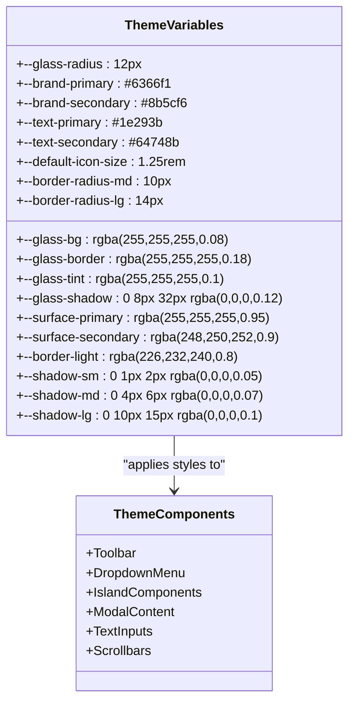
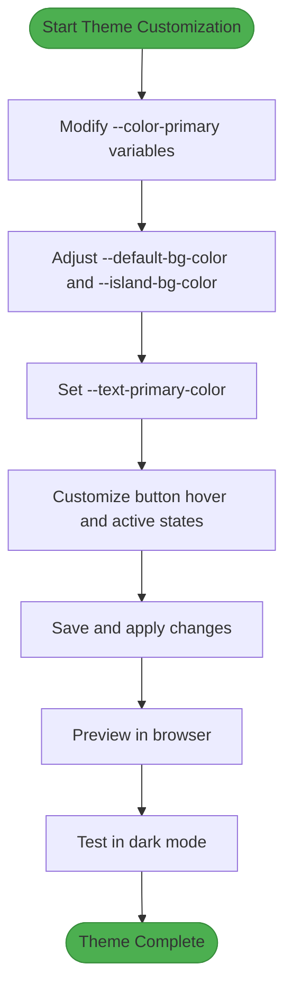
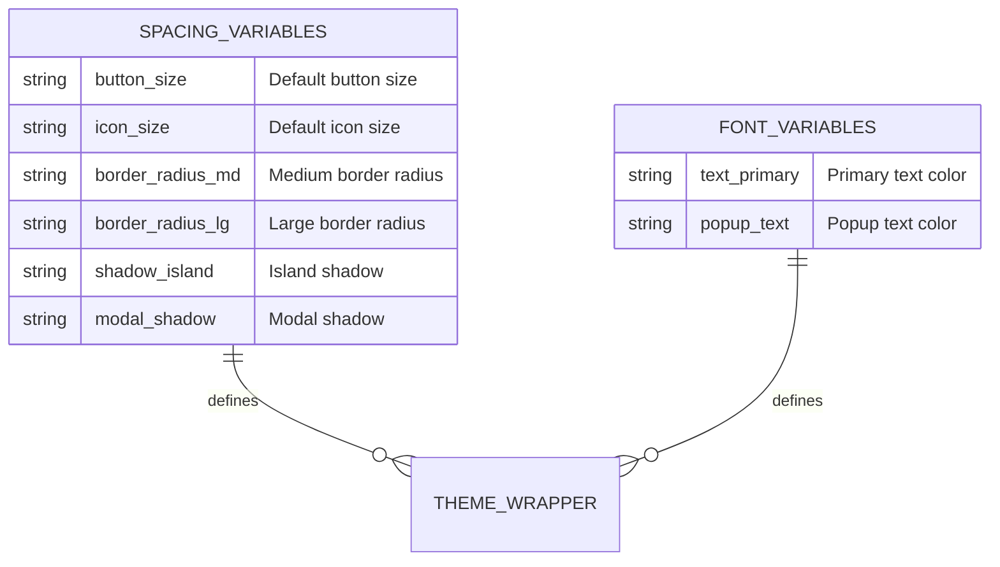
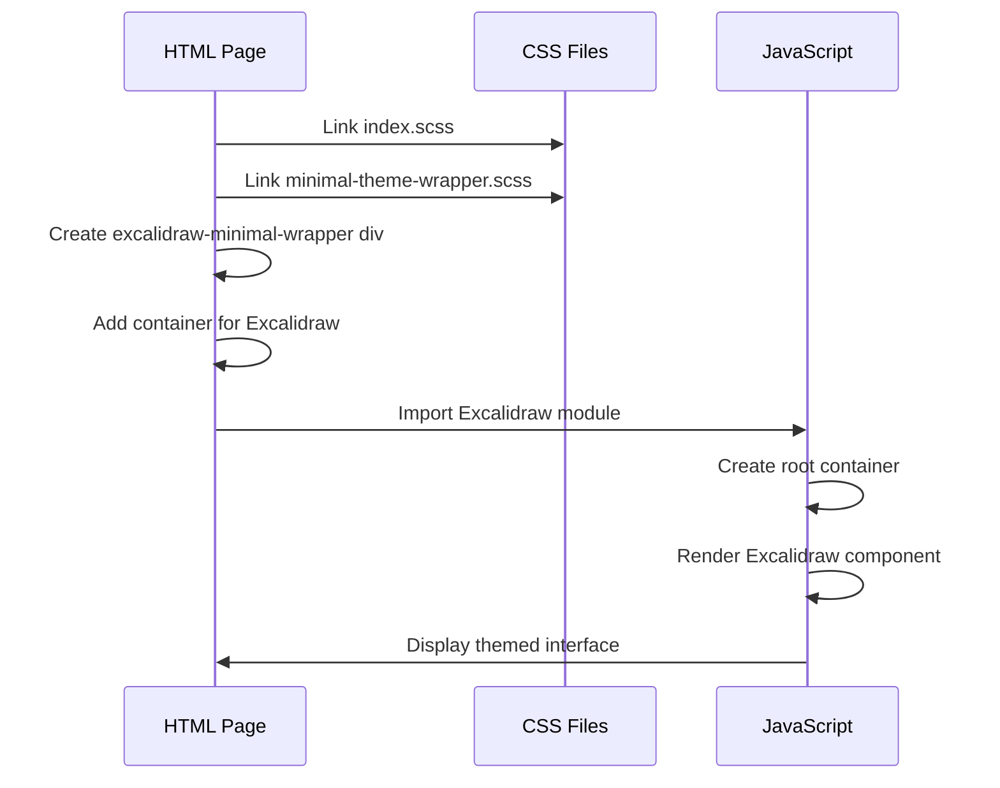
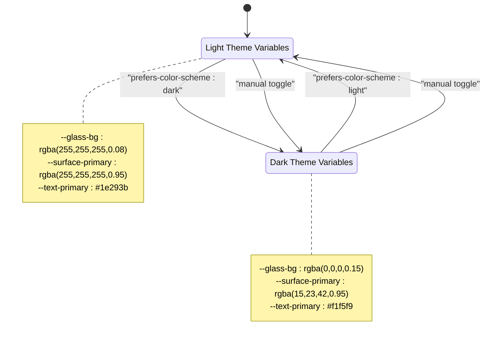
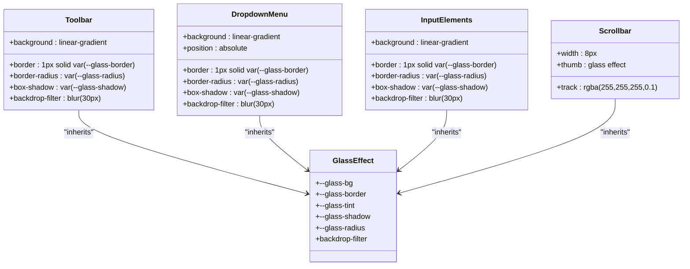
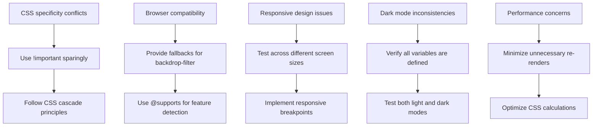
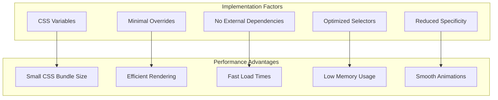

# Minimal Theme Implementation

<cite>
**Referenced Files in This Document**   
- [minimal-theme-wrapper.scss](file://excalidraw/excalidraw-app/minimal-theme-wrapper.scss)
- [minimal-theme-example.html](file://excalidraw/excalidraw-app/minimal-theme-example.html)
- [MINIMAL-THEME-GUIDE.md](file://excalidraw/excalidraw-app/MINIMAL-THEME-GUIDE.md)
</cite>

## Table of Contents
1. [Introduction](#introduction)
2. [Core Theme Files](#core-theme-files)
3. [CSS Variables and Styling](#css-variables-and-styling)
4. [Color Scheme Customization](#color-scheme-customization)
5. [Font and Spacing Adjustments](#font-and-spacing-adjustments)
6. [Integration with HTML Pages](#integration-with-html-pages)
7. [Dark Mode Implementation](#dark-mode-implementation)
8. [Advanced Component Styling](#advanced-component-styling)
9. [Common Issues and Solutions](#common-issues-and-solutions)
10. [Performance Benefits](#performance-benefits)

## Introduction
The Minimal Theme Implementation in Excalidraw provides a lightweight approach to customizing the application's appearance through simple CSS overrides. This documentation details how to use the minimal-theme-wrapper.scss file for quick styling adjustments, including color schemes, font families, and spacing. The approach enables developers to integrate customized themes into static HTML pages with minimal code, as demonstrated in the minimal-theme-example.html file. This lightweight theming solution offers performance benefits for simple integrations while maintaining full functionality.

## Core Theme Files
The minimal theme implementation revolves around two primary files that work together to provide a customizable styling experience. These files serve as the foundation for theme customization and demonstration.

**Section sources**
- [minimal-theme-wrapper.scss](file://excalidraw/excalidraw-app/minimal-theme-wrapper.scss#L1-L201)
- [minimal-theme-example.html](file://excalidraw/excalidraw-app/minimal-theme-example.html#L1-L152)

## CSS Variables and Styling
The minimal theme approach utilizes CSS variables to enable easy customization of visual elements. The theme system is built around a set of predefined variables that control various aspects of the UI, allowing for comprehensive styling with minimal code changes.

**Diagram sources**
- [minimal-theme-wrapper.scss](file://excalidraw/excalidraw-app/minimal-theme-wrapper.scss#L15-L50)

**Section sources**
- [minimal-theme-wrapper.scss](file://excalidraw/excalidraw-app/minimal-theme-wrapper.scss#L15-L50)

## Color Scheme Customization
Customizing color schemes in the minimal theme involves modifying CSS variables that control primary colors, backgrounds, and text elements. The theme system provides specific variables for different UI components, allowing for precise control over the visual appearance.

**Diagram sources**
- [minimal-theme-wrapper.scss](file://excalidraw/excalidraw-app/minimal-theme-wrapper.scss#L9-L33)
- [MINIMAL-THEME-GUIDE.md](file://excalidraw/excalidraw-app/MINIMAL-THEME-GUIDE.md#L9-L46)

**Section sources**
- [minimal-theme-wrapper.scss](file://excalidraw/excalidraw-app/minimal-theme-wrapper.scss#L9-L33)
- [MINIMAL-THEME-GUIDE.md](file://excalidraw/excalidraw-app/MINIMAL-THEME-GUIDE.md#L9-L46)

## Font and Spacing Adjustments
The minimal theme system allows for customization of font sizes, button dimensions, and spacing through CSS variables. These adjustments enable developers to create a consistent visual hierarchy and improve user experience.

**Diagram sources**
- [minimal-theme-wrapper.scss](file://excalidraw/excalidraw-app/minimal-theme-wrapper.scss#L35-L46)
- [MINIMAL-THEME-GUIDE.md](file://excalidraw/excalidraw-app/MINIMAL-THEME-GUIDE.md#L35-L46)

**Section sources**
- [minimal-theme-wrapper.scss](file://excalidraw/excalidraw-app/minimal-theme-wrapper.scss#L35-L46)
- [MINIMAL-THEME-GUIDE.md](file://excalidraw/excalidraw-app/MINIMAL-THEME-GUIDE.md#L35-L46)

## Integration with HTML Pages
Integrating the minimal theme into static HTML pages requires linking the necessary CSS files and setting up the proper HTML structure. The implementation follows a straightforward pattern that can be easily replicated across different projects.

**Diagram sources**
- [minimal-theme-example.html](file://excalidraw/excalidraw-app/minimal-theme-example.html#L1-L152)
- [minimal-theme-wrapper.scss](file://excalidraw/excalidraw-app/minimal-theme-wrapper.scss#L1-L14)

**Section sources**
- [minimal-theme-example.html](file://excalidraw/excalidraw-app/minimal-theme-example.html#L1-L152)

## Dark Mode Implementation
The minimal theme includes built-in support for dark mode through media queries and CSS variables. This allows for automatic theme switching based on user preferences or manual toggling through JavaScript.

**Diagram sources**
- [minimal-theme-wrapper.scss](file://excalidraw/excalidraw-app/minimal-theme-wrapper.scss#L180-L195)
- [minimal-theme-example.html](file://excalidraw/excalidraw-app/minimal-theme-example.html#L100-L150)

**Section sources**
- [minimal-theme-wrapper.scss](file://excalidraw/excalidraw-app/minimal-theme-wrapper.scss#L180-L195)
- [minimal-theme-example.html](file://excalidraw/excalidraw-app/minimal-theme-example.html#L100-L150)

## Advanced Component Styling
Beyond basic color and spacing adjustments, the minimal theme system allows for advanced styling of specific components such as toolbars, dropdown menus, and input elements. These customizations maintain the glass-morphism aesthetic while providing enhanced visual feedback.

**Diagram sources**
- [minimal-theme-wrapper.scss](file://excalidraw/excalidraw-app/minimal-theme-wrapper.scss#L52-L179)

**Section sources**
- [minimal-theme-wrapper.scss](file://excalidraw/excalidraw-app/minimal-theme-wrapper.scss#L52-L179)

## Common Issues and Solutions
When implementing the minimal theme, developers may encounter specific challenges related to CSS specificity, browser compatibility, and responsive design. Understanding these common issues and their solutions ensures a smooth implementation process.

**Diagram sources**
- [minimal-theme-wrapper.scss](file://excalidraw/excalidraw-app/minimal-theme-wrapper.scss#L180-L195)
- [minimal-theme-example.html](file://excalidraw/excalidraw-app/minimal-theme-example.html#L1-L152)

**Section sources**
- [minimal-theme-wrapper.scss](file://excalidraw/excalidraw-app/minimal-theme-wrapper.scss#L180-L195)
- [minimal-theme-example.html](file://excalidraw/excalidraw-app/minimal-theme-example.html#L1-L152)

## Performance Benefits
The minimal theme implementation offers significant performance advantages due to its lightweight nature and efficient CSS architecture. By focusing on essential styling with minimal code, this approach reduces bundle size and improves rendering performance.

**Diagram sources**
- [minimal-theme-wrapper.scss](file://excalidraw/excalidraw-app/minimal-theme-wrapper.scss#L1-L201)

**Section sources**
- [minimal-theme-wrapper.scss](file://excalidraw/excalidraw-app/minimal-theme-wrapper.scss#L1-L201)