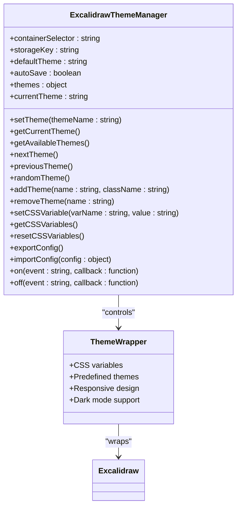
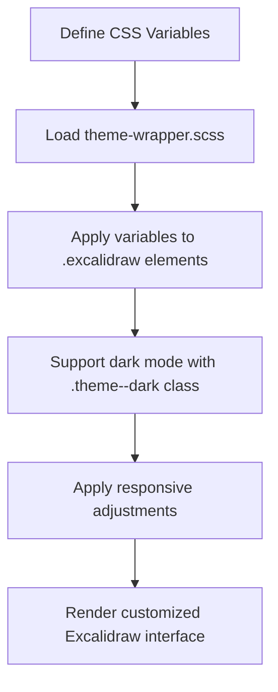
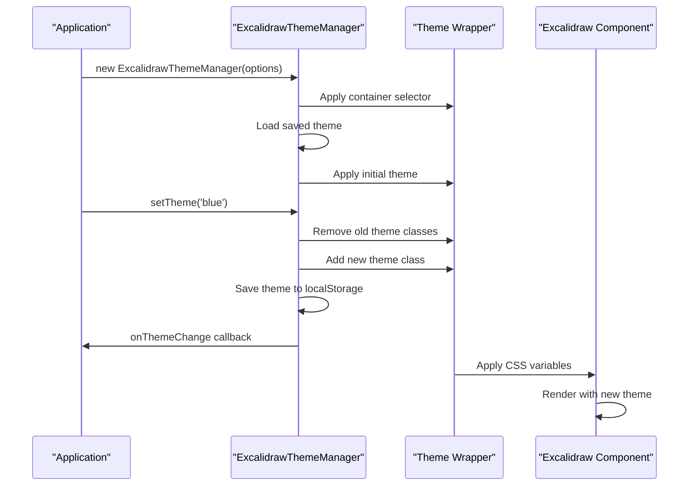
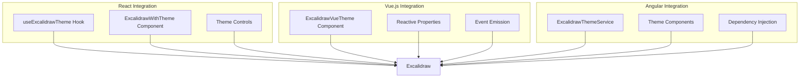
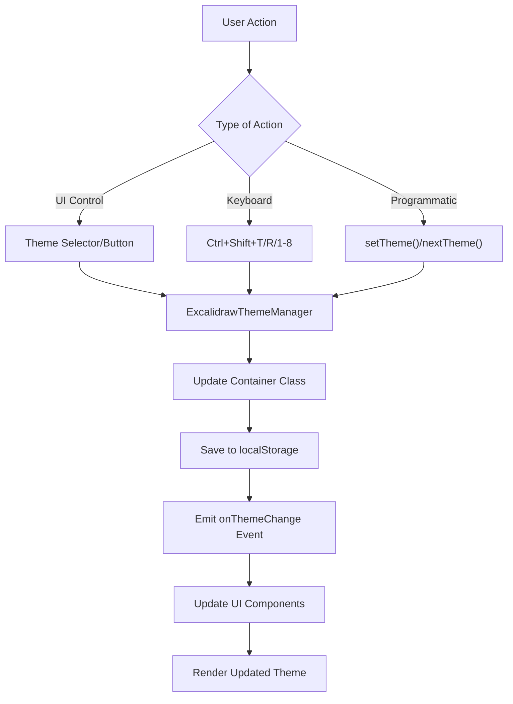

# Theme Customization

<cite>
**Referenced Files in This Document**   
- [MINIMAL-THEME-GUIDE.md](file://excalidraw/excalidraw-app/MINIMAL-THEME-GUIDE.md)
- [COMPLETE-THEME-WRAPPER-GUIDE.md](file://excalidraw/excalidraw-app/COMPLETE-THEME-WRAPPER-GUIDE.md)
- [THEME-WRAPPER-README.md](file://excalidraw/excalidraw-app/THEME-WRAPPER-README.md)
- [theme-wrapper.scss](file://excalidraw/excalidraw-app/theme-wrapper.scss)
- [theme-wrapper.js](file://excalidraw/excalidraw-app/theme-wrapper.js)
- [react-theme-example.jsx](file://excalidraw/excalidraw-app/react-theme-example.jsx)
- [vue-theme-example.vue](file://excalidraw/excalidraw-app/vue-theme-example.vue)
- [angular-theme-example.component.ts](file://excalidraw/excalidraw-app/angular-theme-example.component.ts)
- [useHandleAppTheme.ts](file://excalidraw/excalidraw-app/useHandleAppTheme.ts)
</cite>

## Table of Contents
1. [Introduction](#introduction)
2. [Core Theme System](#core-theme-system)
3. [CSS Variables and Styling](#css-variables-and-styling)
4. [Minimal Theme Implementation](#minimal-theme-implementation)
5. [Complete Theme Wrapper Configuration](#complete-theme-wrapper-configuration)
6. [Framework Integration](#framework-integration)
7. [Dynamic Theme Switching](#dynamic-theme-switching)
8. [User Preference Persistence](#user-preference-persistence)
9. [Advanced Customization](#advanced-customization)
10. [Troubleshooting](#troubleshooting)

## Introduction

The Excalidraw theme customization system provides a comprehensive solution for personalizing the application's appearance without modifying the source code. This system leverages CSS Custom Properties (variables) and a theme wrapper utility to enable complete interface customization. The theme system supports dark mode, responsive design, and seamless integration with popular frontend frameworks including React, Vue, and Angular.

The customization system operates as an overlay that wraps the Excalidraw component, allowing developers to modify colors, fonts, shadows, animations, and other visual elements. This approach ensures that the core Excalidraw functionality remains unchanged while providing extensive styling capabilities.

**Section sources**
- [THEME-WRAPPER-README.md](file://excalidraw/excalidraw-app/THEME-WRAPPER-README.md#L1-L20)
- [COMPLETE-THEME-WRAPPER-GUIDE.md](file://excalidraw/excalidraw-app/COMPLETE-THEME-WRAPPER-GUIDE.md#L1-L20)

## Core Theme System

The Excalidraw theme system consists of two main components: the CSS-based theme wrapper and the JavaScript theme manager. The system enables complete customization of the application's appearance through CSS variables and provides programmatic control over theme switching.

The theme wrapper operates by wrapping the Excalidraw component in a container with a specific class (`.excalidraw-theme-wrapper` or `.excalidraw-minimal-wrapper`). This wrapper applies custom CSS variables that override the default Excalidraw styles. The JavaScript theme manager (`ExcalidrawThemeManager`) provides an API for programmatically changing themes, handling events, and managing theme state.

The system supports eight predefined themes including default, blue, green, purple, orange, glass, neon, and minimal. Each theme is implemented as a CSS class that can be applied to the wrapper container. The theme manager automatically handles the addition and removal of these classes, ensuring smooth transitions between themes.



**Diagram sources**
- [theme-wrapper.js](file://excalidraw/excalidraw-app/theme-wrapper.js#L1-L100)
- [theme-wrapper.scss](file://excalidraw/excalidraw-app/theme-wrapper.scss#L1-L20)

**Section sources**
- [COMPLETE-THEME-WRAPPER-GUIDE.md](file://excalidraw/excalidraw-app/COMPLETE-THEME-WRAPPER-GUIDE.md#L1-L100)
- [THEME-WRAPPER-README.md](file://excalidraw/excalidraw-app/THEME-WRAPPER-README.md#L1-L50)

## CSS Variables and Styling

The theme customization system relies heavily on CSS Custom Properties (variables) to enable flexible styling. These variables are defined in the theme wrapper CSS file and can be overridden to customize the appearance of Excalidraw components.

The system provides a comprehensive set of CSS variables organized into logical categories:

### Primary Colors
```css
--color-primary                 /* Main brand color */
--color-primary-darker          /* Darker shade */
--color-primary-darkest         /* Darkest shade */
--color-primary-light           /* Light shade */
--color-primary-hover           /* Hover state color */
```

### Backgrounds and Surfaces
```css
--default-bg-color              /* Main application background */
--island-bg-color               /* Panel/background islands */
--popup-bg-color                /* Popup backgrounds */
--overlay-bg-color              /* Overlay backgrounds */
--color-surface-high            /* High elevation surfaces */
--color-surface-mid             /* Medium elevation surfaces */
--color-surface-low             /* Low elevation surfaces */
```

### Text Colors
```css
--text-primary-color            /* Main text color */
--popup-text-color              /* Text in popups */
--color-on-surface              /* Text on surfaces */
```

### Buttons and Controls
```css
--button-hover-bg               /* Button hover background */
--button-active-bg              /* Active button background */
--button-active-border          /* Active button border */
--default-border-color          /* Default border color */
```

### Sizes and Spacing
```css
--default-button-size           /* Default button size */
--default-icon-size             /* Default icon size */
--space-factor                  /* Base spacing unit */
--border-radius-md              /* Medium border radius */
--border-radius-lg              /* Large border radius */
```

These variables can be customized by defining them in a CSS file that is loaded after the Excalidraw styles. The theme wrapper ensures that these variables are applied to the appropriate elements through CSS specificity.



**Diagram sources**
- [theme-wrapper.scss](file://excalidraw/excalidraw-app/theme-wrapper.scss#L1-L154)
- [THEME-WRAPPER-README.md](file://excalidraw/excalidraw-app/THEME-WRAPPER-README.md#L1-L100)

**Section sources**
- [THEME-WRAPPER-README.md](file://excalidraw/excalidraw-app/THEME-WRAPPER-README.md#L1-L100)
- [COMPLETE-THEME-WRAPPER-GUIDE.md](file://excalidraw/excalidraw-app/COMPLETE-THEME-WRAPPER-GUIDE.md#L1-L100)

## Minimal Theme Implementation

The minimal theme implementation provides a lightweight approach to customizing Excalidraw's appearance. This approach focuses on essential styling changes without the complexity of the complete theme wrapper.

To implement a minimal theme, create a SCSS file (e.g., `minimal-theme-wrapper.scss`) that defines the necessary CSS variables and styles. The minimal theme wrapper uses a glassmorphism effect with transparency, blur, and subtle gradients to create a modern, sleek appearance.

The key components of the minimal theme include:

### Glassmorphism Effects
```scss
--glass-bg: rgba(255,255,255,0.10);       /* Background transparency */
--glass-bg-strong: rgba(255,255,255,0.14); /* Stronger background */
--glass-tint: rgba(16,185,129,0.08);       /* Color tint */
--glass-border: rgba(255,255,255,0.40);    /* Border transparency */
--glass-inner: rgba(0,0,0,0.14);           /* Inner shadow */
--glass-shadow: 0 18px 48px rgba(0,0,0,0.18), 0 4px 14px rgba(0,0,0,0.10); /* Shadow effect */
--glass-blur: 28px;                         /* Blur amount */
--glass-saturate: 160%;                     /* Saturation level */
--glass-radius: 14px;                       /* Border radius */
```

### Component Styling
The minimal theme applies consistent styling to key components:
- **Panels**: Use linear and radial gradients with backdrop filters for glass effects
- **Toolbar**: Implement pill-shaped buttons with subtle shadows and hover effects
- **Buttons**: Apply gradient backgrounds, borders, and smooth transitions
- **Inputs**: Style text inputs with glass backgrounds and focus states
- **Dropdowns and Modals**: Apply the same glassmorphism treatment as panels

### Dark Mode Support
The minimal theme includes a dark mode variant that adjusts the glassmorphism variables for low-light environments:
```scss
.excalidraw-minimal-wrapper .excalidraw.theme--dark{
  --text-primary-color:#e5e7eb;
  --popup-text-color:#f3f4f6;
  --glass-bg: rgba(14,14,16,0.36);
  --glass-bg-strong: rgba(14,14,16,0.46);
  --glass-tint: rgba(16,185,129,0.12);
  --glass-border: rgba(255,255,255,0.18);
  --glass-inner: rgba(0,0,0,0.55);
  --glass-shadow: 0 24px 60px rgba(0,0,0,0.55), 0 4px 16px rgba(0,0,0,0.35);
}
```

### Fallback for Unsupported Features
The minimal theme includes fallback styles for browsers that don't support backdrop filters:
```scss
@supports not ((backdrop-filter: blur(1px)) or (-webkit-backdrop-filter: blur(1px))){
  .excalidraw-minimal-wrapper .lg-panel,
  .excalidraw-minimal-wrapper .excalidraw .App-toolbar,
  .excalidraw-minimal-wrapper .excalidraw .dropdown-menu,
  .excalidraw-minimal-wrapper .excalidraw .Modal__content{
    background: rgba(255,255,255,0.92) !important;
    box-shadow: 0 12px 28px rgba(0,0,0,0.16);
  }
}
```

**Section sources**
- [MINIMAL-THEME-GUIDE.md](file://excalidraw/excalidraw-app/MINIMAL-THEME-GUIDE.md#L1-L279)
- [theme-wrapper.scss](file://excalidraw/excalidraw-app/theme-wrapper.scss#L1-L154)

## Complete Theme Wrapper Configuration

The complete theme wrapper provides advanced configuration options through the `ExcalidrawThemeManager` JavaScript class. This manager offers a comprehensive API for controlling themes programmatically.

### Configuration Options
The theme manager accepts the following configuration options:

| Option | Type | Default | Description |
|--------|------|---------|-------------|
| `containerSelector` | string | `.excalidraw-theme-wrapper` | CSS selector for the theme container |
| `storageKey` | string | `excalidraw-theme` | localStorage key for theme persistence |
| `defaultTheme` | string | `''` | Default theme to apply |
| `autoSave` | boolean | `true` | Whether to automatically save theme preferences |
| `customThemes` | object | `{}` | Additional custom themes to register |

### Theme Manager API
The `ExcalidrawThemeManager` class provides the following methods:

#### Theme Management
- `setTheme(name)`: Set the current theme by name
- `getCurrentTheme()`: Get the current theme name
- `getAvailableThemes()`: Get all available themes
- `nextTheme()`: Switch to the next theme in sequence
- `previousTheme()`: Switch to the previous theme
- `randomTheme()`: Switch to a random theme
- `addTheme(name, className)`: Register a new custom theme
- `removeTheme(name)`: Remove a registered theme

#### CSS Variable Management
- `setCSSVariable(name, value)`: Set a CSS variable value
- `getCSSVariables()`: Get all current CSS variable values
- `resetCSSVariables()`: Reset all CSS variables to defaults

#### Configuration Management
- `exportConfig()`: Export the current theme configuration
- `importConfig(config)`: Import a theme configuration

#### Event Handling
- `on(event, callback)`: Register an event listener
- `off(event, callback)`: Remove an event listener

### Event System
The theme manager supports the following events:

| Event | Parameters | Description |
|-------|------------|-------------|
| `onThemeChange` | `theme: string` | Triggered when the theme changes |
| `onThemeLoad` | `theme: string` | Triggered when a theme is loaded |
| `onDarkModeChange` | `isDark: boolean` | Triggered when dark mode state changes |



**Diagram sources**
- [theme-wrapper.js](file://excalidraw/excalidraw-app/theme-wrapper.js#L1-L529)
- [COMPLETE-THEME-WRAPPER-GUIDE.md](file://excalidraw/excalidraw-app/COMPLETE-THEME-WRAPPER-GUIDE.md#L1-L100)

**Section sources**
- [COMPLETE-THEME-WRAPPER-GUIDE.md](file://excalidraw/excalidraw-app/COMPLETE-THEME-WRAPPER-GUIDE.md#L1-L100)
- [theme-wrapper.js](file://excalidraw/excalidraw-app/theme-wrapper.js#L1-L100)

## Framework Integration

The Excalidraw theme system provides examples and utilities for integration with popular frontend frameworks including React, Vue, and Angular.

### React Integration

The React integration example demonstrates how to create a theme-aware Excalidraw component using React hooks and components.

#### Key Components
- `useExcalidrawTheme`: Custom hook for managing theme state
- `ExcalidrawWithTheme`: Main component that wraps Excalidraw with theme controls
- `ThemeSelector`: Dropdown selector for choosing themes
- `ThemeButtons`: Button group for theme selection
- `ThemeControlPanel`: Comprehensive theme management interface

#### Implementation Example
```jsx
function App() {
    return (
        <ExcalidrawWithTheme 
            themeOptions={{ defaultTheme: 'blue' }}
            showThemeControls={true}
            onChange={(elements, appState) => {
                console.log('Excalidraw changed:', elements, appState);
            }}
        />
    );
}
```

The integration includes keyboard shortcuts (Ctrl+Shift+T for next theme, Ctrl+Shift+R for random theme) and supports theme persistence through localStorage.

### Vue.js Integration

The Vue.js integration provides a single-file component that encapsulates the theme functionality.

#### Key Features
- Reactive theme management using Vue's reactivity system
- Two-way binding for theme selection
- Event emission for theme changes
- Comprehensive template with theme controls
- Scoped styles to prevent CSS conflicts

#### Implementation Example
```vue
<template>
    <ExcalidrawVueTheme 
        :theme-options="{ defaultTheme: 'green' }"
        :show-theme-controls="true"
        @theme-changed="onThemeChanged"
    />
</template>
```

The component includes advanced features like custom color picking, configuration import/export, and keyboard shortcut handling.

### Angular Integration

The Angular integration uses a service-based architecture with dependency injection.

#### Key Components
- `ExcalidrawThemeService`: Injectable service for theme management
- `ThemeSelectorComponent`: Component for theme selection
- `ThemeButtonsComponent`: Component for theme buttons
- `ThemeControlPanelComponent`: Comprehensive control panel
- `ExcalidrawWithThemeComponent`: Main wrapper component

#### Implementation Example
```typescript
@NgModule({
    imports: [ExcalidrawThemeModule]
})
export class AppModule {}

// Template usage
<app-excalidraw-with-theme 
    [themeOptions]="{ defaultTheme: 'purple' }"
    [showThemeControls]="true"
    (themeChanged)="onThemeChanged($event)"
></app-excalidraw-with-theme>
```

The service uses RxJS observables to provide reactive theme state updates to consuming components.



**Diagram sources**
- [react-theme-example.jsx](file://excalidraw/excalidraw-app/react-theme-example.jsx#L1-L523)
- [vue-theme-example.vue](file://excalidraw/excalidraw-app/vue-theme-example.vue#L1-L747)
- [angular-theme-example.component.ts](file://excalidraw/excalidraw-app/angular-theme-example.component.ts#L1-L954)

**Section sources**
- [react-theme-example.jsx](file://excalidraw/excalidraw-app/react-theme-example.jsx#L1-L523)
- [vue-theme-example.vue](file://excalidraw/excalidraw-app/vue-theme-example.vue#L1-L747)
- [angular-theme-example.component.ts](file://excalidraw/excalidraw-app/angular-theme-example.component.ts#L1-L954)

## Dynamic Theme Switching

The Excalidraw theme system supports dynamic theme switching through both programmatic APIs and user interface controls.

### Programmatic Theme Switching

Themes can be changed programmatically using the `ExcalidrawThemeManager` API:

```javascript
const themeManager = new ExcalidrawThemeManager();

// Set a specific theme
themeManager.setTheme('blue');

// Cycle through themes
themeManager.nextTheme();
themeManager.previousTheme();

// Random theme
themeManager.randomTheme();
```

The theme manager also supports adding custom themes at runtime:

```javascript
themeManager.addTheme('custom', 'theme-custom');
themeManager.setTheme('custom');
```

### User Interface Controls

The system provides several UI components for theme switching:

#### Theme Selector
A dropdown menu that allows users to select from available themes:

```javascript
createThemeSelector(container, themeManager);
```

#### Theme Buttons
A group of buttons, one for each available theme:

```javascript
createThemeButtons(container, themeManager);
```

#### Keyboard Shortcuts
The system includes built-in keyboard shortcuts for quick theme switching:
- `Ctrl+Shift+T`: Next theme
- `Ctrl+Shift+R`: Random theme
- `Ctrl+Shift+1-8`: Specific theme (1-8)

These shortcuts can be added with a single function call:

```javascript
addThemeKeyboardShortcuts(themeManager);
```

### Event-Driven Theme Changes

The theme system emits events when themes change, allowing applications to respond appropriately:

```javascript
themeManager.on('onThemeChange', (newTheme) => {
    console.log('Theme changed to:', newTheme);
    // Update analytics, save preferences, etc.
});

themeManager.on('onDarkModeChange', (isDark) => {
    console.log('Dark mode:', isDark);
    // Adjust related UI elements
});
```

### Real-time CSS Variable Updates

The system allows for real-time updates to CSS variables without changing the overall theme:

```javascript
// Change primary color dynamically
themeManager.setCSSVariable('--color-primary', '#ff0000');
themeManager.setCSSVariable('--default-bg-color', '#f0f0f0');

// Reset all custom variables
themeManager.resetCSSVariables();
```

This feature enables fine-grained customization while maintaining the overall theme structure.



**Diagram sources**
- [theme-wrapper.js](file://excalidraw/excalidraw-app/theme-wrapper.js#L1-L529)
- [react-theme-example.jsx](file://excalidraw/excalidraw-app/react-theme-example.jsx#L1-L523)

**Section sources**
- [theme-wrapper.js](file://excalidraw/excalidraw-app/theme-wrapper.js#L1-L529)
- [COMPLETE-THEME-WRAPPER-GUIDE.md](file://excalidraw/excalidraw-app/COMPLETE-THEME-WRAPPER-GUIDE.md#L1-L100)

## User Preference Persistence

The Excalidraw theme system includes built-in support for persisting user theme preferences across sessions.

### localStorage Persistence

By default, the theme manager automatically saves and loads theme preferences using localStorage:

```javascript
const themeManager = new ExcalidrawThemeManager({
    storageKey: 'excalidraw-theme',  // Custom storage key
    autoSave: true,                 // Enable automatic saving
    defaultTheme: 'blue'            // Default theme if none saved
});
```

The system handles localStorage operations with error handling:

```javascript
saveTheme(theme) {
    try {
        localStorage.setItem(this.storageKey, theme);
    } catch (e) {
        console.warn('Cannot save theme to localStorage:', e);
    }
}

loadTheme() {
    try {
        return localStorage.getItem(this.storageKey) || this.defaultTheme;
    } catch (e) {
        console.warn('Cannot load theme from localStorage:', e);
        return this.defaultTheme;
    }
}
```

### Configuration Export and Import

Users can export their theme configuration as a JSON file and import it later:

```javascript
// Export current configuration
const config = themeManager.exportConfig();
const blob = new Blob([JSON.stringify(config, null, 2)], {
    type: 'application/json'
});
// Create download link and trigger download

// Import configuration
fetch('my-theme-config.json')
    .then(response => response.json())
    .then(config => {
        themeManager.importConfig(config);
    });
```

The exported configuration includes:
- Current theme selection
- Available themes
- Custom CSS variable values

### System Preference Integration

The theme system can integrate with system-level dark mode preferences:

```javascript
watchDarkMode() {
    if (window.matchMedia) {
        const darkModeQuery = window.matchMedia('(prefers-color-scheme: dark)');
        
        const handleDarkModeChange = (e) => {
            this.triggerCallback('onDarkModeChange', e.matches);
        };
        
        darkModeQuery.addListener(handleDarkModeChange);
        handleDarkModeChange(darkModeQuery);
    }
}
```

This allows the application to automatically switch to dark mode when the user's system preference changes.

### React Hook for Theme Persistence

The React integration includes a custom hook that manages theme state with persistence:

```javascript
function useExcalidrawTheme(options = {}) {
    const [currentTheme, setCurrentTheme] = useState('');
    
    useEffect(() => {
        const manager = new ExcalidrawThemeManager({
            storageKey: 'excalidraw-react-theme',
            ...options
        });
        
        const handleThemeChange = (newTheme) => {
            setCurrentTheme(newTheme);
        };
        
        manager.on('onThemeChange', handleThemeChange);
        
        return () => {
            manager.off('onThemeChange', handleThemeChange);
        };
    }, []);
    
    return { currentTheme, setTheme: manager.setTheme };
}
```

**Section sources**
- [theme-wrapper.js](file://excalidraw/excalidraw-app/theme-wrapper.js#L1-L529)
- [react-theme-example.jsx](file://excalidraw/excalidraw-app/react-theme-example.jsx#L1-L523)
- [useHandleAppTheme.ts](file://excalidraw/excalidraw-app/useHandleAppTheme.ts#L1-L71)

## Advanced Customization

The Excalidraw theme system supports advanced customization options beyond basic theme switching.

### Custom Theme Creation

Developers can create custom themes by defining new CSS classes:

```scss
.my-custom-theme .excalidraw {
    --color-primary: #ff6b6b;
    --color-primary-darker: #ff5252;
    --default-bg-color: #fff5f5;
    --island-bg-color: #ffe0e0;
    --text-primary-color: #2d3748;
    
    .excalidraw .App-toolbar {
        background: linear-gradient(135deg, #ff6b6b, #ff8e8e);
        border-radius: 12px;
    }
}
```

Custom themes can be registered programmatically:

```javascript
themeManager.addTheme('custom', 'my-custom-theme');
themeManager.setTheme('custom');
```

### Canvas Background Customization

The drawing canvas background can be customized with various patterns and effects:

```css
.excalidraw-theme-wrapper .excalidraw .excalidraw__canvas {
    /* Grid pattern */
    background-image: 
        linear-gradient(rgba(0, 0, 0, 0.1) 1px, transparent 1px),
        linear-gradient(90deg, rgba(0, 0, 0, 0.1) 1px, transparent 1px);
    background-size: 20px 20px;
    
    /* Gradient */
    background: linear-gradient(135deg, #667eea 0%, #764ba2 100%);
    
    /* Textured paper */
    background: #fafafa url('data:image/svg+xml,<svg>...</svg>');
}
```

### Custom Animations and Effects

The system supports custom animations and hover effects:

```scss
.excalidraw-theme-wrapper .excalidraw .ToolIcon__icon {
    transition: all 0.3s cubic-bezier(0.4, 0, 0.2, 1);
    
    &:hover {
        transform: scale(1.05) rotate(5deg);
    }
}

.excalidraw-theme-wrapper .excalidraw .ToolIcon__icon[aria-pressed="true"] {
    box-shadow: 
        0 0 20px rgba(255, 107, 107, 0.3),
        0 0 40px rgba(255, 107, 107, 0.2);
}
```

### Responsive Design

The theme system automatically adapts to different screen sizes:

```css
@media (max-width: 768px) {
    .excalidraw-theme-wrapper .excalidraw {
        --default-button-size: 2rem;
        --default-icon-size: 1rem;
    }
}

@media (max-width: 480px) {
    .excalidraw-theme-wrapper .excalidraw {
        --default-button-size: 1.75rem;
        --default-icon-size: 0.875rem;
    }
}
```

### Font Customization

Custom fonts can be applied to the interface:

```css
.excalidraw-theme-wrapper .excalidraw {
    --ui-font: 'Poppins', 'Inter', sans-serif;
    font-family: var(--ui-font);
}
```

### Debugging and Development Tools

The system includes tools for debugging theme issues:

```javascript
// Check CSS variable values
const excalidrawElement = document.querySelector('.excalidraw');
const styles = getComputedStyle(excalidrawElement);
console.log('Primary color:', styles.getPropertyValue('--color-primary'));

// Dynamic theme switching for testing
function changeTheme(newTheme) {
    const wrapper = document.querySelector('.excalidraw-theme-wrapper');
    wrapper.className = `excalidraw-theme-wrapper ${newTheme}`;
}
```

**Section sources**
- [THEME-WRAPPER-README.md](file://excalidraw/excalidraw-app/THEME-WRAPPER-README.md#L1-L100)
- [COMPLETE-THEME-WRAPPER-GUIDE.md](file://excalidraw/excalidraw-app/COMPLETE-THEME-WRAPPER-GUIDE.md#L1-L100)

## Troubleshooting

This section addresses common issues encountered when implementing the Excalidraw theme system and provides solutions.

### Theme Not Applied

**Problem**: Theme styles are not being applied to Excalidraw components.

**Solutions**:
1. Verify the container has the correct wrapper class:
```html
<div class="excalidraw-theme-wrapper">
    <div id="excalidraw-container"></div>
</div>
```

2. Check CSS import order - theme wrapper should be imported after Excalidraw styles:
```html
<link rel="stylesheet" href="excalidraw-styles.css">
<link rel="stylesheet" href="theme-wrapper.scss">
```

3. Ensure sufficient CSS specificity:
```css
.your-app .excalidraw-theme-wrapper .excalidraw {
    --color-primary: #your-color;
}
```

### JavaScript Errors

**Problem**: `ExcalidrawThemeManager is not defined`

**Solution**: Ensure the theme wrapper JavaScript file is loaded:
```html
<script src="theme-wrapper.js"></script>
<script>
    // Verify availability
    if (typeof ExcalidrawThemeManager === 'undefined') {
        console.error('ExcalidrawThemeManager not available');
    }
</script>
```

### localStorage Issues

**Problem**: Themes are not persisting across sessions.

**Solutions**:
1. Check if localStorage is available:
```javascript
if (typeof Storage !== 'undefined') {
    const themeManager = new ExcalidrawThemeManager({ autoSave: true });
} else {
    console.warn('localStorage not available');
}
```

2. Verify the storage key is correctly configured:
```javascript
const themeManager = new ExcalidrawThemeManager({
    storageKey: 'excalidraw-theme'
});
```

### Responsive Design Problems

**Problem**: Theme doesn't work correctly on mobile devices.

**Solution**: Add media queries for mobile responsiveness:
```scss
@media (max-width: 768px) {
    .excalidraw-theme-wrapper .excalidraw {
        --island-bg-color: #ffffff;
        
        .excalidraw .App-toolbar {
            padding: 0.5rem;
            font-size: 0.9rem;
        }
    }
}
```

### CSS Conflicts

**Problem**: Theme styles conflict with existing CSS.

**Solutions**:
1. Increase specificity:
```scss
.excalidraw-theme-wrapper.theme-blue {
    .excalidraw {
        --color-primary: #007bff !important;
    }
}
```

2. Use unique class names for custom themes.

### Debug Mode

Enable debug mode to troubleshoot issues:
```javascript
const themeManager = new ExcalidrawThemeManager({
    debug: true
});

// Check theme manager state
console.log('Current theme:', themeManager.getCurrentTheme());
console.log('Available themes:', themeManager.getAvailableThemes());
console.log('CSS variables:', themeManager.getCSSVariables());
```

**Section sources**
- [THEME-WRAPPER-README.md](file://excalidraw/excalidraw-app/THEME-WRAPPER-README.md#L1-L100)
- [COMPLETE-THEME-WRAPPER-GUIDE.md](file://excalidraw/excalidraw-app/COMPLETE-THEME-WRAPPER-GUIDE.md#L1-L100)